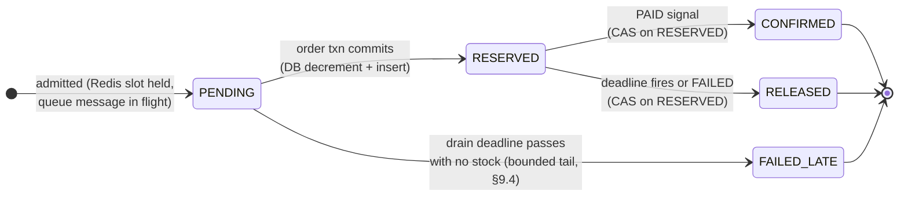
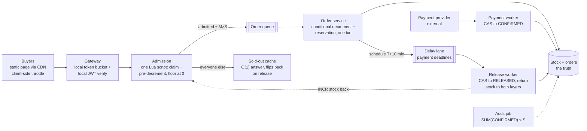
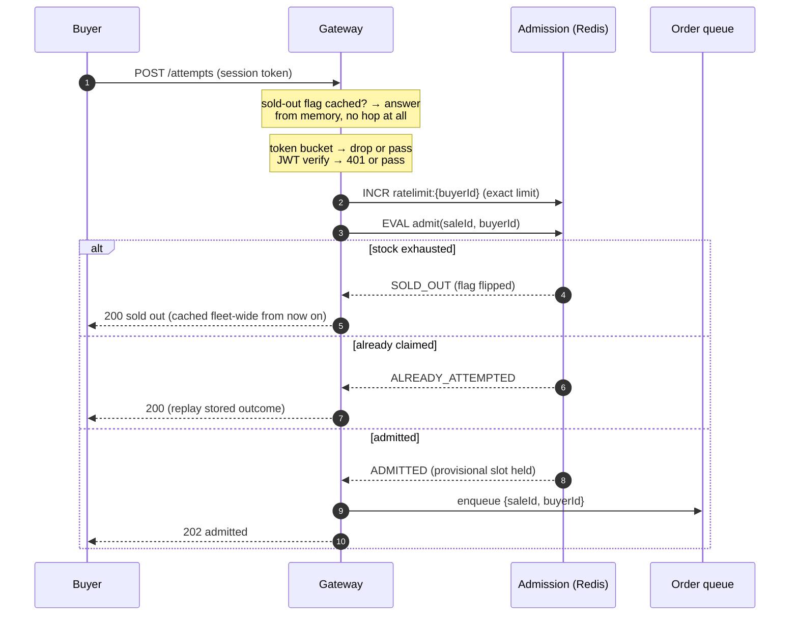
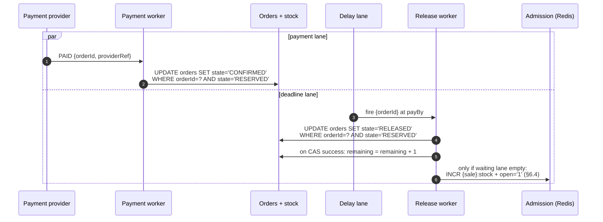
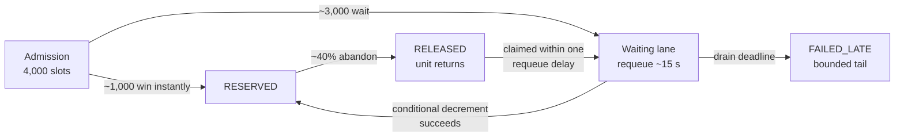
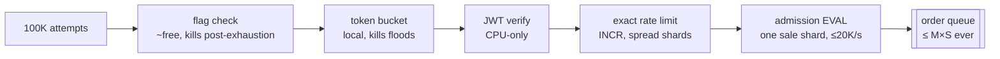
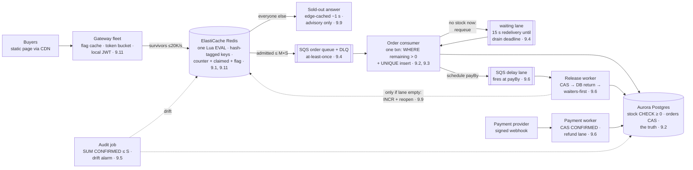

# Flash-Sale Inventory (zero oversell under a 100× stampede)

_This document is the design at production scale (interview altitude). The
buildable specification of the lab system — contracts, schemas, wiring — lives
in [lld.md](./lld.md), which arrives after §9–§10._

## 1. Overview

We are building the inventory-subtraction path for a flash sale: one hot SKU,
stock 1,000, ~100,000 buyers clicking inside one second. The two hard problems
are **enforcing one invariant — stock never goes below zero — at memory speed
under maximal contention**, and **rejecting ≥99% of traffic as cheaply as
possible without lying to anyone for long**. The design is a funnel, not a
faster database.

### 1.1 Problem statement

A flash sale inverts the usual shape of a shop: the interesting case is not
serving the winner, it is saying "no" a hundred thousand times in one second
while saying "yes" exactly 1,000 times — never 1,001. An oversold unit is a
broken customer promise, a support ticket, and possibly compensation; an
unsold unit is retryable. The invariant is therefore asymmetric — transient
under-sell is acceptable, oversell never is — and every mechanism below leans
on that asymmetry. The interview shape of this problem ("seckill", "design a
flash sale", Ticketmaster-adjacent) is graded on whether the candidate turns
the whole system into a funnel or tries to buy a faster database.

### 1.2 The cast — who's who, who owns what

| Party | Owns | How they appear in this system |
|---|---|---|
| **Buyer B** | a session token and one attempt per sale | an authenticated click; no cart, no browsing state on the hot path |
| **Us (the platform)** | the sale config, the admission counters, the reservation state machine, and the **stock truth** (a DB row) | everything in §4 |
| **Payment provider** | the **money truth**, *outside our boundary* | we hand it a reservation and a deadline; it hands back exactly one signal — `PAID` or `FAILED` — which we consume idempotently |

The path in one line: B's click → our admission (memory-speed pre-count) →
our reservation (`RESERVED`, deadline T+10 min) → the provider moves money on
*its* books → our `CONFIRMED` consumes the stock finally. Stock truth never
leaves our DB; money truth never enters it.

## 2. Requirements

### 2.1 Functional requirements

1. **[P1] Buy attempt.** An authenticated buyer makes at most one admission
   claim per sale; the answer is admitted-into-buy-path, sold-out, or
   rate-limited — fast in all three cases.
2. **[P1] Zero oversell.** At every instant, per sale:
   `SUM(CONFIRMED orders) ≤ initial stock`. The hard invariant; it must hold
   through crashes, retries, restores, and operator error.
3. **[P1] Reservation lifecycle.** An admitted attempt becomes a reservation
   (`RESERVED`) with a payment deadline; payment confirms it (`CONFIRMED`);
   the deadline releases it (`RELEASED`) and returns the unit to the pool.
4. **[P1] Sold-out signal.** Once stock is exhausted the system answers "sold
   out" in O(1) from cache, and flips back within seconds when a release
   returns stock.
5. **[P2] Order observation.** A buyer can poll their attempt/order state;
   terminal transitions are observable.
6. **[P2] Continuous audit.** A ledger audit proves FR-2 continuously and on
   demand — the invariant is *checked*, not assumed.

### 2.2 Non-functional requirements

- **Scale, and the shaping fact:** ~100,000 buy attempts in ~1 s against
  stock S = 1,000 — at most 1% can win, so ≥99% of traffic must be rejected
  as cheaply as possible. Page/asset traffic is another 10–50× the attempt
  traffic → static sale page via CDN, zero dynamic calls for browsing.
- **The funnel arithmetic:** admission passes `M × S` into the buy path
  (M = admission multiplier, default 4, range 3–5 — a named business dial,
  §9.4): 4,000 of 100,000 ≈ 4%. The other ~96% get a cached sold-out.
  Downstream sees ~4K order writes drained over ~10 s ≈ **a few hundred
  writes/s at the database — the stampede never reaches it**.
- **The hot-row ceiling (why memory speed):** one relational row sustains
  low-thousands of locked updates/s; 100K/s needs a single-threaded in-memory
  serializer. One Redis shard runs the admission script in <1 ms at ~10⁵
  ops/s — one hot sale ≈ one shard's capacity, which is exactly why the
  gateway must shave load *before* Redis and why hot-SKU relief has an
  escalation path (§9.8).
- **The attempt-surface budget (why the layers hold):** each gateway node's
  local token bucket caps what escapes it — 20 nodes × 1,000/s = a 20K/s
  fleet ceiling on the worst second. Signature rejects are CPU-only. The
  exact rate-limit `INCR`s spread across the cluster by buyer key; only the
  admission `EVAL`s concentrate on the sale's shard: ≤ 20K/s against ~10⁵
  ops/s capacity ≈ **5× headroom on the hottest second**, before the
  sold-out flag removes the crowd from Redis entirely (§6.1, §6.4).
- **Latency:** sold-out p99 < 50 ms (edge/cache) · attempt ack p99 < 200 ms ·
  reservation visible p99 < 2 s (async) · payment window 10 min.
- **Availability, asymmetric:** the reject path survives everything (static
  page + cached sold-out). The buy path may degrade — queueing delays, even
  failing closed to "sold out" — but **correctness beats availability**: no
  failure mode may oversell.
- **Durability, asymmetric:** a `RESERVED` order survives any crash (it is in
  the DB). Admission state in Redis is deliberately *not* durable — it is
  rebuildable from the DB, conservatively (§9.7).
- **Storage:** ~4K orders × ~0.5 KB ≈ 2 MB per sale. Storage is a non-problem
  in this design; noted and moved past.
- **Fairness:** bounded unfairness — roughly arrival order per gateway node,
  no global FIFO (§9.10).

### 2.3 Out of scope

Payment processing internals (we consume `PAID`/`FAILED` signals; the
`payment-system` design in this repo owns that territory) · multi-SKU shard
placement (all keys are per-sale, so N concurrent sales are N independent
funnels; the hot-SKU escalation is §9.8) · bot and fraud scoring beyond rate
limiting · lottery-style fairness (§9.10 names the pivot; same architecture,
different picker) · restock events and multi-round sales · catalog, carts,
checkout UX (a flash sale is buy-now, quantity 1) · queue-position waiting
pages.

## 3. Core entities and APIs

**Entities.** `Sale` (config: skuId, initialStock, startsAt, paymentWindow,
admission multiplier M) · `AdmissionState` (Redis, per sale: a stock counter
and a claimed-set — rebuildable, never authoritative) · `Order` (the
reservation state machine; unique per (saleId, buyerId); carries the payment
deadline and a stored outcome for idempotent replay) · `StockRow` (DB:
`remaining` — **the truth**, only ever mutated by conditional writes) ·
`ReleaseTimer` (one delay message per reservation, fires at the deadline).

**Order states:** every transition is a conditional update on the current
state (CAS), so each applies at most once and late messages no-op (§9.6):



`PENDING` is not a DB state — it is the observable admitted-but-not-reserved
condition, and it has two flavors: *in transit* (the second or two before the
consumer processes the message) and *waiting* (stock exhausted right now; the
message circulates on a delay, ready to claim the next released unit —
§6.2, §9.4). `FAILED_LATE` is terminal and bounded by construction: it is
the admitted tail that never caught a released unit by the sale's drain
deadline — the deliberate price of the admission multiplier (§9.4, §9.5).

**API** (buyer-authenticated with a signed session token, verified locally at
the gateway — no identity-service call on the hot path, §9.11):

```
POST /v1/sales/{saleId}/attempts                            (buyer)
  → 202 {status:"ADMITTED"}               admitted into the buy path
  → 200 {status:"SOLD_OUT"}               O(1), cache/edge-served
  → 200 {status:"ALREADY_ATTEMPTED"}      one claim per buyer (§9.11)
  → 429                                   rate-limited (edge/local)

GET  /v1/sales/{saleId}/orders/me                           (buyer, polling)
  → {orderId?, state: PENDING|RESERVED|CONFIRMED|RELEASED|FAILED_LATE, payBy?}

POST /internal/payment-events           (payment provider, signed webhook)
  {orderId, outcome: PAID|FAILED, providerRef}    idempotent (§9.6)
```

Identity always comes from the auth token, never the body — a buyer id in the
payload would let one client claim (and burn) another buyer's single attempt.
The attempt response never leaks remaining-stock numbers (a countdown invites
scripted sniping); it answers only the buyer's own outcome. The payment
webhook is signature-verified and idempotent on `providerRef`; replays of the
same signal replay the stored outcome.

There is no client-supplied idempotency key: the natural key
**(saleId, buyerId)** *is* the idempotency key end to end — the Redis claim,
the order-table unique constraint, and response replay all hang off it.

## 4. High-level design



**Gateway** — kills the flood before it costs anything, three checks ordered
cheapest-first: the cached sold-out flag (memory read — once the sale
exhausts, ~100% of traffic dies here for free), a token bucket in each
node's memory (approximate is fine — N nodes × limit is still a fleet
ceiling, §2.2), then local signature verification of the session token —
a CPU-only check; an identity-service lookup per attempt at 100K/s would
melt the identity service, so only unknown/expired tokens pay a real
lookup. Survivors make exactly one network hop, to admission. Ordering
argument and details in §9.11.

**Admission** — one Lua script (§6.1, full listing) against three hash-tagged
per-sale keys: reject on the flag, reject at counter zero (flipping the flag
atomically), reject repeat claimants, else claim + decrement — one atomic
unit. Single-threaded execution makes the script a natural per-sale
serializer at memory speed: ~10⁵ scripts/s on one shard vs ≤ 20K/s arriving
after the gateway shave (§9.1, §9.11). It says yes at most `M × S` times;
every yes is a *provisional* slot, not the truth.

**Sold-out cache** — the answer for the ~96%: the per-sale flag the script
flips at zero, cached in every gateway (~1 s refresh) and pushed to the edge,
served in O(1). Flip-back on release (§6.4). Seconds of staleness, always in
the safe direction (§9.9).

**Order queue** — decouples admission (spiky: 4K admits inside a second) from
order creation (steady drain at the DB's comfortable few hundred writes/s ≈
10 s to clear the whole burst). At-least-once delivery is safe because the
consumer is idempotent on (saleId, buyerId) — the §6.2 crash matrix; bursts
are absorbed and nothing re-enters the attempt path. DLQ isolates poison
items, alarmed.

**Order service** — the queue consumer, the only writer on the truth. One
transaction: the conditional stock decrement (`… WHERE remaining > 0`) plus
the `RESERVED` order insert under the unique constraint; then it schedules
the payment deadline. Contract and crash matrix in §6.2. If the conditional
write refuses — no stock *right now* — the admitted buyer waits in line: the
message requeues on a short delay until a release frees a unit or the drain
deadline turns it into `FAILED_LATE` (§6.2, §9.4).

**Delay lane + release worker** — one delay message per reservation fires at
`payBy` (10 min): CAS `RESERVED → RELEASED`, then DB increment — the freed
unit is claimed by the next waiting `PENDING` message hitting the
conditional decrement. Only when nobody is waiting does the worker also
`INCR` Redis and reopen public admission (§6.4). Ordering (CAS first,
returns second) means a mid-release crash can strand a unit briefly but
never return it twice (§6.3). A fire that lands after payment is a no-op by
CAS (§9.6). A slow sweeper (1/min over `RESERVED` rows past `payBy`)
backstops lost messages.

**Payment worker** — consumes the provider's signed signal: `PAID` → CAS
`RESERVED → CONFIRMED`; `FAILED` → early release via the same release path.
Idempotent on providerRef (replays replay the stored outcome). The rare
`PAID`-after-`RELEASED` ordering goes to an alarmed refund lane, walked on a
concrete clock in §6.3.

**Audit job** — continuously proves FR-2: per sale,
`SUM(CONFIRMED) ≤ initialStock`, plus the admission-vs-DB drift metric and a
`RELEASED`-without-returned-stock reconciler (§6.3). The invariant is checked
by a query, not assumed (§8).

## 5. Data model

Relational DB (the truth store — §7 prices the KV alternative):

| Table | Keys | Columns / notes |
|---|---|---|
| `sales` | PK `saleId` | `skuId`, `initialStock`, `startsAt`, `endsAt`, `paymentWindowSec` (600), `multiplier` (M, default 4), `admissionPct` (rollout dial, §8). Read-mostly, cached in every gateway |
| `stock` | PK `saleId` | `remaining INT NOT NULL CHECK (remaining >= 0)`. Exactly two mutations exist: the conditional decrement `WHERE remaining > 0` (§9.2) and the release increment. The CHECK constraint is a third, free, belt — a bug that bypasses the WHERE still cannot go negative. **The truth** |
| `orders` | PK `orderId` · **UNIQUE (saleId, buyerId)** · index `(saleId, state)` | `buyerId`, `state`, `payBy`, `providerRef?`, `outcome` (stored response for idempotent replay), `createdAt`, `stateChangedAt`. The unique constraint is the durable one-per-customer backstop; the `(saleId, state)` index serves the audit, the sweeper, and the conversion metric — never the hot path |

Redis (admission — rebuildable, never authoritative, §9.7):

| Key | Type | Contents |
|---|---|---|
| `{sale:<id>}:stock` | STRING (int) | admission slot counter, seeded `M × initialStock` at sale open; `DECR` by the admit script; `INCR` only by releases that find the waiting lane empty (§6.4) |
| `{sale:<id>}:claimed` | SET | buyerIds that consumed their one attempt; ~100K members ≈ a few MB. TTL = sale window + grace |
| `{sale:<id>}:open` | STRING (0/1) | the sold-out flag gateways cache; flipped by the admit script at zero, cleared by flip-back (§6.4) |
| `ratelimit:{buyerId}` | STRING + EXPIRE | exact per-buyer `INCR` counter, 1 s window — spread across shards by buyer key, deliberately NOT hash-tagged with the sale |

The `{sale:<id>}` hash tag forces `stock`, `claimed`, and `open` onto **one
cluster shard** — Lua atomicity requires every key it touches to be
co-located (§9.11). The rate-limit keys stay un-tagged on purpose: they carry
the full 100K/s and must spread, while the tagged trio carries only
post-shave traffic (§2.2 budget).

Queues:

| Queue | Message | Notes |
|---|---|---|
| Order queue + DLQ | `{saleId, buyerId}` | at-least-once; consumer idempotent on the natural key; DLQ isolates poison items, alarmed |
| Delay lane | `{orderId}`, delivered at `payBy` | one message per reservation; a slow sweeper over `(saleId, state=RESERVED, payBy < now)` backstops lost messages |

Two counters, one truth: `{sale}:stock` (Redis) is *throughput*;
`stock.remaining` (DB) is *truth*. They drift only through crashes and bugs;
the drift metric and the audit exist to prove the drift stays bounded and the
truth never overshoots (§9.2, §9.5).

Access patterns that shaped this: one Lua `EVAL` per surviving attempt
(single shard, single round-trip); point lookups by `orderId` and by the
`(saleId, buyerId)` unique key; one conditional `UPDATE` per order; the only
range read anywhere is the off-hot-path `(saleId, state)` index for
audit/sweeper/metrics. No joins, no scans on the hot path.

## 6. Detailed design

### 6.1 The admission path



The script, in full (§9.11 walks the shard trap and the ordering decision):

```lua
-- KEYS[1] = {sale:<id>}:stock   KEYS[2] = {sale:<id>}:claimed
-- KEYS[3] = {sale:<id>}:open    ARGV[1] = buyerId
-- All three keys share the {sale:<id>} hash tag → one shard → atomic EVAL.
if redis.call('GET', KEYS[3]) == '0' then return 'SOLD_OUT' end
if tonumber(redis.call('GET', KEYS[1])) <= 0 then
  redis.call('SET', KEYS[3], '0')          -- flip the flag exactly once
  return 'SOLD_OUT'
end
if redis.call('SADD', KEYS[2], ARGV[1]) == 0 then return 'ALREADY' end
redis.call('DECR', KEYS[1])
return 'ADMITTED'
```

Single-threaded Redis executes the whole script as one unit — there is no
interleaving to reason about. The last-unit race, concretely: buyers X and Y
both `EVAL` with stock = 1. Redis runs X's script to completion first: X
reads 1, claims, decrements to 0, returns ADMITTED. Y's script then reads 0,
flips `open` to `'0'`, returns SOLD_OUT. No lock, no retry loop, no gap
between the dedup answer and the admission answer — sequential execution *is*
the mutual exclusion (§9.1).

Two ordering decisions inside the script, both deliberate:
- **Stock check before `SADD`:** a sold-out answer must not burn the buyer's
  one claim — if a release flips the sale back open (§6.4), they may try
  again. Claim-first would permanently lock out everyone who clicked during
  a sold-out window.
- **Flag flip inside the script:** the transition to sold-out happens exactly
  once, on the shard that owns the truth about the counter, not by gateways
  inferring it — so the flip is atomic with the last rejection.

Failure edge, named now: the claim lands, then the enqueue or anything after
it fails → that buyer is locked out holding nothing. Bounded (gateway crash
window, not a steady state) but real. §9.11's refinement turns the claimed
SET into a small state ladder (HSET `claimed → enqueued`), so the same
buyer's retry re-enters at the failed step idempotently instead of bouncing
off `ALREADY` — the same replay-don't-reject shape the order table uses one
layer down (§6.2).

### 6.2 Order creation — where the truth gets written

The queue consumer's contract is *exactly-once effect per (saleId, buyerId),
at-least-once delivery notwithstanding*:

1. Receive `{saleId, buyerId}` (possibly a redelivery, possibly a duplicate
   enqueue — assume nothing).
2. Open one transaction:
   `UPDATE stock SET remaining = remaining - 1
   WHERE saleId = ? AND remaining > 0` — the conditional write *is* the
   mutual exclusion (§9.2, §9.3). The row lock serializes concurrent
   consumers; the predicate makes the outcome deterministic at zero.
3. Same transaction:
   `INSERT INTO orders (…, state = 'RESERVED', payBy = now + 600s)`. If the
   UNIQUE (saleId, buyerId) constraint fires, this message is a replay —
   roll back the decrement, read the existing row, replay its stored
   outcome. The constraint converts duplicates into idempotent reads.
4. Commit, then schedule the delay message for `payBy`, then ack the queue
   message. Ordering matters: commit before ack, so a crash anywhere leaves
   a redelivery, never a lost order.
5. Zero rows updated in step 2 = no stock *right now*. This is the designed
   condition, not an error: admission deliberately lets in `M × S` buyers so
   that abandonment releases (arriving minutes later, §6.3) find warm buyers
   already in line. Before the sale's **drain deadline** (sale close +
   payment window + grace): requeue the message with a short delay (~15 s)
   and leave the buyer `PENDING` — "in line". Past the deadline: write the
   order as `FAILED_LATE` (the stored apology) and ack. The waiting lane and
   its arithmetic are §9.4; why the invariant survives it is §9.5.

The crash matrix that makes at-least-once safe:

| Crash point | On redelivery | Net effect |
|---|---|---|
| before the txn | full retry | exactly one order |
| inside the txn | txn rolled back, full retry | exactly one order |
| after commit, before ack | step 3's unique constraint → replay stored outcome | exactly one order, one duplicate delay message (harmless: second CAS no-ops, §9.6) |
| after ack | nothing redelivered | done |

Never read-then-write on stock: a `SELECT remaining` followed by an
unconditional `UPDATE` reintroduces exactly the race the conditional write
exists to kill — two consumers both read 1, both write 0, two units sold on
one remaining. The predicate form makes the storage engine the arbiter; the
`CHECK (remaining >= 0)` constraint (§5) backstops even a future bug that
edits the SQL.

### 6.3 Payment outcome vs. the deadline — a race, by design



Both lanes guard on `state = 'RESERVED'`, so exactly one wins; the loser's
update matches zero rows and no-ops. That single guard is the entire
double-return defense: a late deadline after payment cannot release, and a
duplicate release cannot increment twice (§9.6). The release itself is
ordered deliberately — **CAS first, DB increment second, Redis last and only
when nobody waits**: the freed unit normally goes to the next waiting
`PENDING` message via the conditional decrement (§6.2), and public
admission reopens only once the admitted pool has drained. A crash
mid-release strands at most one unit temporarily (the sweeper's re-fire
no-ops on the CAS and a reconciler re-derives the returns from
`RELEASED`-without-return rows) rather than ever returning one unit twice.

The one ugly ordering — `PAID` arrives *after* the deadline released the
unit. On a concrete clock: reservation at 12:00:00, `payBy` 12:10:00; the
buyer completes payment at 12:09:59.4; the provider's webhook leaves at
12:10:00.8; the delay message fired at 12:10:00.0 and the release CAS
committed at 12:10:00.3. The payment worker's CAS to `CONFIRMED` now matches
zero rows (state is `RELEASED`) — money moved, reservation gone. That order
enters an **alarmed refund lane** — never silent, resolved with the
provider's own idempotent refund, and rare by construction: it needs a
payment inside the final second *and* a slow signal. Two design dials keep
it rare: the client-facing pay button disables at `payBy − ε` (UX grace),
and the delay lane fires at `payBy` exactly, no early firing. The
alternative — honoring late payment by extending the reservation — would
mean a unit promised twice, the one thing this design never does.

### 6.4 Sold-out: flip and flip-back

The flip is owned by the admission script (§6.1): the request that observes
zero flips `{sale}:open` to `'0'` atomically with its own rejection.
Gateways poll-or-subscribe the flag and serve the cached sold-out from then
on — the crowd stops touching Redis entirely, which is what lets one shard
survive the stampede (§2.2).

Flip-back is **waiters-first** (§6.3): a released unit is normally consumed
by the admitted buyers already circulating in the waiting lane — they hit
the conditional decrement within one requeue delay (~15 s) and need no
Redis change at all. Only when the waiting lane is empty (mass abandonment
beyond the M× margin — the funnel drained) does the release worker `INCR`
`{sale}:stock` and set `{sale}:open = '1'`, re-admitting the public. Gateway
caches lag by their refresh interval (~1 s), so buyers may see "sold out"
while a returned unit exists — seconds of staleness in the safe direction,
priced in §9.9. The unsafe direction cannot come from staleness at all: an
admitted attempt always re-checks the counter inside the script, and the DB
conditional write backstops even a wrongly-open flag (§9.5). The flag is
plain-SET rather than CAS-guarded on purpose: the worst a racing
flip/flip-back can produce is a transiently wrong *advisory* flag, and both
readers of consequence re-verify against the counter or the DB.

### 6.5 Recovery in one paragraph

Redis gone = admission fails closed: the gateway treats script
errors/timeouts as "sold out", nothing can oversell while we are blind. On
restore, rebuild conservatively from the truth, in order:

1. Hold admission closed (`{sale}:open = '0'`) while rebuilding.
2. `claimed` := all buyerIds holding an order row for the sale (any state) —
   one indexed query.
3. `stock` := `M × DB.remaining − (queue depth estimate)`, floored at zero —
   DB `remaining` is the only number that must be right; the in-flight
   subtraction only avoids over-admitting into a backlog.
4. Reopen (`open = '1'`) only if the rebuilt counter is positive.

Both estimates err toward *under*-admission — the recoverable direction. The
buyers whose claims lived only in the lost claimed-set (admitted but never
ordered) are forgiven a second attempt; the order-table unique constraint
absorbs any that already ordered. The full walk, including why forgiving
those few is fine, is §9.7.

## 7. Alternatives considered

Compact scorecards; full reasoning lands in the deep dives.

**The decrement point** (§9.1–§9.3)

| Option | Throughput at the hot row | Crash behavior | Verdict |
|---|---|---|---|
| DB row lock only | ~10³ locked updates/s — funnel must admit ≈ stock exactly, killing the abandonment margin | correct but slow everywhere | rejected |
| Redis only, no DB authority | memory-speed | failover/restore glitch can mint phantom stock → oversell owns a money-adjacent invariant | rejected |
| Distributed lock around the decrement | same serialization, lower throughput | TTL expiry during a pause, fencing tokens — liveness failure modes a conditional write doesn't have | rejected |
| **Redis admission + DB conditional write** | memory-speed where it matters, ~10²/s where truth lives | oversell requires both layers to fail in the same direction | **chosen** (§9.2) |

**Deadline mechanism** (§9.6)

| Option | Release precision | Failure mode | Verdict |
|---|---|---|---|
| Periodic sweeper only | its period — a 60 s sweep holds units hostage a minute of the hottest window | simple, robust | rejected as primary |
| Per-reservation delay message | second-level | a lost message strands one reservation | **chosen as primary** |
| **Delay message + slow sweeper backstop** | second-level, minute-level floor | strand window bounded by sweep period | **chosen** — precision from one, a floor from the other |

**Admission → order coupling.** *Direct synchronous call:* the order
service's availability multiplies into the attempt path, and the
4K-in-one-second admit burst hits the DB at burst rate. *Queue:* absorbs the
burst (4,000 admitted in ~1 s, drained at a steady few hundred/s ≈ 10 s to
clear), retry + DLQ semantics for free, attempt path stays flat. Costs:
eventual order visibility (`PENDING` for a second or two) and an idempotent
consumer — both already required by other constraints. **Chosen: queue.**

**One-per-customer placement** (§9.11). *DB unique constraint only:* correct,
but every duplicate costs a DB round-trip mid-storm — the constraint is the
backstop, not the bouncer. *Gateway-memory only:* evaporates on restart and
multiplies by node count. **Chosen: SADD claim inside the admission script**
(atomic with the stock check, one shard, no extra hop) **plus the unique
constraint as the durable backstop.**

**Truth store: relational vs key-value.** Both support the required
conditional write (`WHERE remaining > 0` vs a condition expression). The
unique constraint and the one-line aggregate audit are native to relational;
on key-value they become an extra conditional item and a scan. Nothing here
needs relational scale-out — the DB sees hundreds of writes/s, not the
stampede (§2.2). **Chosen: relational**, with the honest note that a team
fluent in a conditional-write KV store loses little; lld.md pins the lab
choice.

**Fairness** (§9.10). *Global FIFO:* needs a single sequencer — a new
bottleneck and failure domain purchased to deliver a property the business
did not ask for. *Lottery over a collection window:* the fairest option and a
legitimate product choice; same architecture, different picker. **Chosen:
bounded unfairness** (≈ arrival order per gateway), lottery documented as the
pivot.

## 8. Failure analysis and operations

| Failure | Blast radius | Behavior |
|---|---|---|
| Redis crash mid-sale | admission blind | fail closed → "sold out" while blind; conservative rebuild from the DB (§9.7); transient under-sell possible, oversell impossible |
| Order queue backlog | order latency | nothing lost (durable queue); volume pre-bounded at M×S; alarm on oldest-message age |
| Double-click / retry storm | none (by design) | token bucket sheds; claim + unique constraint collapse duplicates into replay (§9.11) |
| Payment provider slow/down | conversions stall | reservations release at deadline, stock returns to the pool; conversion-rate alarm; late `PAID` → refund lane (§6.3) |
| Over-admission bug (multiplier misconfig, rebuild error) | extra waiters; bounded `FAILED_LATE` tail at the drain deadline | the DB conditional write refuses everything past zero — the invariant holds at layer 2 (§9.5); admission-vs-DB drift alarm |
| Delay message lost | one stranded reservation | backstop sweeper releases it; alarm on max `RESERVED` age |
| Order service crash mid-transaction | none (by design) | the transaction is atomic; the queue redelivers; the consumer replays idempotently on (saleId, buyerId) |
| Sold-out cache stale during flip-back | seconds of "sold out" while a unit exists | accepted — staleness only ever points in the safe direction (§9.9) |

**Metrics that page:** the audit query `SUM(CONFIRMED) ≤ initialStock`
failing (severity-1 — the invariant broke) · admission-vs-DB drift beyond
`M × S` (over-admission beyond design) · refund-lane entries (each one is a
customer who paid and lost the unit) · DLQ depth > 0 · oldest queue message
age past the drain budget · max `RESERVED` age past `payBy` + sweep period
(both timers failed).

**Dashboards, not pages:** conditional-write refusal rate (≈0 expected; a
few during flip-back races are design-normal) · reservation→payment
conversion (the business dial M feeds on this, §9.4) · attempt p99 and
sold-out p99 · claimed-set size vs admitted count · flip-back frequency.

**Measure at the caller:** server-side latency metrics only count requests
that completed — a client-timeout storm is invisible in them. The gateway
emits the attempt timer on success *and* failure, plus a distinct timeout
counter; the buy path is judged from where the buyer stands.

**Rollout and rollback:** `sales.admissionPct` (§5) is the dial — the
admission script admits that fraction of otherwise-admissible attempts
(deterministic on a buyerId hash, so one buyer sees a consistent answer).
Start at 1%, raise in stages. Rollback = dial to 0: the queue drains,
reservations resolve by payment or deadline, no state is stranded — the sale
can resume with stock intact. The same dial doubles as the load-shedding
control during an incident.

## 9. Deep Dives

### 9.1 Why is the decrement point Redis and not the database?

**The question behind the question:** what does 100K/s of contention on one
row do to a disk-backed store, and what is the cheapest correct serializer?

**The database as the decrement point:** every attempt becomes a locked
update on one row. A single hot row sustains ~10³ locked updates/s — lock
acquisition, WAL append, replication all serialize on it. At 100K attempts/s
that is a 100-second queue forming in the lock manager of the same database
that must also write orders; timeouts cascade, connection pools drain, and
the product page dies with it. To survive, the funnel would have to
pre-reject down to ~stock exactly — killing the abandonment margin §9.4
exists to provide.

**Redis Lua as the decrement point:** a single-threaded event loop executes
the admission script (§6.1) sequentially at ~10⁵/s, each in <1 ms. There is
no lock because there is no concurrency — arrival order *is* the
serialization. The gateway shave (§2.2) delivers ≤20K/s to the shard: 5×
headroom.

**Decision:** Redis Lua for admission throughput — but the DB stays in the
design as *truth*, not throughput (§9.2). This is division of labor, not
distrust of databases: the DB sees only the post-funnel trickle (~hundreds
of writes/s), which is exactly the load profile it is good at.

**In the code (planned):** `src/admission/admit.lua` (the serializer),
`src/admission/client.ts` (EVAL wrapper + fail-closed timeout),
`src/harness/stampede.ts` (proves the rate arithmetic empirically).

### 9.2 Why enforce the invariant twice — isn't Redis + DB redundant?

**The question behind the question:** which failure modes does each layer
actually cover, and what single event could oversell?

**One layer (Redis only):** memory-speed, but the invariant now lives in a
store whose failover semantics are asynchronous. A crash-restore from a
stale snapshot, a split-brain promotion, or a rebuild bug (§9.7) can mint
phantom slots — and with no second check, every phantom slot becomes a sold
unit. Oversell via infrastructure event: unacceptable for a money-adjacent
promise.

**One layer (DB only):** correct but slow (§9.1) — and every failure is now
a customer-visible outage instead of a degraded funnel.

**Both layers:** Redis absorbs the concurrency; the DB conditional write
(`WHERE remaining > 0`, §6.2) is the final arbiter that refuses anything a
damaged admission layer over-admits. The layers fail independently — a Redis
restore glitch produces extra *waiting buyers* (§9.5), not extra sold units;
a DB failure stops sales entirely (fail closed), never oversells. Oversell
requires both layers to lie **in the same direction at the same time** — and
the third belt, `CHECK (remaining >= 0)` (§5), demands a triple failure.

**Decision:** Redis Lua admission + DB conditional write, with the
admission-vs-DB drift metric alarmed (§8) so divergence is observed, not
discovered by customers. The honest price: two counters to reconcile and a
drift audit to operate — cheap against the alternative.

**In the code (planned):** `src/admission/admit.lua` (layer 1),
`src/orders/store.ts` (layer 2: conditional decrement),
`src/audit/invariant.ts` (the drift + oversell queries),
`src/harness/redis-kill.ts` (the drill that proves layer 2 holds alone).

### 9.3 Why not a distributed lock around the decrement?

**The question behind the question:** what does a lock add over a
conditional write when the storage engine can arbitrate directly?

**Distributed lock (Redis SETNX / ZooKeeper / etcd):** acquire, read stock,
decide, write, release. It serializes the same operation as the conditional
write — at strictly lower throughput (two extra round-trips minimum) — and
imports liveness problems the conditional write simply does not have: a
GC pause or network stall past the lock TTL lets a second holder in
(classic split-lock), which then demands fencing tokens checked… by a
conditional write at the store. The "fix" for the lock is the mechanism
that made the lock unnecessary.

**Conditional write:** `UPDATE … WHERE remaining > 0` *is* the mutual
exclusion — condition check and mutation execute as one atomic operation
inside the engine that owns the data. Crash mid-flight and the transaction
rolls back; there is nothing to expire, no token to fence, no janitor to
run.

**Decision:** no lock anywhere in this design. Both enforcement points are
condition-carrying writes: the Lua script (the condition is the first two
lines, §6.1) and the SQL predicate (§6.2). Locks appear in the sibling
uber-like-rides design where a *time-boxed human decision* (a 10 s offer)
must exclude concurrent offers — a genuinely different problem. Here the
decision is instantaneous, so the write can carry its own condition.

**In the code (planned):** `src/orders/store.ts` (predicate-guarded
decrement + CAS transitions — grep it: no lock acquisition exists),
`src/admission/admit.lua`.

### 9.4 Why admit 4× stock instead of exactly stock?

**The question behind the question:** what does payment abandonment do to
sell-through if admission equals stock exactly?

**Admit exactly 1× (1,000):** every admitted buyer maps to one unit. Flash
sales convert poorly — payment friction, cold feet, card declines; assume
~40% abandonment. 400 reservations release over the 10-minute window, and
each release must claw a *new* buyer through the whole funnel — but the
crowd dispersed within a minute of "sold out". Result: stranded stock,
sell-through dragging over an hour or never completing. Launch-day failure
in the business's currency.

**Admit M× (default 4× = 4,000):** ~1,000 reserve immediately; ~3,000 wait
in line as `PENDING`, their queue messages circulating on a ~15 s delay
(§6.2 step 5). Every release is claimed within one delay period by a buyer
who already cleared auth, rate limits, and dedup — warm demand parked at
the exact point of consumption. Expected coverage: 1,000 × 40% = 400
releases against 3,000 waiters — the margin absorbs even a 3× worse
abandonment day. The waiting lane drains to `FAILED_LATE` at the drain
deadline (sale close + payment window + grace); those buyers were told
"you're in line", the honest UX for a flash sale.

**The dial:** M is a business knob, not architecture. Higher M = faster
sell-through + more disappointed waiters; lower M = cleaner UX + slower
conversion. M lives in `sales.multiplier` (§5) per sale; nothing but the
seed value changes.



**Decision:** M = 4 (range 3–5), waiting-lane semantics — the multiplier is
only coherent *because* extras wait; instant refusal at zero would make the
multiplier pure cruelty (4,000 admitted, 3,000 refused seconds later, and
releases finding nobody).

**In the code (planned):** `src/orders/consumer.ts` (zero-rows → requeue
with delay vs `FAILED_LATE` at deadline), `cdk/stacks/order-stack.ts`
(redelivery delay), `src/harness/stampede.ts` (asserts waiters convert on
injected releases).

### 9.5 What if Redis says yes but the DB says no?

**The question behind the question:** over-admission is designed *and*
accidental — where does each kind land, and who notices?

**Designed over-admission** is §9.4: M× buyers against 1× stock. The DB
saying "no stock right now" to a waiter is the waiting lane working.

**Accidental over-admission** — a rebuild error after a Redis restore
(§9.7), a fat-fingered multiplier, a re-seeded counter: Redis hands out
more slots than `M × S`. Nothing downstream trusts those slots. Every
admitted buyer still funnels into the same conditional decrement; the DB
refuses everything past `remaining = 0`; the excess waits in line and drains
to `FAILED_LATE` at the deadline. The blast radius of an arbitrarily broken
admission layer is *disappointment*, never oversell — the invariant's
asymmetry (§1.1) made real.

**Detection is a metric, not a customer:** `admitted_count − (RESERVED +
CONFIRMED + RELEASED + waiting)` per sale, alarmed when it exceeds `M × S`
(§8). A drift alarm at 10:02 beats a support storm at 10:40.

**Decision:** the DB conditional write refuses silently and cheaply; the
drift alarm makes the refusal *observed*. No compensating logic on the hot
path — the waiting lane already is the compensation.

**In the code (planned):** `src/audit/invariant.ts` (drift query + alarm
wiring in `cdk/stacks/ops-stack.ts`), `src/harness/redis-kill.ts` (injects
a deliberately wrong rebuild and asserts zero oversell).

### 9.6 How does the payment deadline return stock without ever double-returning?

**The question behind the question:** two independent timers (payment
success, deadline expiry) race for one reservation — what makes the outcome
exactly-once?

**Naive release:** delay message fires → `UPDATE orders SET
state='RELEASED'` unconditionally + increment stock. Every failure mode
double-counts: a redelivered delay message increments twice; a release
racing a payment confirms *and* releases the same unit — sold and returned
simultaneously, the books lie.

**CAS state machine:** both racers guard on the current state (§6.3):

```
payment:  UPDATE orders SET state='CONFIRMED' WHERE orderId=? AND state='RESERVED'
deadline: UPDATE orders SET state='RELEASED'  WHERE orderId=? AND state='RESERVED'
```

The row's state is the arbiter: exactly one matches, the loser updates zero
rows and no-ops. The stock increment runs only on the winning release CAS —
a redelivered delay message loses the CAS and therefore cannot increment
again. Exactly-once effect from at-least-once timers, no coordination
beyond the row itself.

**The residual race** is time, not state: `PAID` arriving after the release
CAS won (§6.3's concrete clock). State machines cannot un-ring the bell —
money moved outside our boundary. The refund lane (alarmed, provider-side
idempotent refund) is the honest answer; extending the reservation would
promise one unit twice.

**Decision:** CAS transitions on `orders.state` as the single arbiter;
delay message (primary) + sweeper (backstop) both funnel through the same
CAS so *any number* of firings release at most once.

**In the code (planned):** `src/release/worker.ts` (CAS + ordered returns),
`src/release/sweeper.ts` (same CAS, slow loop), `src/payments/handler.ts`
(confirm CAS + refund-lane hand-off).

### 9.7 Redis restarts mid-sale — walk me through recovery.

**The question behind the question:** the admission layer just lost its
memory; how do you resume without minting phantom slots?

**While Redis is down:** the gateway treats EVAL errors and timeouts as
"sold out" (§6.5) — fail closed. Nothing can oversell while we are blind,
because nothing gets admitted; buyers see the safe answer.

**The wrong rebuild:** re-seed `{sale}:stock = M × initialStock`. Every
already-admitted buyer's slot is forgotten, the crowd re-admits, and the
waiting lane floods far past `M × S` — no oversell (§9.5 holds) but the
funnel's promise ("in line" means a real chance) degrades into a lottery
with terrible odds.

**The conservative rebuild** (§6.5, in order):
1. Keep `{sale}:open = '0'` while rebuilding — the flag doubles as a
   maintenance latch.
2. `claimed` := every buyerId with an order row for this sale (indexed
   query on `(saleId, state)`). Buyers who were admitted but never reached
   an order row are *forgiven* — their re-attempt re-claims. Cost: a few
   over-M admissions, absorbed by §9.5.
3. `stock` := `M × DB.remaining − queue_depth`, floored at 0 — remaining
   real units times the multiplier, minus admissions already in flight.
   Every uncertainty rounds *down*: under-admission, the recoverable
   direction (the drain deadline or ops re-opens the tap if we rounded too
   far).
4. Reopen only if the rebuilt counter is positive.

**Decision:** rebuild from the DB (the only surviving truth), err toward
under-admission, and let §9.5's second layer absorb the forgiven edge. The
serving state is *reconstructable from durable facts* — the property that
makes non-durable admission acceptable at all (§2.2 durability asymmetry).

**In the code (planned):** `src/admission/rebuild.ts` (steps 1–4 as one
runbook command), `src/harness/redis-kill.ts` (kills Redis mid-stampede,
runs the rebuild, asserts the audit still holds — the checkpoint-5 drill).

### 9.8 One SKU saturates its Redis shard — what is the relief?

**The question behind the question:** the hash tag (§5) deliberately pins a
sale to one shard — what happens when one sale outgrows one shard?

**The arithmetic first:** a shard runs ~10⁵ EVAL/s; the gateway fleet
ceiling (§2.2) delivers ≤2×10⁴/s. Saturation needs a ~5× hotter sale or a
gateway misconfiguration — this dive is the escalation path, not the
default.

**Split counters (shard the count):** split stock into K sub-counters
(4,000 = 10 × 400), route buyers by hash, each sub-counter on its own
shard. Throughput multiplies by K. Costs: near sell-out, stock strands in
cold sub-counters (buyer hashes to an empty one while another holds units)
— so you need drain-and-rebalance logic exactly when the sale is hottest;
the sold-out flip becomes a K-way condition; the rebuild (§9.7) multiplies
by K.

**Dedicated single-threaded writer (explicit serializer):** one process
owns the SKU, consumes attempts from a queue, applies the same
check-claim-decrement logic in memory, snapshots to Redis/DB. Same
serialization idea as Redis-runs-my-script, one moving part more, no
strand/rebalance problem.

**Decision:** stay single-shard until the budget breaks (measured, ~5×
headroom); first relief is **split counters with lazy rebalance** (a
sub-counter that hits zero steals the remainder of the largest sibling
under a short lock — rebalance cost only at the tail), because it reuses
the existing script unchanged per shard. The dedicated-writer pattern is
the answer when even K-way splitting hits coordination pain. Both preserve
the invariant unchanged: the DB conditional write never sharded.

**In the code (planned):** not built in the lab — the lab proves the
single-shard budget (`src/harness/stampede.ts` reports EVAL/s at the
shard); this dive documents the escalation with its trigger metric
(`admission EVAL p99 > 5 ms or shard CPU > 60%`).

### 9.9 Is "sold out from cache" ever a lie?

**The question behind the question:** the cheapest answer in the system is
also the most cached — when is it wrong, in which direction, and who pays?

**When it is honestly stale:** a release returns a unit while every gateway
still caches `open = '0'`. Under waiters-first flip-back (§6.4) this is not
even staleness — the unit is *reserved for the waiting lane*, and "sold
out" is the correct public answer while any waiter remains. Only when the
waiting lane is empty does the flag reopen, and then the gateways lag by
one refresh (~1 s): a newcomer might see "sold out" for a second while a
unit sits free. Direction: under-sell, self-healing, bounded by the cache
TTL.

**The direction that would matter — saying "available" without stock:** a
stale `open = '1'` admits a buyer against nothing. Two backstops make this
harmless: the admission script re-checks the *counter* (not the flag)
before admitting, and the DB conditional write refuses at zero (§9.5). The
buyer waits in line or fails late — never oversold.

**Decision:** cache the sold-out answer aggressively (gateway memory +
edge, ~1 s TTL) precisely *because* both failure directions are safe: one
is a second of pessimism, the other is caught twice. The flag is advisory;
the counter and the DB are the authorities (§6.4).

**In the code (planned):** `src/gateway/handler.ts` (flag cache + TTL),
`src/admission/admit.lua` (counter re-check independent of flag).

### 9.10 Fairness — first-click-wins or lottery?

**The question behind the question:** what does "fair" cost, and did the
business actually ask for it?

**Strict global FIFO:** all 100K attempts sequence through one ordered log
before admission. That sequencer is a new single point of failure and a
new throughput ceiling (the hot-row problem reborn one layer up, §9.1), and
it still is not "fair" — position in the log is network luck (CDN pop,
carrier latency), just laundered to look official.

**Bounded unfairness (chosen default):** admission order ≈ arrival order
per gateway node; across nodes, ±rebalancing jitter. Cheap, honest about
what it is, and matches user intuition for "first come" within human
perception (~seconds).

**Lottery:** collect entries for a window (say 60 s), then draw winners
randomly. *Fairer* than FIFO under stampede (network luck stops mattering)
and kinder to infrastructure (collection is an append, no race at all).
Costs: a "results at :01" UX instead of instant feedback, and a collection
store sized for all entrants.

**Decision:** bounded unfairness, because the scope lock (§2.3) ratified it
and it needs zero new machinery. The architecture is deliberately
pivot-ready: a lottery replaces the admission script's *picker* (SADD into
an entries set during the window; a draw job seeds the winners into the
same waiting lane) — the funnel, the invariant layers, and the reservation
machine are untouched. If the business ever says "scalpers win too much",
this dive is the one-page migration plan.

**In the code (planned):** `src/admission/admit.lua` is the only file the
pivot touches — noted in its header comment.

### 9.11 What actually runs at the gateway — and why is the Lua script shaped that way?

**The question behind the question:** "rate limit + auth + dedup" hides the
real design work — the *ordering* of checks and the atomicity boundary.

**Cheapest first, always.** Each check is strictly cheaper than the one it
shields:
1. **Sold-out flag** (memory read, ~ns): once the sale exhausts, ~100% of
   traffic dies at cost zero — the flag is the funnel's off switch.
2. **Local token bucket** (memory, per node): kills floods and bot bursts
   for free; approximate by design — N nodes × limit is still a fleet
   ceiling (§2.2). Nobody needs exact rate limiting *before* auth.
3. **Local JWT verify** (one signature op, CPU-only): an identity-service
   call here would be 100K lookups/s against a service sized for logins —
   the classic melt-your-dependency mistake. Only unknown/expired tokens
   pay a network hop.
4. **Exact per-buyer rate limit** (`INCR` + `EXPIRE`, sub-ms): the first
   network hop, spread across the cluster by buyer key (§5 — deliberately
   NOT hash-tagged with the sale).
5. **The admission EVAL** (§6.1): the only per-attempt operation that
   touches the sale's own shard.

**The script's two structural choices:**
- **All-or-nothing atomicity:** dedup answer and admission answer must be
  one decision. Split them (SADD, then a separate DECR) and a crash between
  the two burns a claim without a slot, or worse — two interleaved buyers
  both pass a check the other invalidated. The Lua boundary is the
  transaction.
- **The shard trap:** cluster Lua refuses (or worse, misbehaves on) keys
  from different slots. The `{sale:<id>}` hash tag (§5) pins `stock`,
  `claimed`, and `open` to one slot — co-location is a *correctness*
  requirement, not an optimization. Miss it and the failure appears only
  in clustered production, never on a single-node dev box: the classic
  works-on-my-machine landmine, named here so the lab pins it with a
  cluster-mode test.
- **Claim before slot, stock before claim** — the ordering argument in
  §6.1: a sold-out answer must not consume the claim; a consumed claim must
  guarantee the DECR runs (nothing between SADD and DECR can fail inside
  the atomic script).

**The residual edge** (§6.1): claim landed, enqueue failed — the buyer holds
a claim and nothing else. Refinement: the claimed SET becomes a small HSET
ladder (`claimed → enqueued`); the gateway's retry path re-runs the enqueue
if the ladder shows `claimed` without `enqueued`, making the same buyer's
retry *complete the failed step* instead of bouncing off `ALREADY` — the
replay-don't-reject shape the order table uses one layer down (§6.2).



**In the code (planned):** `src/gateway/handler.ts` (the ordered chain),
`src/gateway/token-bucket.ts`, `src/gateway/auth.ts`,
`src/admission/admit.lua` (ladder + ordering comments),
`src/admission/client.ts` (cluster-mode test pinning the hash-tag
requirement).

## 10. Final design — the whiteboard after the deep dives

§4 is the sketch you draw in minute 15. The dives amended it; this is the
picture when the interview ends — same funnel, but components carry names,
edges carry guarantees, and the waiting lane the dives forced (9.4) is
visible.



What changed since §4, dive by dive:

- **Added components:** the waiting lane (9.4) — zero-stock is a requeue
  with delay, not a refusal, which is the only reading under which the
  admission multiplier makes sense; and the refund lane for
  paid-after-released (9.6). Nothing else needed inventing — the dives
  hardened edges rather than adding boxes.
- **Data-model changes:** `orders` carries `FAILED_LATE` as the bounded
  waiting-lane tail (9.4, 9.5); the claimed SET is upgraded to a
  claim-ladder HSET so gateway crashes replay instead of locking buyers out
  (9.11); `CHECK (remaining >= 0)` named as the third belt (9.2).
- **Edges that gained guarantees:** releases are waiters-first — public
  re-admission only when the lane is empty (9.4, 9.9); the sold-out flag is
  formally advisory, with the counter and the DB as authorities (9.9);
  every timer (delay message, sweeper, payment webhook) funnels through the
  same CAS so duplicates no-op (9.6); admission failure is fail-closed with
  a conservative, DB-derived rebuild (9.7).
- **Deliberately unchanged:** two-layer enforcement (9.1–9.3 confirmed the
  §4 shape — no lock appeared anywhere), bounded unfairness with the
  lottery documented as a one-file pivot (9.10), single-shard admission
  with split-counters as a measured escalation, not a default (9.8).

### One buy attempt, start to finish

The same design, narrated — 100K buyers hit a 1,000-unit sale; buyer W wins
instantly; buyer L loses; buyer P waits in line and catches an abandoned
unit; buyer R pays a heartbeat too late; the books stay right throughout:

1. **10:00:00.0 — the doors open.** The sale page is CDN-static; the buy
   button is the only dynamic call. ~100K attempts arrive within the first
   second. Each gateway node's token bucket sheds the flood beyond its
   rate; signature checks kill replayed and expired tokens on CPU alone.
   About 20K attempts survive to Redis (9.11).
2. **W's attempt reaches the admission script.** One EVAL: flag open →
   counter 4,000 → not yet claimed → claim + decrement. ADMITTED, message
   onto the SQS queue, 202 back. Total time ~30 ms. W's app starts polling
   `orders/me`: `PENDING` (9.1, 9.11).
3. **The counter hits zero at ~10:00:01.** The 4,001st surviving attempt
   reads 0 and flips the flag inside the same script — atomic with its own
   rejection. Within a second every gateway caches sold-out; the remaining
   ~96K answer from memory. Redis load collapses to near zero (9.9).
4. **L clicked at 10:00:02.** Flag check at the gateway: "sold out", ~1 ms,
   no Redis hop. L's claim was never consumed — if the sale ever reopens,
   L may try again (9.9, the §6.1 ordering).
5. **W double-clicks.** The second attempt hits the claimed set: `ALREADY`.
   The gateway replays W's stored outcome — no second slot, no error page.
   The same key would bounce off the orders UNIQUE constraint even if the
   claim were lost — belt and braces (9.11, 9.2).
6. **The queue drains.** Consumers pull ~4,000 messages over ~10 s. W's
   transaction runs `UPDATE stock SET remaining = remaining − 1 WHERE
   remaining > 0` — one row, engine-arbitrated — and inserts W's order:
   `RESERVED`, `payBy 10:10:04`. A delay message is scheduled; then the
   queue message is acked, in that order — a crash anywhere redelivers, and
   the UNIQUE constraint turns the redelivery into a replay (9.2, 9.3, §6.2
   crash matrix).
7. **P is admitted buyer #2,741.** By P's turn, `remaining = 0`. Not a
   refusal: P's message requeues on a 15 s delay, P stays `PENDING` — "in
   line". P's app shows exactly that (9.4).
8. **10:07:12 — a reservation dies.** A buyer abandons payment… nothing
   happens yet. At their `payBy`, the delay message fires: CAS `RESERVED →
   RELEASED` wins, `remaining` increments to 1. The unit is *not*
   re-advertised — the waiting lane holds thousands; the flag stays down
   (waiters-first, 9.9). Within one requeue cycle, P's message re-runs the
   conditional decrement: 1 → 0, P is `RESERVED` with a fresh `payBy`. The
   release-to-reserve hand-off took ≤15 s and touched no new admission
   (9.4, 9.6).
9. **R pays at the buzzer.** R completes payment at `payBy − 0.6 s`; the
   provider's webhook arrives 1.1 s later — after R's release CAS already
   won. The confirm CAS matches zero rows. R's order enters the refund
   lane: alarmed, human-visible, resolved by the provider's idempotent
   refund. R gets an apology and their money back; the unit went to the
   next waiter. The alternative — un-releasing — would promise one unit
   twice (9.6).
10. **10:11:30 — mid-sale Redis failover** (the drill from checkpoint 5,
    §9.7). Gateways fail closed: attempts see "sold out" for the ~40 s
    blip. On restore, the rebuild derives `claimed` from order rows and
    re-seeds the counter from `M × remaining − queue depth`, floored at
    zero, reopening only if positive. A handful of admitted-but-unordered
    buyers are forgiven a retry; the DB layer absorbs them (9.5, 9.7).
11. **Continuously, and at the drain deadline.** The audit query runs:
    `SUM(CONFIRMED) ≤ 1,000` — pass; admission-vs-DB drift within `M × S` —
    pass. At sale close + payment window + grace, the residual waiting lane
    drains to `FAILED_LATE` with the honest "didn't catch one" message. The
    books close: every confirmed unit traceable to exactly one buyer, no
    unit sold twice, unsold returns retryable tomorrow (9.5, §8).
