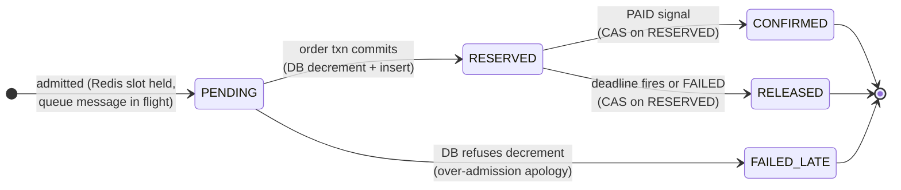
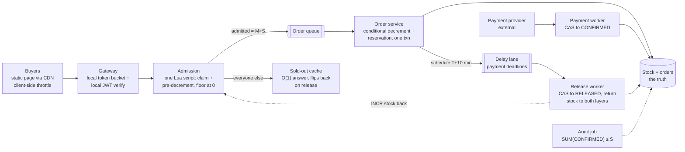
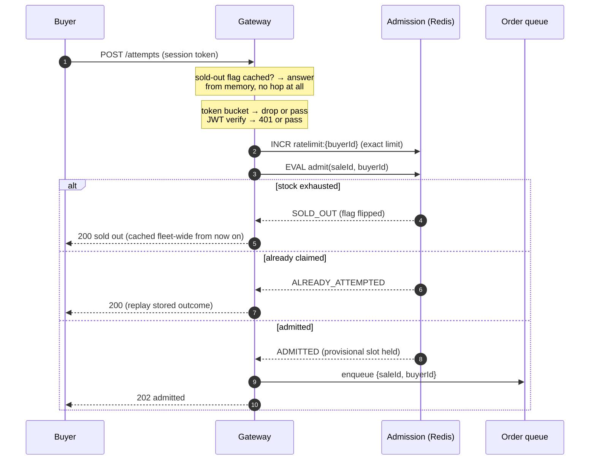
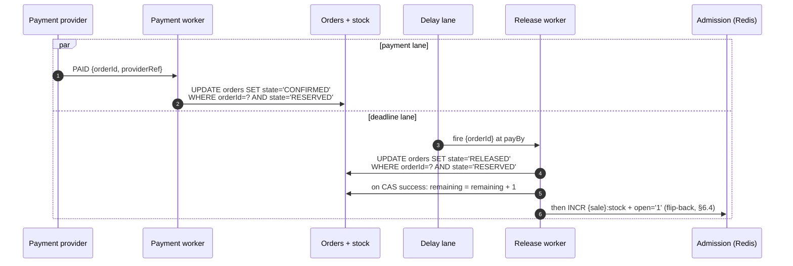

# Flash-Sale Inventory (zero oversell under a 100× stampede)

_This document is the design at production scale (interview altitude). The
buildable specification of the lab system — contracts, schemas, wiring — lives
in [lld.md](./lld.md), which arrives after §9–§10._

## 1. Overview

We are building the inventory-subtraction path for a flash sale: one hot SKU,
stock 1,000, ~100,000 buyers clicking inside one second. The two hard problems
are **enforcing one invariant — stock never goes below zero — at memory speed
under maximal contention**, and **rejecting ≥99% of traffic as cheaply as
possible without lying to anyone for long**. The design is a funnel, not a
faster database.

### 1.1 Problem statement

A flash sale inverts the usual shape of a shop: the interesting case is not
serving the winner, it is saying "no" a hundred thousand times in one second
while saying "yes" exactly 1,000 times — never 1,001. An oversold unit is a
broken customer promise, a support ticket, and possibly compensation; an
unsold unit is retryable. The invariant is therefore asymmetric — transient
under-sell is acceptable, oversell never is — and every mechanism below leans
on that asymmetry. The interview shape of this problem ("seckill", "design a
flash sale", Ticketmaster-adjacent) is graded on whether the candidate turns
the whole system into a funnel or tries to buy a faster database.

### 1.2 The cast — who's who, who owns what

| Party | Owns | How they appear in this system |
|---|---|---|
| **Buyer B** | a session token and one attempt per sale | an authenticated click; no cart, no browsing state on the hot path |
| **Us (the platform)** | the sale config, the admission counters, the reservation state machine, and the **stock truth** (a DB row) | everything in §4 |
| **Payment provider** | the **money truth**, *outside our boundary* | we hand it a reservation and a deadline; it hands back exactly one signal — `PAID` or `FAILED` — which we consume idempotently |

The path in one line: B's click → our admission (memory-speed pre-count) →
our reservation (`RESERVED`, deadline T+10 min) → the provider moves money on
*its* books → our `CONFIRMED` consumes the stock finally. Stock truth never
leaves our DB; money truth never enters it.

## 2. Requirements

### 2.1 Functional requirements

1. **[P1] Buy attempt.** An authenticated buyer makes at most one admission
   claim per sale; the answer is admitted-into-buy-path, sold-out, or
   rate-limited — fast in all three cases.
2. **[P1] Zero oversell.** At every instant, per sale:
   `SUM(CONFIRMED orders) ≤ initial stock`. The hard invariant; it must hold
   through crashes, retries, restores, and operator error.
3. **[P1] Reservation lifecycle.** An admitted attempt becomes a reservation
   (`RESERVED`) with a payment deadline; payment confirms it (`CONFIRMED`);
   the deadline releases it (`RELEASED`) and returns the unit to the pool.
4. **[P1] Sold-out signal.** Once stock is exhausted the system answers "sold
   out" in O(1) from cache, and flips back within seconds when a release
   returns stock.
5. **[P2] Order observation.** A buyer can poll their attempt/order state;
   terminal transitions are observable.
6. **[P2] Continuous audit.** A ledger audit proves FR-2 continuously and on
   demand — the invariant is *checked*, not assumed.

### 2.2 Non-functional requirements

- **Scale, and the shaping fact:** ~100,000 buy attempts in ~1 s against
  stock S = 1,000 — at most 1% can win, so ≥99% of traffic must be rejected
  as cheaply as possible. Page/asset traffic is another 10–50× the attempt
  traffic → static sale page via CDN, zero dynamic calls for browsing.
- **The funnel arithmetic:** admission passes `M × S` into the buy path
  (M = admission multiplier, default 4, range 3–5 — a named business dial,
  §9.4): 4,000 of 100,000 ≈ 4%. The other ~96% get a cached sold-out.
  Downstream sees ~4K order writes drained over ~10 s ≈ **a few hundred
  writes/s at the database — the stampede never reaches it**.
- **The hot-row ceiling (why memory speed):** one relational row sustains
  low-thousands of locked updates/s; 100K/s needs a single-threaded in-memory
  serializer. One Redis shard runs the admission script in <1 ms at ~10⁵
  ops/s — one hot sale ≈ one shard's capacity, which is exactly why the
  gateway must shave load *before* Redis and why hot-SKU relief has an
  escalation path (§9.8).
- **The attempt-surface budget (why the layers hold):** each gateway node's
  local token bucket caps what escapes it — 20 nodes × 1,000/s = a 20K/s
  fleet ceiling on the worst second. Signature rejects are CPU-only. The
  exact rate-limit `INCR`s spread across the cluster by buyer key; only the
  admission `EVAL`s concentrate on the sale's shard: ≤ 20K/s against ~10⁵
  ops/s capacity ≈ **5× headroom on the hottest second**, before the
  sold-out flag removes the crowd from Redis entirely (§6.1, §6.4).
- **Latency:** sold-out p99 < 50 ms (edge/cache) · attempt ack p99 < 200 ms ·
  reservation visible p99 < 2 s (async) · payment window 10 min.
- **Availability, asymmetric:** the reject path survives everything (static
  page + cached sold-out). The buy path may degrade — queueing delays, even
  failing closed to "sold out" — but **correctness beats availability**: no
  failure mode may oversell.
- **Durability, asymmetric:** a `RESERVED` order survives any crash (it is in
  the DB). Admission state in Redis is deliberately *not* durable — it is
  rebuildable from the DB, conservatively (§9.7).
- **Storage:** ~4K orders × ~0.5 KB ≈ 2 MB per sale. Storage is a non-problem
  in this design; noted and moved past.
- **Fairness:** bounded unfairness — roughly arrival order per gateway node,
  no global FIFO (§9.10).

### 2.3 Out of scope

Payment processing internals (we consume `PAID`/`FAILED` signals; the
`payment-system` design in this repo owns that territory) · multi-SKU shard
placement (all keys are per-sale, so N concurrent sales are N independent
funnels; the hot-SKU escalation is §9.8) · bot and fraud scoring beyond rate
limiting · lottery-style fairness (§9.10 names the pivot; same architecture,
different picker) · restock events and multi-round sales · catalog, carts,
checkout UX (a flash sale is buy-now, quantity 1) · queue-position waiting
pages.

## 3. Core entities and APIs

**Entities.** `Sale` (config: skuId, initialStock, startsAt, paymentWindow,
admission multiplier M) · `AdmissionState` (Redis, per sale: a stock counter
and a claimed-set — rebuildable, never authoritative) · `Order` (the
reservation state machine; unique per (saleId, buyerId); carries the payment
deadline and a stored outcome for idempotent replay) · `StockRow` (DB:
`remaining` — **the truth**, only ever mutated by conditional writes) ·
`ReleaseTimer` (one delay message per reservation, fires at the deadline).

**Order states:** every transition is a conditional update on the current
state (CAS), so each applies at most once and late messages no-op (§9.6):



`PENDING` is not a DB state — it is the observable gap between admission and
the order row materializing from the queue (a second or two). `FAILED_LATE`
is terminal and rare by construction: it exists only for the over-admission
edge the second layer refuses (§9.5).

**API** (buyer-authenticated with a signed session token, verified locally at
the gateway — no identity-service call on the hot path, §9.11):

```
POST /v1/sales/{saleId}/attempts                            (buyer)
  → 202 {status:"ADMITTED"}               admitted into the buy path
  → 200 {status:"SOLD_OUT"}               O(1), cache/edge-served
  → 200 {status:"ALREADY_ATTEMPTED"}      one claim per buyer (§9.11)
  → 429                                   rate-limited (edge/local)

GET  /v1/sales/{saleId}/orders/me                           (buyer, polling)
  → {orderId?, state: PENDING|RESERVED|CONFIRMED|RELEASED|FAILED_LATE, payBy?}

POST /internal/payment-events           (payment provider, signed webhook)
  {orderId, outcome: PAID|FAILED, providerRef}    idempotent (§9.6)
```

Identity always comes from the auth token, never the body — a buyer id in the
payload would let one client claim (and burn) another buyer's single attempt.
The attempt response never leaks remaining-stock numbers (a countdown invites
scripted sniping); it answers only the buyer's own outcome. The payment
webhook is signature-verified and idempotent on `providerRef`; replays of the
same signal replay the stored outcome.

There is no client-supplied idempotency key: the natural key
**(saleId, buyerId)** *is* the idempotency key end to end — the Redis claim,
the order-table unique constraint, and response replay all hang off it.

## 4. High-level design



**Gateway** — kills the flood before it costs anything, three checks ordered
cheapest-first: the cached sold-out flag (memory read — once the sale
exhausts, ~100% of traffic dies here for free), a token bucket in each
node's memory (approximate is fine — N nodes × limit is still a fleet
ceiling, §2.2), then local signature verification of the session token —
a CPU-only check; an identity-service lookup per attempt at 100K/s would
melt the identity service, so only unknown/expired tokens pay a real
lookup. Survivors make exactly one network hop, to admission. Ordering
argument and details in §9.11.

**Admission** — one Lua script (§6.1, full listing) against three hash-tagged
per-sale keys: reject on the flag, reject at counter zero (flipping the flag
atomically), reject repeat claimants, else claim + decrement — one atomic
unit. Single-threaded execution makes the script a natural per-sale
serializer at memory speed: ~10⁵ scripts/s on one shard vs ≤ 20K/s arriving
after the gateway shave (§9.1, §9.11). It says yes at most `M × S` times;
every yes is a *provisional* slot, not the truth.

**Sold-out cache** — the answer for the ~96%: the per-sale flag the script
flips at zero, cached in every gateway (~1 s refresh) and pushed to the edge,
served in O(1). Flip-back on release (§6.4). Seconds of staleness, always in
the safe direction (§9.9).

**Order queue** — decouples admission (spiky: 4K admits inside a second) from
order creation (steady drain at the DB's comfortable few hundred writes/s ≈
10 s to clear the whole burst). At-least-once delivery is safe because the
consumer is idempotent on (saleId, buyerId) — the §6.2 crash matrix; bursts
are absorbed and nothing re-enters the attempt path. DLQ isolates poison
items, alarmed.

**Order service** — the queue consumer, the only writer on the truth. One
transaction: the conditional stock decrement (`… WHERE remaining > 0`) plus
the `RESERVED` order insert under the unique constraint; then it schedules
the payment deadline. Contract and crash matrix in §6.2. If the conditional
write refuses — the over-admission edge — the buyer gets a late apology and
the invariant holds (§9.5).

**Delay lane + release worker** — one delay message per reservation fires at
`payBy` (10 min): CAS `RESERVED → RELEASED`, then DB increment, then Redis
flip-back — in that order, so a mid-release crash can strand a unit briefly
but never return it twice (§6.3). A fire that lands after payment is a no-op
by CAS (§9.6). A slow sweeper (1/min over `RESERVED` rows past `payBy`)
backstops lost messages.

**Payment worker** — consumes the provider's signed signal: `PAID` → CAS
`RESERVED → CONFIRMED`; `FAILED` → early release via the same release path.
Idempotent on providerRef (replays replay the stored outcome). The rare
`PAID`-after-`RELEASED` ordering goes to an alarmed refund lane, walked on a
concrete clock in §6.3.

**Audit job** — continuously proves FR-2: per sale,
`SUM(CONFIRMED) ≤ initialStock`, plus the admission-vs-DB drift metric and a
`RELEASED`-without-returned-stock reconciler (§6.3). The invariant is checked
by a query, not assumed (§8).

## 5. Data model

Relational DB (the truth store — §7 prices the KV alternative):

| Table | Keys | Columns / notes |
|---|---|---|
| `sales` | PK `saleId` | `skuId`, `initialStock`, `startsAt`, `endsAt`, `paymentWindowSec` (600), `multiplier` (M, default 4), `admissionPct` (rollout dial, §8). Read-mostly, cached in every gateway |
| `stock` | PK `saleId` | `remaining INT NOT NULL CHECK (remaining >= 0)`. Exactly two mutations exist: the conditional decrement `WHERE remaining > 0` (§9.2) and the release increment. The CHECK constraint is a third, free, belt — a bug that bypasses the WHERE still cannot go negative. **The truth** |
| `orders` | PK `orderId` · **UNIQUE (saleId, buyerId)** · index `(saleId, state)` | `buyerId`, `state`, `payBy`, `providerRef?`, `outcome` (stored response for idempotent replay), `createdAt`, `stateChangedAt`. The unique constraint is the durable one-per-customer backstop; the `(saleId, state)` index serves the audit, the sweeper, and the conversion metric — never the hot path |

Redis (admission — rebuildable, never authoritative, §9.7):

| Key | Type | Contents |
|---|---|---|
| `{sale:<id>}:stock` | STRING (int) | provisional slot counter, seeded `M × initialStock` at sale open; `DECR` by the admit script, `INCR` by releases and failed-late refunds |
| `{sale:<id>}:claimed` | SET | buyerIds that consumed their one attempt; ~100K members ≈ a few MB. TTL = sale window + grace |
| `{sale:<id>}:open` | STRING (0/1) | the sold-out flag gateways cache; flipped by the admit script at zero, cleared by flip-back (§6.4) |
| `ratelimit:{buyerId}` | STRING + EXPIRE | exact per-buyer `INCR` counter, 1 s window — spread across shards by buyer key, deliberately NOT hash-tagged with the sale |

The `{sale:<id>}` hash tag forces `stock`, `claimed`, and `open` onto **one
cluster shard** — Lua atomicity requires every key it touches to be
co-located (§9.11). The rate-limit keys stay un-tagged on purpose: they carry
the full 100K/s and must spread, while the tagged trio carries only
post-shave traffic (§2.2 budget).

Queues:

| Queue | Message | Notes |
|---|---|---|
| Order queue + DLQ | `{saleId, buyerId}` | at-least-once; consumer idempotent on the natural key; DLQ isolates poison items, alarmed |
| Delay lane | `{orderId}`, delivered at `payBy` | one message per reservation; a slow sweeper over `(saleId, state=RESERVED, payBy < now)` backstops lost messages |

Two counters, one truth: `{sale}:stock` (Redis) is *throughput*;
`stock.remaining` (DB) is *truth*. They drift only through crashes and bugs;
the drift metric and the audit exist to prove the drift stays bounded and the
truth never overshoots (§9.2, §9.5).

Access patterns that shaped this: one Lua `EVAL` per surviving attempt
(single shard, single round-trip); point lookups by `orderId` and by the
`(saleId, buyerId)` unique key; one conditional `UPDATE` per order; the only
range read anywhere is the off-hot-path `(saleId, state)` index for
audit/sweeper/metrics. No joins, no scans on the hot path.

## 6. Detailed design

### 6.1 The admission path



The script, in full (§9.11 walks the shard trap and the ordering decision):

```lua
-- KEYS[1] = {sale:<id>}:stock   KEYS[2] = {sale:<id>}:claimed
-- KEYS[3] = {sale:<id>}:open    ARGV[1] = buyerId
-- All three keys share the {sale:<id>} hash tag → one shard → atomic EVAL.
if redis.call('GET', KEYS[3]) == '0' then return 'SOLD_OUT' end
if tonumber(redis.call('GET', KEYS[1])) <= 0 then
  redis.call('SET', KEYS[3], '0')          -- flip the flag exactly once
  return 'SOLD_OUT'
end
if redis.call('SADD', KEYS[2], ARGV[1]) == 0 then return 'ALREADY' end
redis.call('DECR', KEYS[1])
return 'ADMITTED'
```

Single-threaded Redis executes the whole script as one unit — there is no
interleaving to reason about. The last-unit race, concretely: buyers X and Y
both `EVAL` with stock = 1. Redis runs X's script to completion first: X
reads 1, claims, decrements to 0, returns ADMITTED. Y's script then reads 0,
flips `open` to `'0'`, returns SOLD_OUT. No lock, no retry loop, no gap
between the dedup answer and the admission answer — sequential execution *is*
the mutual exclusion (§9.1).

Two ordering decisions inside the script, both deliberate:
- **Stock check before `SADD`:** a sold-out answer must not burn the buyer's
  one claim — if a release flips the sale back open (§6.4), they may try
  again. Claim-first would permanently lock out everyone who clicked during
  a sold-out window.
- **Flag flip inside the script:** the transition to sold-out happens exactly
  once, on the shard that owns the truth about the counter, not by gateways
  inferring it — so the flip is atomic with the last rejection.

Failure edge, named now: the claim lands, then the enqueue or anything after
it fails → that buyer is locked out holding nothing. Bounded (gateway crash
window, not a steady state) but real. §9.11's refinement turns the claimed
SET into a small state ladder (HSET `claimed → enqueued`), so the same
buyer's retry re-enters at the failed step idempotently instead of bouncing
off `ALREADY` — the same replay-don't-reject shape the order table uses one
layer down (§6.2).

### 6.2 Order creation — where the truth gets written

The queue consumer's contract is *exactly-once effect per (saleId, buyerId),
at-least-once delivery notwithstanding*:

1. Receive `{saleId, buyerId}` (possibly a redelivery, possibly a duplicate
   enqueue — assume nothing).
2. Open one transaction:
   `UPDATE stock SET remaining = remaining - 1
   WHERE saleId = ? AND remaining > 0` — the conditional write *is* the
   mutual exclusion (§9.2, §9.3). The row lock serializes concurrent
   consumers; the predicate makes the outcome deterministic at zero.
3. Same transaction:
   `INSERT INTO orders (…, state = 'RESERVED', payBy = now + 600s)`. If the
   UNIQUE (saleId, buyerId) constraint fires, this message is a replay —
   roll back the decrement, read the existing row, replay its stored
   outcome. The constraint converts duplicates into idempotent reads.
4. Commit, then schedule the delay message for `payBy`, then ack the queue
   message. Ordering matters: commit before ack, so a crash anywhere leaves
   a redelivery, never a lost order.
5. Zero rows updated in step 2 = over-admission caught at the second layer
   (§9.5): write the order as `FAILED_LATE` (the stored apology), `INCR` the
   admission counter so the provisional slot returns to the pool, ack.

The crash matrix that makes at-least-once safe:

| Crash point | On redelivery | Net effect |
|---|---|---|
| before the txn | full retry | exactly one order |
| inside the txn | txn rolled back, full retry | exactly one order |
| after commit, before ack | step 3's unique constraint → replay stored outcome | exactly one order, one duplicate delay message (harmless: second CAS no-ops, §9.6) |
| after ack | nothing redelivered | done |

Never read-then-write on stock: a `SELECT remaining` followed by an
unconditional `UPDATE` reintroduces exactly the race the conditional write
exists to kill — two consumers both read 1, both write 0, two units sold on
one remaining. The predicate form makes the storage engine the arbiter; the
`CHECK (remaining >= 0)` constraint (§5) backstops even a future bug that
edits the SQL.

### 6.3 Payment outcome vs. the deadline — a race, by design



Both lanes guard on `state = 'RESERVED'`, so exactly one wins; the loser's
update matches zero rows and no-ops. That single guard is the entire
double-return defense: a late deadline after payment cannot release, and a
duplicate release cannot increment twice (§9.6). The release itself is
ordered deliberately — **CAS first, DB increment second, Redis increment
last**: the stock only returns to the pool after the state machine has
irrevocably recorded the release, so a crash mid-release strands at most one
unit temporarily (the sweeper's re-fire no-ops on the CAS and a reconciler
re-derives the increments from `RELEASED`-without-return rows) rather than
ever returning one unit twice.

The one ugly ordering — `PAID` arrives *after* the deadline released the
unit. On a concrete clock: reservation at 12:00:00, `payBy` 12:10:00; the
buyer completes payment at 12:09:59.4; the provider's webhook leaves at
12:10:00.8; the delay message fired at 12:10:00.0 and the release CAS
committed at 12:10:00.3. The payment worker's CAS to `CONFIRMED` now matches
zero rows (state is `RELEASED`) — money moved, reservation gone. That order
enters an **alarmed refund lane** — never silent, resolved with the
provider's own idempotent refund, and rare by construction: it needs a
payment inside the final second *and* a slow signal. Two design dials keep
it rare: the client-facing pay button disables at `payBy − ε` (UX grace),
and the delay lane fires at `payBy` exactly, no early firing. The
alternative — honoring late payment by extending the reservation — would
mean a unit promised twice, the one thing this design never does.

### 6.4 Sold-out: flip and flip-back

The flip is owned by the admission script (§6.1): the request that observes
zero flips `{sale}:open` to `'0'` atomically with its own rejection.
Gateways poll-or-subscribe the flag and serve the cached sold-out from then
on — the crowd stops touching Redis entirely, which is what lets one shard
survive the stampede (§2.2).

Flip-back rides the release path (§6.3): after the DB increment, the release
worker `INCR`s `{sale}:stock` and sets `{sale}:open = '1'`. Gateway caches
lag by their refresh interval (~1 s), so buyers may see "sold out" while a
returned unit exists — seconds of staleness in the safe direction, priced in
§9.9. The unsafe direction cannot come from staleness at all: an admitted
attempt always re-checks the counter inside the script, and the DB
conditional write backstops even a wrongly-open flag (§9.5). The flag is
plain-SET rather than CAS-guarded on purpose: the worst a racing flip/flip-
back can produce is a transiently wrong *advisory* flag, and both readers of
consequence re-verify against the counter or the DB.

### 6.5 Recovery in one paragraph

Redis gone = admission fails closed: the gateway treats script
errors/timeouts as "sold out", nothing can oversell while we are blind. On
restore, rebuild conservatively from the truth, in order:

1. Hold admission closed (`{sale}:open = '0'`) while rebuilding.
2. `claimed` := all buyerIds holding an order row for the sale (any state) —
   one indexed query.
3. `stock` := `M × DB.remaining − (queue depth estimate)`, floored at zero —
   DB `remaining` is the only number that must be right; the in-flight
   subtraction only avoids over-admitting into a backlog.
4. Reopen (`open = '1'`) only if the rebuilt counter is positive.

Both estimates err toward *under*-admission — the recoverable direction. The
buyers whose claims lived only in the lost claimed-set (admitted but never
ordered) are forgiven a second attempt; the order-table unique constraint
absorbs any that already ordered. The full walk, including why forgiving
those few is fine, is §9.7.

## 7. Alternatives considered

Compact scorecards; full reasoning lands in the deep dives.

**The decrement point** (§9.1–§9.3)

| Option | Throughput at the hot row | Crash behavior | Verdict |
|---|---|---|---|
| DB row lock only | ~10³ locked updates/s — funnel must admit ≈ stock exactly, killing the abandonment margin | correct but slow everywhere | rejected |
| Redis only, no DB authority | memory-speed | failover/restore glitch can mint phantom stock → oversell owns a money-adjacent invariant | rejected |
| Distributed lock around the decrement | same serialization, lower throughput | TTL expiry during a pause, fencing tokens — liveness failure modes a conditional write doesn't have | rejected |
| **Redis admission + DB conditional write** | memory-speed where it matters, ~10²/s where truth lives | oversell requires both layers to fail in the same direction | **chosen** (§9.2) |

**Deadline mechanism** (§9.6)

| Option | Release precision | Failure mode | Verdict |
|---|---|---|---|
| Periodic sweeper only | its period — a 60 s sweep holds units hostage a minute of the hottest window | simple, robust | rejected as primary |
| Per-reservation delay message | second-level | a lost message strands one reservation | **chosen as primary** |
| **Delay message + slow sweeper backstop** | second-level, minute-level floor | strand window bounded by sweep period | **chosen** — precision from one, a floor from the other |

**Admission → order coupling.** *Direct synchronous call:* the order
service's availability multiplies into the attempt path, and the
4K-in-one-second admit burst hits the DB at burst rate. *Queue:* absorbs the
burst (4,000 admitted in ~1 s, drained at a steady few hundred/s ≈ 10 s to
clear), retry + DLQ semantics for free, attempt path stays flat. Costs:
eventual order visibility (`PENDING` for a second or two) and an idempotent
consumer — both already required by other constraints. **Chosen: queue.**

**One-per-customer placement** (§9.11). *DB unique constraint only:* correct,
but every duplicate costs a DB round-trip mid-storm — the constraint is the
backstop, not the bouncer. *Gateway-memory only:* evaporates on restart and
multiplies by node count. **Chosen: SADD claim inside the admission script**
(atomic with the stock check, one shard, no extra hop) **plus the unique
constraint as the durable backstop.**

**Truth store: relational vs key-value.** Both support the required
conditional write (`WHERE remaining > 0` vs a condition expression). The
unique constraint and the one-line aggregate audit are native to relational;
on key-value they become an extra conditional item and a scan. Nothing here
needs relational scale-out — the DB sees hundreds of writes/s, not the
stampede (§2.2). **Chosen: relational**, with the honest note that a team
fluent in a conditional-write KV store loses little; lld.md pins the lab
choice.

**Fairness** (§9.10). *Global FIFO:* needs a single sequencer — a new
bottleneck and failure domain purchased to deliver a property the business
did not ask for. *Lottery over a collection window:* the fairest option and a
legitimate product choice; same architecture, different picker. **Chosen:
bounded unfairness** (≈ arrival order per gateway), lottery documented as the
pivot.

## 8. Failure analysis and operations

| Failure | Blast radius | Behavior |
|---|---|---|
| Redis crash mid-sale | admission blind | fail closed → "sold out" while blind; conservative rebuild from the DB (§9.7); transient under-sell possible, oversell impossible |
| Order queue backlog | order latency | nothing lost (durable queue); volume pre-bounded at M×S; alarm on oldest-message age |
| Double-click / retry storm | none (by design) | token bucket sheds; claim + unique constraint collapse duplicates into replay (§9.11) |
| Payment provider slow/down | conversions stall | reservations release at deadline, stock returns to the pool; conversion-rate alarm; late `PAID` → refund lane (§6.3) |
| Over-admission bug (multiplier misconfig, rebuild error) | a few late apologies | the DB conditional write refuses the excess — the invariant holds at layer 2 (§9.5); admission-vs-DB drift alarm |
| Delay message lost | one stranded reservation | backstop sweeper releases it; alarm on max `RESERVED` age |
| Order service crash mid-transaction | none (by design) | the transaction is atomic; the queue redelivers; the consumer replays idempotently on (saleId, buyerId) |
| Sold-out cache stale during flip-back | seconds of "sold out" while a unit exists | accepted — staleness only ever points in the safe direction (§9.9) |

**Metrics that page:** the audit query `SUM(CONFIRMED) ≤ initialStock`
failing (severity-1 — the invariant broke) · admission-vs-DB drift beyond
`M × S` (over-admission beyond design) · refund-lane entries (each one is a
customer who paid and lost the unit) · DLQ depth > 0 · oldest queue message
age past the drain budget · max `RESERVED` age past `payBy` + sweep period
(both timers failed).

**Dashboards, not pages:** conditional-write refusal rate (≈0 expected; a
few during flip-back races are design-normal) · reservation→payment
conversion (the business dial M feeds on this, §9.4) · attempt p99 and
sold-out p99 · claimed-set size vs admitted count · flip-back frequency.

**Measure at the caller:** server-side latency metrics only count requests
that completed — a client-timeout storm is invisible in them. The gateway
emits the attempt timer on success *and* failure, plus a distinct timeout
counter; the buy path is judged from where the buyer stands.

**Rollout and rollback:** `sales.admissionPct` (§5) is the dial — the
admission script admits that fraction of otherwise-admissible attempts
(deterministic on a buyerId hash, so one buyer sees a consistent answer).
Start at 1%, raise in stages. Rollback = dial to 0: the queue drains,
reservations resolve by payment or deadline, no state is stranded — the sale
can resume with stock intact. The same dial doubles as the load-shedding
control during an incident.
