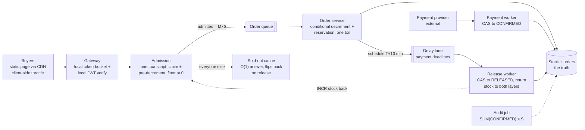
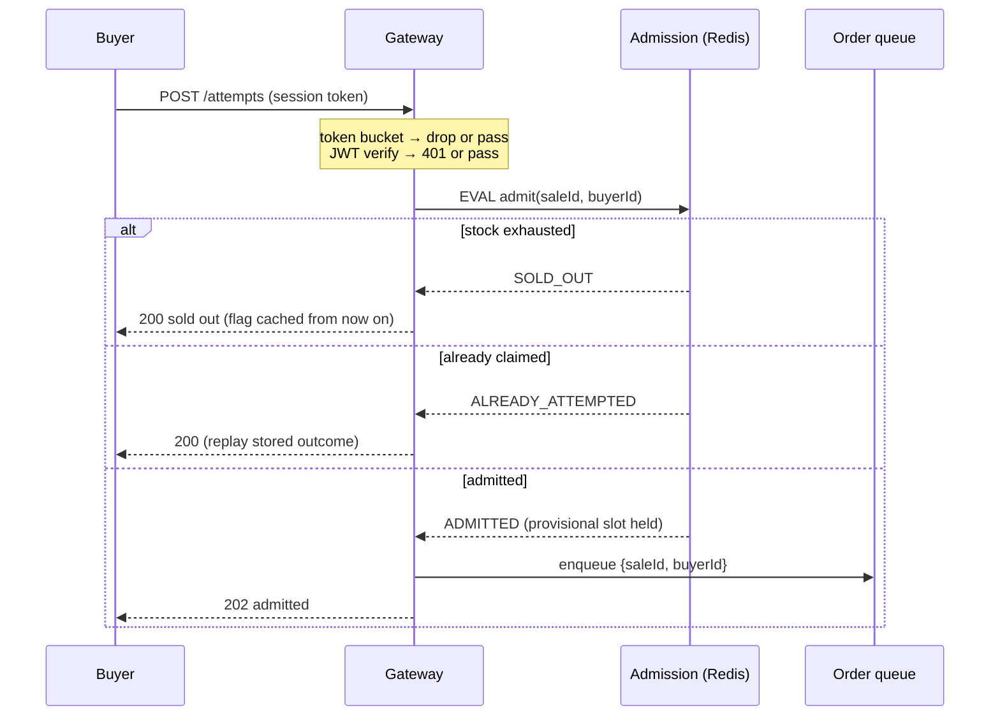
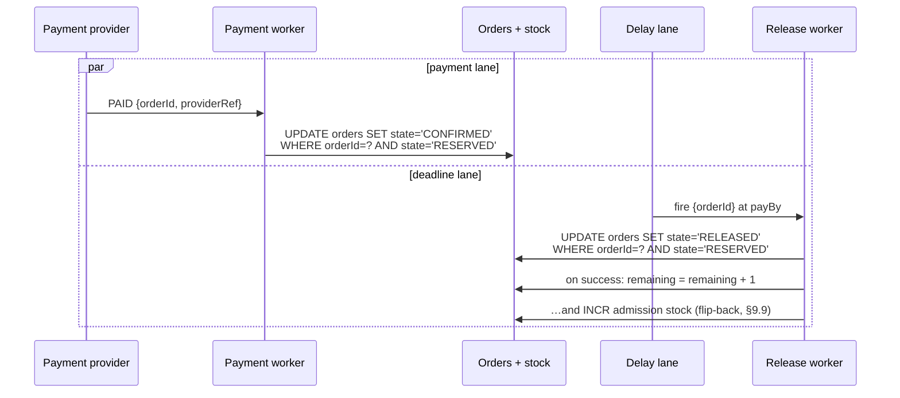

# Flash-Sale Inventory (zero oversell under a 100× stampede)

## 1. Overview

We are building the inventory-subtraction path for a flash sale: one hot SKU,
stock 1,000, ~100,000 buyers clicking inside one second. The two hard problems
are **enforcing one invariant — stock never goes below zero — at memory speed
under maximal contention**, and **rejecting ≥99% of traffic as cheaply as
possible without lying to anyone for long**. The design is a funnel, not a
faster database.

### 1.1 Problem statement

A flash sale inverts the usual shape of a shop: the interesting case is not
serving the winner, it is saying "no" a hundred thousand times in one second
while saying "yes" exactly 1,000 times — never 1,001. An oversold unit is a
broken customer promise, a support ticket, and possibly compensation; an
unsold unit is retryable. The invariant is therefore asymmetric — transient
under-sell is acceptable, oversell never is — and every mechanism below leans
on that asymmetry. The interview shape of this problem ("seckill", "design a
flash sale", Ticketmaster-adjacent) is graded on whether the candidate turns
the whole system into a funnel or tries to buy a faster database.

### 1.2 The cast — who's who, who owns what

| Party | Owns | How they appear in this system |
|---|---|---|
| **Buyer B** | a session token and one attempt per sale | an authenticated click; no cart, no browsing state on the hot path |
| **Us (the platform)** | the sale config, the admission counters, the reservation state machine, and the **stock truth** (a DB row) | everything in §4 |
| **Payment provider** | the **money truth**, *outside our boundary* | we hand it a reservation and a deadline; it hands back exactly one signal — `PAID` or `FAILED` — which we consume idempotently |

The path in one line: B's click → our admission (memory-speed pre-count) →
our reservation (`RESERVED`, deadline T+10 min) → the provider moves money on
*its* books → our `CONFIRMED` consumes the stock finally. Stock truth never
leaves our DB; money truth never enters it.

## 2. Requirements

### 2.1 Functional requirements

1. **[P1] Buy attempt.** An authenticated buyer makes at most one admission
   claim per sale; the answer is admitted-into-buy-path, sold-out, or
   rate-limited — fast in all three cases.
2. **[P1] Zero oversell.** At every instant, per sale:
   `SUM(CONFIRMED orders) ≤ initial stock`. The hard invariant; it must hold
   through crashes, retries, restores, and operator error.
3. **[P1] Reservation lifecycle.** An admitted attempt becomes a reservation
   (`RESERVED`) with a payment deadline; payment confirms it (`CONFIRMED`);
   the deadline releases it (`RELEASED`) and returns the unit to the pool.
4. **[P1] Sold-out signal.** Once stock is exhausted the system answers "sold
   out" in O(1) from cache, and flips back within seconds when a release
   returns stock.
5. **[P2] Order observation.** A buyer can poll their attempt/order state;
   terminal transitions are observable.
6. **[P2] Continuous audit.** A ledger audit proves FR-2 continuously and on
   demand — the invariant is *checked*, not assumed.

### 2.2 Non-functional requirements

- **Scale, and the shaping fact:** ~100,000 buy attempts in ~1 s against
  stock S = 1,000 — at most 1% can win, so ≥99% of traffic must be rejected
  as cheaply as possible. Page/asset traffic is another 10–50× the attempt
  traffic → static sale page via CDN, zero dynamic calls for browsing.
- **The funnel arithmetic:** admission passes `M × S` into the buy path
  (M = admission multiplier, default 4, range 3–5 — a named business dial,
  §9.4): 4,000 of 100,000 ≈ 4%. The other ~96% get a cached sold-out.
  Downstream sees ~4K order writes drained over ~10 s ≈ **a few hundred
  writes/s at the database — the stampede never reaches it**.
- **The hot-row ceiling (why memory speed):** one relational row sustains
  low-thousands of locked updates/s; 100K/s needs a single-threaded in-memory
  serializer. One Redis shard runs the admission script in <1 ms at ~10⁵
  ops/s — one hot sale ≈ one shard's capacity, which is exactly why the
  gateway must shave load *before* Redis and why hot-SKU relief has an
  escalation path (§9.8).
- **Latency:** sold-out p99 < 50 ms (edge/cache) · attempt ack p99 < 200 ms ·
  reservation visible p99 < 2 s (async) · payment window 10 min.
- **Availability, asymmetric:** the reject path survives everything (static
  page + cached sold-out). The buy path may degrade — queueing delays, even
  failing closed to "sold out" — but **correctness beats availability**: no
  failure mode may oversell.
- **Durability, asymmetric:** a `RESERVED` order survives any crash (it is in
  the DB). Admission state in Redis is deliberately *not* durable — it is
  rebuildable from the DB, conservatively (§9.7).
- **Storage:** ~4K orders × ~0.5 KB ≈ 2 MB per sale. Storage is a non-problem
  in this design; noted and moved past.
- **Fairness:** bounded unfairness — roughly arrival order per gateway node,
  no global FIFO (§9.10).

### 2.3 Out of scope

Payment processing internals (we consume `PAID`/`FAILED` signals; the
`payment-system` design in this repo owns that territory) · multi-SKU shard
placement (all keys are per-sale, so N concurrent sales are N independent
funnels; the hot-SKU escalation is §9.8) · bot and fraud scoring beyond rate
limiting · lottery-style fairness (§9.10 names the pivot; same architecture,
different picker) · restock events and multi-round sales · catalog, carts,
checkout UX (a flash sale is buy-now, quantity 1) · queue-position waiting
pages.

## 3. Core entities and APIs

**Entities.** `Sale` (config: skuId, initialStock, startsAt, paymentWindow,
admission multiplier M) · `AdmissionState` (Redis, per sale: a stock counter
and a claimed-set — rebuildable, never authoritative) · `Order` (the
reservation state machine; unique per (saleId, buyerId); carries the payment
deadline and a stored outcome for idempotent replay) · `StockRow` (DB:
`remaining` — **the truth**, only ever mutated by conditional writes) ·
`ReleaseTimer` (one delay message per reservation, fires at the deadline).

**Order states:** `RESERVED → CONFIRMED | RELEASED` — every transition is a
conditional update on the current state (CAS), so each applies at most once
and late messages no-op (§9.6).

**API** (buyer-authenticated with a signed session token, verified locally at
the gateway — no identity-service call on the hot path, §9.11):

```
POST /v1/sales/{saleId}/attempts
  → 202 {status:"ADMITTED"}               admitted into the buy path
  → 200 {status:"SOLD_OUT"}               O(1), cache/edge-served
  → 200 {status:"ALREADY_ATTEMPTED"}      one claim per buyer (§9.11)
  → 429                                   rate-limited (edge/local)

GET  /v1/sales/{saleId}/orders/me
  → {orderId?, state: PENDING|RESERVED|CONFIRMED|RELEASED, payBy?}
    (PENDING = admitted, order row not yet materialized from the queue)

POST /internal/payment-events           from the payment provider
  {orderId, outcome: PAID|FAILED, providerRef}    idempotent (§9.6)
```

There is no client-supplied idempotency key: the natural key
**(saleId, buyerId)** *is* the idempotency key end to end — the Redis claim,
the order-table unique constraint, and response replay all hang off it.

## 4. High-level design



**Gateway** — kills the flood before it costs anything: a token bucket in
each node's memory (approximate is fine — N nodes × limit is still a
ceiling), then local signature verification of the session token. Survivors
make exactly one network hop, to admission. Ordering argument and details in
§9.11.

**Admission** — one Lua script against per-sale keys: reject if stock ≤ 0,
reject if this buyer already claimed, else claim + decrement — atomically.
Single-threaded execution makes the script a natural per-sale serializer at
memory speed (§9.1, §9.11). It says yes at most `M × S` times; every yes is a
*provisional* slot, not the truth.

**Sold-out cache** — the answer for the ~96%: a per-sale flag flipped when
admission hits zero, served from gateway/edge cache in O(1), flipped back
when a release returns stock. Seconds of staleness, always in the safe
direction (§9.9).

**Order queue** — decouples admission (spiky: 4K in a second) from order
creation (steady drain). At-least-once delivery is safe because the consumer
is idempotent on (saleId, buyerId); bursts are absorbed and nothing re-enters
the attempt path.

**Order service** — the only writer on the truth. One transaction: the
conditional stock decrement (`… WHERE remaining > 0`) plus the `RESERVED`
order insert under the unique constraint; then it schedules the payment
deadline. If the conditional write refuses — the over-admission edge — the
buyer gets a late apology and the invariant holds (§9.5).

**Delay lane + release worker** — one delay message per reservation fires at
the deadline: CAS `RESERVED → RELEASED`, return the unit to the DB and to the
admission counter. A fire that lands after payment is a no-op by CAS (§9.6).
A slow sweeper backstops lost messages.

**Payment worker** — consumes the provider's signal: `PAID` → CAS
`RESERVED → CONFIRMED`; `FAILED` → early release. Idempotent on providerRef.
The rare `PAID`-after-`RELEASED` ordering goes to an alarmed refund lane
(§6.3).

**Audit job** — continuously proves FR-2: per sale,
`SUM(CONFIRMED) ≤ initialStock`, plus the admission-vs-DB drift metric. The
invariant is checked by a query, not assumed (§8).

## 5. Data model

| Store | Keys | Notes / access patterns |
|---|---|---|
| Admission (Redis) | `{sale:<id>}:stock` counter · `{sale:<id>}:claimed` SET | hash-tagged so both keys land on one shard — Lua atomicity requires it (§9.11). TTL = sale window + grace. 100K claimed members ≈ a few MB. Rebuildable from the DB, never authoritative (§9.7) |
| `sales` | PK `saleId` | config: skuId, initialStock, startsAt, paymentWindow, M. Read-mostly, cached |
| `stock` | PK `saleId` | one row: `remaining`. Exactly two mutations exist: conditional decrement (`WHERE remaining > 0`, §9.2) and release increment. **The truth** |
| `orders` | PK `orderId` · **unique (saleId, buyerId)** · index `saleId → state` | reservation state machine + stored outcome (idempotent replay). The unique constraint is the durable one-per-customer backstop; the index serves the audit and the sweeper |
| Order queue + DLQ | — | admitted attempts `{saleId, buyerId}`; DLQ isolates poison items |
| Delay lane | — | one message per reservation `{orderId}`, delivered at `payBy` |

Two counters, one truth: `{sale}:stock` (Redis) is *throughput*;
`stock.remaining` (DB) is *truth*. They drift only through crashes and bugs;
the drift metric and the audit exist to prove the drift stays bounded and the
truth never overshoots (§9.2, §9.5).

Relational is the working assumption for the truth store — a unique
constraint, a conditional UPDATE, and a one-line aggregate audit are its home
turf. §7 prices the alternative; lld.md pins the lab choice.

## 6. Detailed design

### 6.1 The admission path



The script, in essence (§9.11 walks every line and the shard trap):

```lua
if tonumber(redis.call('GET', stockKey)) <= 0 then return 'SOLD_OUT' end
if redis.call('SADD', claimedKey, buyerId) == 0 then return 'ALREADY' end
redis.call('DECR', stockKey)
return 'ADMITTED'
```

Single-threaded Redis executes the whole script as one unit: no gap between
the dedup answer and the admission answer, no interleaving between two buyers
racing for the last unit. Checking stock *before* consuming the claim means a
sold-out answer does not burn the buyer's one claim — if a release flips the
sale back open (§9.9), they may try again.

Failure edge, named now: the claim lands, then the enqueue or anything after
it fails → that buyer is locked out holding nothing. §9.11's refinement turns
the claim into a small state ladder (claimed → ordered) so the same buyer's
retry proceeds idempotently instead of bouncing.

### 6.2 Order creation — where the truth gets written

The queue consumer runs **one transaction**:

1. `UPDATE stock SET remaining = remaining - 1
   WHERE saleId = ? AND remaining > 0` — the conditional write *is* the
   mutual exclusion (§9.2, §9.3). Zero rows updated = over-admission caught;
   the excess is refused here, at the second layer (§9.5).
2. `INSERT INTO orders (…, state = 'RESERVED', payBy = now + paymentWindow)`
   — the unique (saleId, buyerId) constraint collapses redelivered queue
   items and double-enqueues into a replay of the stored outcome.

On commit: schedule the delay message for `payBy`. On conditional-write
refusal: record the attempt as failed-late (the apology, §9.5) and `INCR` the
admission counter so the provisional slot returns to the pool.

Never read-then-write on stock: a `SELECT remaining` followed by an
unconditional `UPDATE` reintroduces exactly the race the conditional write
exists to kill.

### 6.3 Payment outcome vs. the deadline — a race, by design



Both lanes guard on `state = 'RESERVED'`, so exactly one wins; the loser's
update matches zero rows and no-ops. That single guard is the entire
double-return defense: a late deadline after payment cannot release, and a
duplicate release cannot increment twice (§9.6).

The one ugly ordering — `PAID` arrives *after* the deadline released the unit
(buyer paid at 9:59.9, the timer fired at 10:00.0, the signal lagged): the
CAS to `CONFIRMED` fails because state is `RELEASED`; money moved but the
reservation is gone. That order enters an **alarmed refund lane** — rare (it
needs a payment inside the final seconds *and* a slow signal), never silent,
resolved with the provider's own idempotent refund. The alternative —
honoring late payment by extending the reservation — would mean a unit
promised twice, the one thing this design never does.

### 6.4 Sold-out: flip and flip-back

Admission hitting zero flips a per-sale flag; gateways serve the cached
sold-out from then on without touching Redis. A release (§6.3) increments the
admission counter and clears the flag. Between the increment and the clear,
buyers may see "sold out" while one unit exists — seconds of staleness in the
safe direction. The unsafe direction (admitting without stock) cannot come
from staleness at all: admission always re-checks its own counter, and the DB
conditional write backstops even that (§9.9, §9.5).

### 6.5 Recovery in one paragraph

Redis gone = admission fails closed: attempts get "sold out", nothing can
oversell while we are blind. On restore, rebuild conservatively from the
truth: admission stock := DB `remaining` − in-flight admissions not yet
ordered (estimated from queue depth), floored at zero; claimed-set := buyers
holding an order row. Both estimates err toward *under*-admission — the
recoverable direction. The full walk, including why the rebuilt claimed-set
may forgive a few second attempts and why that is fine, is §9.7.

## 7. Alternatives considered

**The decrement point** (§9.1–§9.3). *DB row lock only:* correct and simple,
but one hot row sustains ~10³ locked updates/s — the funnel would have to
admit ≈ stock exactly, killing the conversion margin abandonment requires.
*Redis only, no DB authority:* memory-speed, but failover and durability
semantics would own a money-adjacent invariant — a restore glitch becomes
oversell. *Distributed lock around the decrement:* serializes the same
operation at lower throughput and adds liveness failure modes (TTL expiry
during a pause, fencing tokens) that a conditional write simply does not
have. **Chosen: Redis admission + DB conditional write** — speed where speed
lives, truth where truth lives; oversell now requires both layers to fail in
the same direction (§9.2).

**Admission → order coupling.** *Direct synchronous call:* the order
service's availability multiplies into the attempt path, and the
4K-in-one-second admit burst hits the DB at burst rate. *Queue:* absorbs the
burst (4,000 admitted in ~1 s, drained at a steady few hundred/s ≈ 10 s to
clear), retry + DLQ semantics for free, attempt path stays flat. Costs:
eventual order visibility (`PENDING` for a second or two) and an idempotent
consumer — both already required by other constraints. **Chosen: queue.**

**One-per-customer placement** (§9.11). *DB unique constraint only:* correct,
but every duplicate costs a DB round-trip mid-storm — the constraint is the
backstop, not the bouncer. *Gateway-memory only:* evaporates on restart and
multiplies by node count. **Chosen: SADD claim inside the admission script**
(atomic with the stock check, one shard, no extra hop) **plus the unique
constraint as the durable backstop.**

**Deadline mechanism** (§9.6). *Periodic sweeper scanning expired
reservations:* simple, but its period is stranded-stock time — a 60 s sweep
holds units hostage for up to a minute of the sale's hottest window.
*Per-reservation delay message:* fires at the deadline with second-level
precision. **Chosen: delay message, with a slow sweeper as backstop** for
lost messages — precision from the former, a floor from the latter.

**Truth store: relational vs key-value.** Both support the required
conditional write (`WHERE remaining > 0` vs a condition expression). The
unique constraint and the one-line aggregate audit are native to relational;
on key-value they become an extra conditional item and a scan. Nothing here
needs relational scale-out — the DB sees hundreds of writes/s, not the
stampede (§2.2). **Chosen: relational**, with the honest note that a team
fluent in a conditional-write KV store loses little; lld.md pins the lab
choice.

**Fairness** (§9.10). *Global FIFO:* needs a single sequencer — a new
bottleneck and failure domain purchased to deliver a property the business
did not ask for. *Lottery over a collection window:* the fairest option and a
legitimate product choice; same architecture, different picker. **Chosen:
bounded unfairness** (≈ arrival order per gateway), lottery documented as the
pivot.

## 8. Failure analysis and operations

| Failure | Blast radius | Behavior |
|---|---|---|
| Redis crash mid-sale | admission blind | fail closed → "sold out" while blind; conservative rebuild from the DB (§9.7); transient under-sell possible, oversell impossible |
| Order queue backlog | order latency | nothing lost (durable queue); volume pre-bounded at M×S; alarm on oldest-message age |
| Double-click / retry storm | none (by design) | token bucket sheds; claim + unique constraint collapse duplicates into replay (§9.11) |
| Payment provider slow/down | conversions stall | reservations release at deadline, stock returns to the pool; conversion-rate alarm; late `PAID` → refund lane (§6.3) |
| Over-admission bug (multiplier misconfig, rebuild error) | a few late apologies | the DB conditional write refuses the excess — the invariant holds at layer 2 (§9.5); admission-vs-DB drift alarm |
| Delay message lost | one stranded reservation | backstop sweeper releases it; alarm on max `RESERVED` age |
| Order service crash mid-transaction | none (by design) | the transaction is atomic; the queue redelivers; the consumer replays idempotently on (saleId, buyerId) |
| Sold-out cache stale during flip-back | seconds of "sold out" while a unit exists | accepted — staleness only ever points in the safe direction (§9.9) |

**Dashboards/SLIs:** conditional-write refusal rate (≈0) · admission-vs-DB
drift (≈0, alarmed) · the audit query `SUM(CONFIRMED) ≤ initialStock` (pass,
continuously) · queue depth and oldest-message age · reservation→payment
conversion rate · max `RESERVED` age · refund-lane count (≈0, each one
paged) · attempt p99 · sold-out p99.

**Measure at the caller:** server-side latency metrics only count requests
that completed — a client-timeout storm is invisible in them. The gateway
emits the attempt timer on success *and* failure, plus a distinct timeout
counter; the buy path is judged from where the buyer stands.

**Rollout and rollback:** admission percentage is a dial (start at 1%, raise
in stages behind a flag). Rollback = dial to 0: the queue drains,
reservations resolve by payment or deadline, no state is stranded — the sale
can resume with stock intact. The same dial doubles as the load-shedding
control during an incident.
