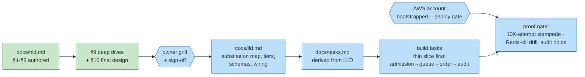

# Ledger — flash-sale-inventory

## Work DAG

Encoding: green = done, blue = pending; rectangles = artifacts, hexagons =
external gates. The AWS gate binds at deployment only — development never
blocks on it (repo rule). The proof gate is design-specific and
non-negotiable: a load harness fires ≥10K concurrent buy attempts at stock
100, a ledger audit asserts `SUM(confirmed) ≤ initial stock`; then the same
run repeats with a mid-sale Redis kill + conservative rebuild and the audit
must still hold — under-sell allowed, oversell never.

## Ledger

| Date | Work item | Outcome | Evidence |
|---|---|---|---|
| 2026-09-21 | Scope locked with owner: single hot SKU centered (per-sale keys generalize; multi-SKU placement out of scope), payment window 10 min via delay message, bounded unfairness (lottery documented as the pivot), one-per-customer on, payment processing external (consume PAID/FAILED signals; payment-system design owns that territory) | defaults ratified, design brief pinned | chat checkpoint 1a |
| 2026-09-21 | HLD §1–§8 authored: funnel admission (token bucket → local JWT → one Lua script: claim + pre-decrement, stock-check-before-claim so sold-out never burns the claim), invariant enforced twice (Redis Lua for throughput, DB conditional write for truth), reservation state machine RESERVED→CONFIRMED\|RELEASED with CAS-guarded deadline race and an alarmed refund lane for PAID-after-RELEASED, (saleId, buyerId) as the natural idempotency key end to end, fail-closed admission with conservative rebuild, staged admission dial as both rollout and load-shed control. Deep-dive numbering 9.1–9.11 pre-wired from §1–§8 | docs/hld.md at review altitude | e4f77ca |
| 2026-09-22 | HLD §1–§8 deepened to the uber-like-rides altitude per owner review: order state machine diagram (PENDING/FAILED_LATE made explicit), attempt-surface budget arithmetic (fleet ceiling → per-shard headroom), attribute-level §5 schemas (CHECK constraint third belt, hash-tag placement rationale, un-tagged rate-limit keys), full annotated admission Lua with last-unit race walkthrough and two ordering decisions, §6.2 consumer contract + crash matrix, release ordering (CAS → DB → Redis) with concrete-clock refund-lane timeline, numbered conservative-rebuild recipe, §7 scorecard tables, §8 pages-vs-dashboards split with admissionPct dial mechanics | docs/hld.md §1–§8 | 3e14286 |
| 2026-09-22 | §9 Deep Dives (11 dives, adapted from the source Q&A bank into the repo format with planned code paths) + §10 final whiteboard with dive-annotated nodes/edges, what-changed list, and "One buy attempt, start to finish" (11 steps: instant winner, cached loser, double-click replay, waiting-lane catch of an abandoned unit, paid-at-the-buzzer refund lane, mid-sale Redis failover, closing audit). Semantic correction folded into §1–§8 in the same pass: zero-stock at the consumer is a WAITING-LANE requeue until the drain deadline, not an instant FAILED_LATE — the admission multiplier is only coherent if extras wait for abandonment releases; releases are waiters-first, public re-admission only when the lane is empty | docs/hld.md §3–§10 complete | this commit |
