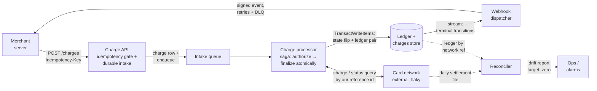
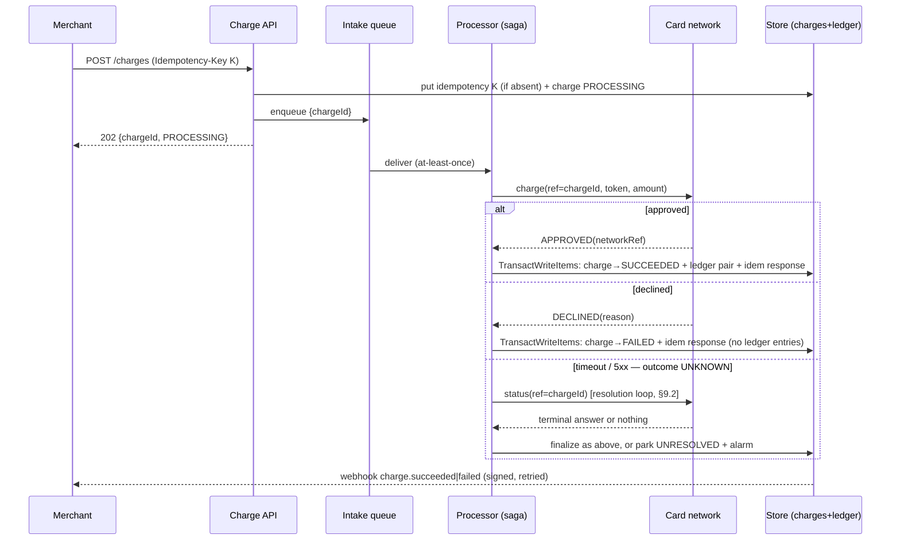
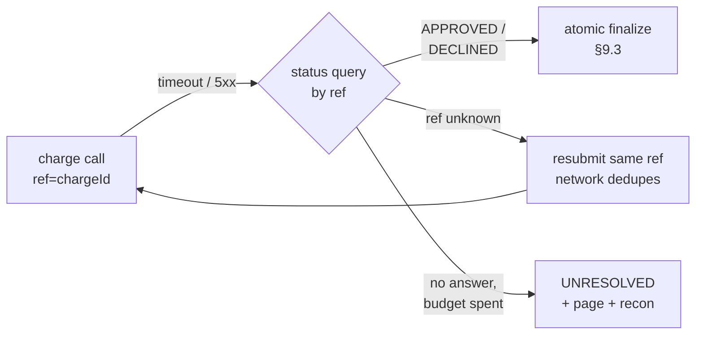
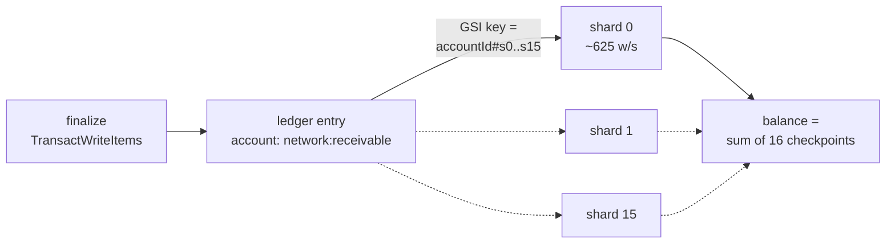

# Payment System (Stripe-style charges on a double-entry ledger)

## 1. Overview

We are building a payment processor: merchants charge their customers' cards
through us instead of integrating with card networks themselves. The two hard
problems are **exactly-once money movement over an unreliable external card
network** (retries everywhere, timeouts that don't tell you whether money moved)
and **provable correctness of balances** (an append-only double-entry ledger as
the single source of truth, reconciled against the network's own records).

### 1.1 Problem statement

A merchant who wants to accept card payments needs connectivity to card
networks, an idempotent API that tolerates client retries, durable records that
survive audits, and a way to know their balance is *right* — not approximately
right. Building this per-merchant is prohibitive; a processor does it once,
behind one API. The interview shape of this problem (HelloInterview "Payment
System", asked at Coinbase/Revolut in ledger/wallet form) is graded almost
entirely on failure handling: what happens when the network times out, when the
client retries, when your process crashes between "network said yes" and "we
recorded it".

## 2. Requirements

### 2.1 Functional requirements

1. **[P1] Create charge.** A merchant initiates a charge (amount in minor
   units, currency, tokenized card) with a client-supplied idempotency key.
   The API acknowledges fast; processing is asynchronous.
2. **[P1] Process to terminal state.** The system executes the charge against
   the external card network and drives it to `SUCCEEDED` or `FAILED`, no
   matter how the network or our own components misbehave.
3. **[P1] Observe status.** Merchants can poll a charge by id and receive a
   signed webhook on every terminal transition.
4. **[P1] Ledger.** Every movement of money is recorded as a balanced
   double-entry transaction in an append-only ledger; a merchant's balance is
   derived from the ledger and reproducible by replay.
5. **[P2] Reconcile.** The system ingests the network's daily settlement
   report and proves ledger agreement — every discrepancy is surfaced,
   classified, and tracked to resolution.

### 2.2 Non-functional requirements

- **Scale:** 10,000 charges/s peak (flash sale), ~1,000/s steady →
  ~86M charges/day. Each charge writes ~6 items (charge row, idempotency
  record, 2 ledger entries, checkpoint update, webhook delivery row) →
  ~500M writes/day ≈ 6K WPS average, 60K WPS peak. Storage ~1.3 KB/charge
  ≈ 110 GB/day hot; archival beyond 90 days is out of scope.
- **Correctness beats availability on the money path.** A charge may be
  *delayed*; it is never *doubled* and never *lost*. Exactly-once effect per
  idempotency key, end to end.
- **Durability:** an acknowledged charge (202 returned) survives any
  single-component crash. No fire-and-forget hops between ack and terminal
  state.
- **Latency:** ack p99 < 500 ms. Terminal state p99 < 5 s with a healthy
  network; unbounded (but alarmed) when the network is degraded — parked, not
  dropped.
- **Auditability:** the ledger is append-only (enforced, not promised);
  every state transition is attributable and timestamped; balances at any
  past instant are reproducible.
- **Ambiguity budget:** charges stuck unresolved (network outcome unknowable)
  < 0.01%, every one alarmed and reconciled within 24 h.

### 2.3 Out of scope

Refunds and chargebacks (reconciliation will *detect* network-side reversals;
acting on them is future work) · saved payment methods and the token vault's
internals (we receive opaque card tokens; PANs never enter the system) ·
payouts to merchant bank accounts · multi-currency FX · fraud/risk scoring ·
3-D Secure / SCA challenge flows · subscriptions · processing fees (noted in
§9.3 as a third balanced ledger leg — the model extends without redesign).

## 3. Core entities and APIs

**Entities.** `Merchant` (API identity, webhook config) · `Charge` (the unit
of work: amount, currency, card token, state) · `IdempotencyRecord` (merchant
+ key → charge + response snapshot) · `LedgerEntry` (one debit or credit; a
`transactionId` groups a balanced set) · `LedgerAccount` (named balance
bucket: `merchant:{id}:available`, `network:receivable`) · `BalanceCheckpoint`
(derived, per account shard) · `WebhookEndpoint` / `WebhookDelivery`.

**Charge states:** `PROCESSING → SUCCEEDED | FAILED | UNRESOLVED`.
`UNRESOLVED` is deliberate: the state for "the network may or may not have
moved money and we have exhausted safe ways to find out" — rare, alarmed,
never silently guessed (§9.2).

**API** (merchant-authenticated via bearer key):

```
POST /v1/charges            Idempotency-Key: <uuid>     → 202
  {amountMinor, currency, cardToken}
  → {chargeId, status: "PROCESSING"}        (repeat key → same response, §9.1)

GET  /v1/charges/{chargeId}                              → 200
  → {chargeId, amountMinor, currency, status, outcome?, createdAt, finalizedAt?}

GET  /v1/balance                                         → 200
  → {accountId, availableMinor, asOf}       (checkpoint-derived, §9.3)

POST /v1/webhook-endpoints  {url} → {endpointId, secret} (signing key, §9.5)

Webhook out:  POST <merchant url>
  {eventId, type: charge.succeeded|charge.failed, occurredAt, data{...}}
  X-Signature: HMAC-SHA256(endpoint secret, body)
```

The API never exposes card data (only opaque tokens in requests, never in
responses) and never exposes another merchant's resources — charge and balance
reads are scoped to the authenticated merchant.

## 4. High-level design



**Charge API** — authenticates the merchant, validates the request, passes the
idempotency gate (first writer wins; repeats replay the stored response),
persists the charge durably in `PROCESSING`, enqueues exactly one work item,
returns 202. After this point the charge cannot be lost (NFR durability).

**Intake queue** — decouples ack rate from processing rate; absorbs the 10×
burst; redelivers on consumer crash. The processor's start is idempotent, so
at-least-once delivery is safe (§9.7).

**Charge processor** — a per-charge durable saga: call the network with *our*
reference id, interpret the outcome (approved / declined / **unknown**), and
finalize with a single atomic write that flips charge state and appends the
balanced ledger pair together — the crash-proof commit point (§9.3, §9.4).
Unknown outcomes enter a resolution loop instead of a guess (§9.2).

**Ledger** — append-only double-entry records; the only source of truth for
money. Balances are derived views (checkpoints advanced from the ledger
stream), never independently mutated (§9.3).

**Webhook dispatcher** — turns terminal transitions (from the store's change
stream, not from the processor — so a crash after commit still notifies) into
signed deliveries with backoff and a dead-letter lane (§9.5).

**Reconciler** — nightly diff of the network's settlement file against our
ledger by network reference id. The independent check that catches everything
the online path resolved wrongly (§9.6).

**Card network** — external. In the lab it is a simulator behind a port
(`CardNetworkPort`) with injectable latency, declines, ambiguous timeouts, and
a settlement-file writer — the same substitution discipline as uber's
`RoutingPort` (production ↔ lab map lands in lld.md §0).

## 5. Data model

| Store | Keys | Notes / access patterns |
|---|---|---|
| `charges` | PK `chargeId` · GSI `merchantId → createdAt` | point reads (status poll); merchant listing. State machine column `status` guarded by conditional writes |
| `idempotency` | PK `merchantId#idemKey` | conditional-put gate; stores `chargeId`, request hash, response snapshot; TTL 7 days (§9.1) |
| `ledger-entries` | PK `txn#chargeId` · SK `entry#n` · GSI `accountShard → createdAt` | append-only (IAM denies update/delete — §9.3); per-transaction balanced pair; GSI serves statements + checkpointing; account key is **sharded** `accountId#s{0..15}` (§9.7) |
| `balance-checkpoints` | PK `accountId#shard` | derived: `{balanceMinor, lastEntryAt}`; advanced by the ledger stream consumer; `GET /balance` = sum of shards |
| `webhook-endpoints` / `webhook-deliveries` | PK `merchantId` / PK `deliveryId` | endpoint config + per-attempt audit trail |
| Intake queue + DLQ | — | charge work items; DLQ isolates poison items |
| Settlement files | S3, `settlement/date=YYYY-MM-DD/` | written by the network (sim); read by the reconciler |

All money amounts are integers in minor units (cents) — floats never touch
money. All tables on-demand capacity; every hot-path access is a point lookup
or a single-partition query.

## 6. Detailed design

### 6.1 Charge lifecycle (happy path and the three unhappy ones)



A declined charge moves no money, so it writes no ledger entries — the ledger
records money movements, not attempts. A successful €20.00 charge appends one
balanced pair inside the same atomic write that flips the state:

```
txn#<chargeId>  entry#0  DEBIT   network:receivable        2000 EUR
txn#<chargeId>  entry#1  CREDIT  merchant:{id}:available   2000 EUR
```

(The network owes us the money; we owe the merchant. Both truths recorded,
sum zero. Fees, when they arrive, become a third leg — credit
`fees:revenue`, reduce the merchant credit — the invariant "debits = credits
per transaction" is unchanged.)

### 6.2 Idempotency end to end

Three independent retry sources — merchant clients, queue redelivery, network
calls — each covered by its own mechanism: the conditional-put gate at the
API (§9.1), the idempotent saga start keyed by `chargeId`, and *our* reference
id on every network call so the network can deduplicate us (§9.2). No
component assumes any other delivered exactly once.

### 6.3 Balance reads

`GET /balance` sums the account's 16 shard checkpoints (parallel point reads).
Checkpoints trail the ledger stream by design (typically < 1 s, alarmed at
60 s); statements and audits replay the ledger itself. The balance is a cache
of the ledger — never the other way around (§9.3).

### 6.4 Reconciliation

Nightly, per settlement file: stream file rows, look up each network reference
in the ledger, classify — matched · in-file-not-in-ledger (we under-recorded:
the worst class, means an UNRESOLVED guess or a lost write) ·
in-ledger-not-in-file (usually T+1 timing; escalates if it persists) · amount
mismatch (severity-1, page). Output: a drift report (target: zero rows) and a
repair queue for humans. Details and drills in §9.6.

## 7. Alternatives considered

**Ledger store** (Deep Dive 9.3): Postgres/Aurora → the industry default for
ledgers, native multi-row ACID, SQL audits — the honest runner-up, and the
right choice for a team already operating relational. DynamoDB
`TransactWriteItems` → chosen: the single invariant we need (state flip +
balanced pair, atomically) fits inside one transaction; every access is a
point/single-partition read; on-demand pricing fits a lab that sleeps. This is
the closest call in the design — closer than uber's 9.5 — and the deep dive
records exactly what would flip it.

**Charge orchestration** (Deep Dive 9.4): hand-rolled queue-driven state
machine with conditional-write guards → workable (uber proved the guard
toolkit), but the resolution loop's timers and retry policy re-implement an
engine. Temporal → the same durable-execution model, self-hosted control
plane. Step Functions Standard → chosen; with the honest at-scale note that
per-transition pricing pushes a real 10K TPS processor toward Express/hybrid.

**Intake** (§9.7): direct `StartExecution` from the API → couples ack
availability to Step Functions quotas. Kinesis → ordering we don't need, shard
management we don't want. SQS + DLQ → chosen, same arithmetic as uber's 9.3
burst case.

**Webhook delivery** (Deep Dive 9.5): EventBridge API Destinations → the
managed answer (built-in retries, rate limiting) and what a product team
should evaluate first. Own SQS pipeline → chosen here: we control signing,
per-attempt audit rows, and DLQ semantics — and it is deliberately a miniature
of the notification-system design queued next.

**Idempotency placement** (Deep Dive 9.1): API-gateway response cache →
evaporates on restart, can't distinguish key reuse with a different body.
Durable conditional-write gate → chosen.

## 8. Failure analysis and operations

| Failure | Blast radius | Behavior |
|---|---|---|
| Card network down/slow | terminal latency | charges park in `PROCESSING`/resolution loop; queue absorbs; ack path unaffected. Alarm: oldest `PROCESSING` age |
| Processor crash mid-saga | none (by design) | saga resumes from durable state; every step idempotent; the atomic finalize either happened or didn't (§9.4) |
| Store throttled (incl. GSI back-pressure) | write latency | on-demand absorbs 2× instantly; ledger GSI sharding prevents the one predictable hot partition (§9.7) |
| Webhook endpoint dead | that merchant's notifications | backoff to 24 h → DLQ → merchant-visible failure state; polling remains truth |
| Settlement file late/absent | reconciliation SLA | alarm at T+1 noon; recon runs on arrival — drift detection delayed, never skipped |
| Resolution loop exhausted | one charge | `UNRESOLVED` + page; recon closes it within 24 h (§9.2) |
| Ledger stream lag | balance staleness, webhook delay | checkpoint-lag alarm at 60 s; correctness unaffected (ledger is truth) |

**Dashboards/SLIs:** ack p99 · terminal p99 · oldest-PROCESSING age ·
UNRESOLVED count (≈0) · recon drift rows (=0) · webhook success rate ·
DLQ depths (=0) · idempotency replay rate (a *health* signal of client
retries) · checkpoint lag.

## 9. Deep Dives

### 9.1 How does a merchant retrying a request never double-charge the customer?

**The question behind the question:** retries are not an edge case — they are
the client's *correct* behavior on any timeout. Where does the exactly-once
illusion live?

**Gateway response cache:** memoize responses by key at the edge. Evaporates
on restart/failover, caches across deploys badly, and cannot tell "same key,
same request" (replay) from "same key, different body" (client bug).

**Unique constraint on the charge row:** dedupes creation but loses the
original *response* — a retry that arrives after a failure can't be answered
consistently, and validation errors get re-executed.

**Durable idempotency record with a conditional put:** first request writes
`{merchantId#key → requestHash, chargeId, state}` guarded by
`attribute_not_exists(PK)` — atomic first-writer-wins in one round trip.
Losers read the record: same request hash → return the stored
response/charge (the replay is byte-identical to the original outcome);
different hash → `409 idempotency key reuse` (never silently execute a
*different* request under an old key). The finalize transaction (§9.3) updates
the record with the terminal response, so replays after completion return the
final state without touching the network.

**Decision:** DynamoDB conditional `PutItem` gate keyed `merchantId#idemKey`,
request-hash comparison, response snapshot, 7-day TTL. The saga start is
separately idempotent (execution name = `chargeId`), and the network call
carries our reference id — so *every* hop tolerates its upstream retrying
(§6.2).

**In the code (planned):** `src/charges/idempotency.ts` (gate + replay),
`src/charges/handler.ts` (API wiring), pinned by exact-condition tests.

### 9.2 How do we keep money right when the card network times out and we don't know whether it charged?

**The question behind the question:** a timeout is not a failure — it is the
*absence of information*. Both guesses are wrong: assume-failed and retry
blindly → double charge; assume-failed and mark FAILED → customer charged,
merchant never credited, trust destroyed. This dive is the heart of the
design.

**Never guess — resolve.** The mechanism, step by step:

1. Every network call carries **our** reference id (`chargeId`). The network
   deduplicates on it — this single property converts "retry" from dangerous
   to safe.
2. On timeout/5xx the saga does not retry the charge call blindly; it enters
   the **resolution loop**: query `status(ref=chargeId)`.
3. Network answers `APPROVED`/`DECLINED` → finalize normally (§9.3). The
   money outcome is whatever the network says it is — we record reality, we
   don't vote on it.
4. Network answers "never saw this ref" → the original request died in
   flight → *now* resubmitting with the same ref is safe (worst case it
   arrives twice; the ref dedupes).
5. No answer for the loop budget (30 s intervals, ~30 min) → park
   `UNRESOLVED`, page, and let reconciliation (§9.6) or a human close it.
   Budgeted honesty: < 0.01% of charges, every one accounted for.



**The losing option** — treating timeout as failure — is what naive designs
do, and it fails *silently*: the drift only surfaces when the customer
disputes. Our failure mode is loud (`UNRESOLVED` + alarm) and bounded.

**Decision:** reference-id-keyed network calls + a Step Functions resolution
loop + an explicit `UNRESOLVED` terminal-for-operations state. The lab
simulator injects exactly this ambiguity (accept-then-timeout) so the loop is
tested, not theoretical.

**In the code (planned):** `src/network/card-network-port.ts` (port with ref
semantics), `src/charges/resolve.ts` (loop), `src/sim/card-network.ts`
(ambiguity injection).

### 9.3 How is a merchant's balance provably correct — why a double-entry ledger instead of a balance column?

**The question behind the question:** `UPDATE balance += amount` is one write.
Why maintain an append-only ledger and *derive* the balance?

**Balance column:** fast, obvious — and unauditable. A bug that corrupts it is
undetectable (no history to check against), unfixable (no history to rebuild
from), and every incident becomes archaeology. Financial systems that did this
are the reason regulators ask for ledgers.

**Single-entry log:** append `{account, +amount}` events, derive balances.
Auditable, but nothing *structurally* catches a half-recorded movement — money
can appear from or vanish into nowhere.

**Double-entry ledger:** every transaction is a balanced set — debits equal
credits, always, per transaction (§6.1's pair). Money cannot be created or
destroyed by a partial write *if* the set is atomic. Two mechanisms make it
real here:

1. **Atomicity:** the finalize is one `TransactWriteItems`: charge
   `PROCESSING→SUCCEEDED` (conditioned on current state — a lost race aborts
   the whole transaction) + both ledger entries + the idempotency response.
   There is no instant where the state says SUCCEEDED but the money is
   unrecorded, or vice versa. This is the multi-item ACID uber never needed —
   its guards were single-item.
2. **Append-only, enforced:** the runtime role's IAM policy simply lacks
   `UpdateItem`/`DeleteItem` on the ledger table. Immutability as a
   *permission boundary*, not a code-review convention. Corrections are new
   compensating entries — exactly how accountants have done it for six
   centuries.

Balances are then checkpoints advanced from the ledger stream (§6.3): a cache
of the truth, rebuildable by replay from any point, per-shard to survive hot
accounts (§9.7).

**Decision:** DynamoDB `TransactWriteItems` finalize + IAM-enforced
append-only ledger + stream-driven balance checkpoints. Postgres was the
serious runner-up (§7) — what would flip it: cross-entity transactional
queries (joins over live money data) or a team whose audit tooling is SQL.

**In the code (planned):** `src/ledger/entries.ts` (balanced-pair builder —
refuses unbalanced sets), `src/charges/finalize.ts` (the transaction),
`cdk/stacks/data-stack.ts` (tables + the IAM deny).

### 9.4 How does a charge survive crashes mid-flight — ours, not the network's?

**The question behind the question:** between "202 returned" and "terminal
state recorded" there are network calls, waits, and retries. Any component can
die at any point. Who remembers where each charge was?

**Queue-driven state machine (hand-rolled):** each step writes state, next
step triggered by redelivery. Uber's guard toolkit proves it works — but the
resolution loop (§9.2) needs timers, attempt counters, and backoff, which is
an orchestration engine re-implemented in table columns.

**Temporal:** the right model (durable execution), a control plane we'd have
to run.

**Step Functions Standard:** the saga *is* the state machine: `Authorize →
[resolution loop] → Finalize`, with the execution state persisted by the
engine between steps. Crash-safety comes from two properties: the engine
replays from recorded state (never from scratch), and every step is
idempotent — the network call by reference id (§9.2), the finalize by
conditional state flip (§9.3). Start-idempotency (execution name =
`chargeId`) makes queue redelivery harmless. Same pattern family as uber's
9.4, minus `waitForTaskToken` (no human in this loop) plus saga-style
compensation semantics.

**Decision:** Step Functions Standard, execution per charge, name =
`chargeId`. At-scale honesty: 86M executions/day × ~7 transitions at
Standard's per-transition price is real money — a production processor at this
volume runs Express for the happy path and Standard only for long-lived
resolution; the lab keeps one engine for legibility.

**In the code (planned):** `cdk/stacks/processing-stack.ts` (state machine,
queue, pump), `src/charges/authorize.ts` / `finalize.ts` (idempotent steps).

### 9.5 How do webhooks reach flaky merchant servers without losing events or spamming duplicates?

**The question behind the question:** we control our components; we do *not*
control thousands of merchant endpoints — down for deploys, behind broken
TLS, occasionally returning 200 after 29 s. Delivery must be reliable without
being trusting.

**Fire from the processor:** couple money finalization to merchant uptime —
a crash after commit but before send loses the event forever. Rejected
outright.

**The pipeline:** terminal transitions are *observed*, not sent inline — the
charges stream feeds a delivery queue; a deliverer POSTs the signed event
(HMAC-SHA256 with the endpoint's secret, so merchants verify origin), records
the attempt, and on non-2xx retries on a backoff schedule (1 m → 5 m → 30 m →
2 h → 24 h) before dead-lettering into a merchant-visible failure state.
Duplicates are possible by design (at-least-once); every event carries a
stable `eventId` (= `chargeId` + transition) so merchant-side dedupe is one
uniqueness check — documented, like Stripe does. Ordering is *not*
guaranteed and merchants are told to treat `GET /charges/{id}` as truth;
events are notifications, not state transfer.

**Decision:** DynamoDB Streams → SQS (delay tiers for backoff) → deliverer
Lambda, HMAC-signed, per-attempt audit rows, DLQ + alarm. EventBridge API
Destinations was the managed contender (§7) — rejected here mainly because
this pipeline is deliberately a working miniature of the queued
notification-system design.

**In the code (planned):** `src/webhooks/deliver.ts` (sign, POST, classify),
`src/webhooks/schedule.ts` (backoff tiers), `cdk/stacks/webhook-stack.ts`.

### 9.6 Reconciliation: if the ledger is atomic and the saga never guesses, why do we still need a nightly diff?

**The question behind the question:** internal consistency proves we recorded
*our* view correctly. It cannot prove our view matches the *network's* — and
only the network's view moves real money to the settlement account.

**Where drift comes from despite §9.2/§9.3:** an `UNRESOLVED` charge a human
closed wrongly · a network-side reversal we never see online (fraud teams,
chargebacks) · network bugs (their APPROVED, their file says declined) · our
bugs (the class we don't know about yet — recon is the detector for unknown
unknowns).

**Mechanism:** the network publishes a daily settlement file (row: network
ref, amount, outcome, settled-at). The reconciler streams it, point-reads our
ledger by reference id, and buckets every row: **matched** (overwhelming
majority) · **in-file-not-in-ledger** — money moved that we never recorded;
severity 1, auto-creates a repair item with the file row attached ·
**in-ledger-not-in-file** — usually T+1 settlement timing; escalates only if
it survives the next file · **amount mismatch** — page immediately. The
output artifact is the drift report; the SLI is *zero unexplained rows*, and
the lab proves the detector by injection: drills corrupt the simulator's file
(drop a row, mutate an amount) and assert the right bucket fires.

**Decision:** S3 settlement files + a nightly EventBridge-triggered reconciler
Lambda diffing by network reference id, drift report to the ledger's ops
lane. This is Revolut's signature interview expectation ("reconcile against
external rails weeks after clearing") made concrete.

**In the code (planned):** `src/recon/reconcile.ts` (bucket classifier —
pure, heavily tested), `src/sim/settlement.ts` (file writer + drift
injection), `cdk/stacks/recon-stack.ts`.

### 9.7 How do we absorb a 10K TPS spike — and which partition melts first?

**The question behind the question:** "on-demand scales for you" is the
answer that gets graded down. Where, specifically, does this design
concentrate load, and what breaks?

**The intake is the easy half:** the ack path is append-shaped and
well-distributed (charge PK = `chargeId`, idempotency PK = `merchantId#key` —
both unique per charge). The queue absorbs the burst exactly as uber's 9.3
computed; the processor drains at its own rate.

**The ledger GSI is the hard half.** Every successful charge credits some
merchant — but *every single one* debits `network:receivable`. One logical
account, 10K writes/s at peak, landing on **one** GSI partition key. DynamoDB
caps a partition at ~1,000 WCU/s; the GSI throttles at ~10% of peak, and GSI
back-pressure **throttles the base-table `TransactWriteItems` with it** — the
hot *index* stalls the money path itself. A mega-merchant's flash sale
creates the same shape on their account key at smaller scale.

**Write sharding:** the GSI key is `accountId#s{hash(chargeId) % 16}` —
`network:receivable` becomes 16 partition keys at ~625 writes/s peak each,
comfortably inside limits and linearly widenable. The costs, honestly: balance
reads become 16 parallel checkpoint point-reads summed (§6.3 — microseconds,
unchanged API), and a statement query fans out 16-way with a merge sort on
`createdAt`. Both costs are read-side and cheap; the write-side hot spot was
existential.



**Decision:** SQS burst absorption (intake) + 16-way GSI write sharding on
the ledger account key (the genuinely new muscle vs uber — its hot key was
solved by Redis; this one is solved by key design). Shard count is a config
knob; the load test (task-phase) is charged with finding the throttle point
with sharding disabled, to prove the melt is real.

**In the code (planned):** `src/ledger/shard.ts` (key derivation),
`src/ledger/balance.ts` (fan-in read), load scenario in `src/load/`.

### 9.8 How does card data stay out of our blast radius?

**The question behind the question:** the cheapest way to secure card data is
to never possess it. What does that mean structurally?

**Tokenization boundary:** the merchant's client exchanges the PAN for an
opaque token directly with the token vault (external — in production a PCI
provider or the acquirer; in the lab a stub). Our API accepts *tokens only*:
PANs have no field to arrive in, no log line to leak into, no table to be
breached from — PCI scope collapses to token handling. The remaining secrets
follow uber's discipline: merchant API keys hashed at rest, webhook signing
secrets in Secrets Manager delivered to Lambdas at deploy, IAM
least-privilege per function (the ledger's append-only deny of §9.3 is the
same idea pointed inward). Webhook payloads carry charge metadata, never
instrument details.

**Decision:** token-only API surface + vault-as-external-port + IAM
boundaries. Deliberately *not* building the vault: it is SUPPORTING-tier by
design, and pretending otherwise would be lab theater.

**In the code (planned):** `src/network/card-network-port.ts` (token-typed —
no PAN-shaped field exists), `cdk/stacks/api-stack.ts` (secrets wiring),
`src/sim/vault.ts` (token stub).

## 10. Final design — the whiteboard after the deep dives

§4 is the sketch you draw in minute 15. Every deep dive then amended it; this
is the picture on the whiteboard when the interview ends — same shape, but the
components carry names, the edges carry guarantees, and the additions the
dives forced are visible.

```mermaid
flowchart LR
    V[Token vault<br/>external · PANs never<br/>enter our system · 9.8]
    M[Merchant server<br/>Idempotency-Key on POST ·<br/>eventId dedupe on webhooks]
    GW[API Gateway<br/>merchant auth + rate limiting]
    API[Charge API Lambda<br/>idempotency gate: conditional<br/>PutItem, hash check, replay · 9.1]
    Q[[SQS intake queue]]
    DLQ1[[DLQ + paging alarm]]
    SFN[Step Functions Standard<br/>per charge, name = chargeId · 9.4<br/>authorize → resolve loop → finalize]
    NET[Card network<br/>external, flaky · charge + status<br/>keyed by OUR ref · 9.2]
    DB[(DynamoDB on-demand<br/>charges · idempotency · ledger<br/>append-only via IAM deny · 9.3<br/>GSI accountId#s0..15 · 9.7)]
    CKPT[Checkpointer<br/>ledger stream →<br/>16 balance shards · 9.3]
    WQ[[SQS webhook queue<br/>delay-tier backoff · 9.5]]
    WD[Webhook deliverer<br/>HMAC-SHA256 signed,<br/>per-attempt audit · 9.5]
    DLQ2[[webhook DLQ → merchant-<br/>visible failure state]]
    S3[(S3 settlement files)]
    REC[Reconciler<br/>nightly EventBridge rule · 9.6]
    OPS[Ops lane<br/>drift report + repair queue ·<br/>UNRESOLVED pages · 9.2/9.6]

    V -.->|token to checkout| M
    M -->|tokens only, never PANs| GW
    GW --> API
    API -->|charge PROCESSING +<br/>exactly one message| Q
    Q -->|StartExecution name = chargeId<br/>redelivery dedupe · 9.4| SFN
    Q -.->|3 failed receives| DLQ1
    SFN <-->|every call carries<br/>ref = chargeId · 9.2| NET
    SFN -->|TransactWriteItems: state flip<br/>+ balanced pair + idem response · 9.3| DB
    DB -->|stream: terminal<br/>transitions only| WQ
    WQ --> WD
    WD -->|signed POST,<br/>backoff to 24 h| M
    WD -.-> DLQ2
    DB -->|ledger stream| CKPT
    NET -.->|daily settlement file| S3
    S3 -.-> REC
    DB -.->|ledger lookup by<br/>network ref| REC
    REC -.-> OPS
```



What changed since §4, dive by dive:

- **Added components:** the `UNRESOLVED` state with its page (9.2) — ambiguity
  became a first-class, bounded, alarmed condition instead of a silent guess;
  the balance checkpointer materialized as its own component (9.3); DLQs with
  alarms on both queue lanes; the reconciler's repair queue (9.6). Like uber,
  the dives mostly hardened edges rather than adding boxes.
- **Data-model changes:** the ledger GSI key became sharded
  `accountId#s{0..15}` — without it `network:receivable` melts at ~10% of
  peak, and the *index* would stall the money path itself (9.7); the
  idempotency record carries the request hash and a response snapshot so
  replays are byte-identical and key-reuse is detectable (9.1); the ledger
  table is append-only by IAM deny, not by convention (9.3).
- **Edges that gained guarantees:** every network call is keyed by *our*
  reference id, converting retries from dangerous to safe (9.2); the finalize
  collapsed into one `TransactWriteItems` so state and money can never
  disagree, even for an instant (9.3); queue→saga carries execution-name
  dedupe (9.4); webhooks are observed from the store's stream, not sent by
  the processor — a crash after commit still notifies (9.5); every delivery
  is HMAC-signed and carries a stable `eventId` for merchant-side dedupe
  (9.5).
- **Deliberately unchanged:** SQS, Step Functions, and DynamoDB all survived
  interrogation (9.3, 9.4, 9.7) — with Postgres recorded as the serious
  production runner-up for the ledger (9.3) and EventBridge API Destinations
  as the managed swap for the webhook pipeline (§7).

### One charge, start to finish

The same design, narrated — merchant M charges customer C €20.00; M's client
retries; the card network goes ambiguous mid-charge; M's webhook endpoint is
down for a deploy; and three weeks later the settlement file disagrees with
one charge nobody noticed:

1. **C pays on M's site.** M's checkout exchanges C's card details for a
   token directly with the vault — the PAN never touches M's backend, and it
   *cannot* touch ours: no API field exists for it to arrive in (9.8). M's
   server calls `POST /charges`: 2000 EUR, the token, Idempotency-Key K.
2. **The gate.** The conditional put of K wins (first writer), the charge row
   lands as `PROCESSING`, exactly one message is enqueued, and M gets
   `202 {chargeId}`. From this line down the charge cannot be lost —
   everything that follows is either progress or repair (§2.2).
3. **M's client retries.** M's HTTP client had a 2-second timeout; our 202
   arrived at 2.1 s. M retries with the same key K. The gate's conditional
   put loses this time, the stored record is read, the request hash matches —
   M receives the *same* `202 {chargeId}`, byte-identical. One charge exists,
   not two, and nothing downstream even noticed (9.1). Had the retry carried
   a *different* amount under key K, it would have gotten a 409 instead of
   silently executing the wrong request.
4. **The saga starts — twice.** The queue delivers; the pump starts the Step
   Functions execution named after the charge id. A minute later the queue
   redelivers (at-least-once is its contract); the second `StartExecution`
   bounces off the name. One saga, not two (9.4).
5. **The network goes ambiguous.** The authorize call — carrying
   `ref = chargeId` — times out at 10 s. Freeze the frame: did C's card get
   charged? *We do not know, and both guesses are wrong* (9.2). The saga
   neither retries blindly nor marks anything failed. It asks `status(ref)`.
   The network answers `APPROVED` — the original request had landed; only its
   response was lost in transit. (Had the answer been "never saw that ref",
   resubmitting the same ref would have been safe — the ref dedupes. Had
   there been no answer for the loop budget, the charge would have parked
   `UNRESOLVED` and paged, entering step 9's net.)
6. **The atomic finalize.** One `TransactWriteItems`: charge
   `PROCESSING→SUCCEEDED` (conditioned on `PROCESSING` — a lost race aborts
   everything), DEBIT `network:receivable` shard s7, CREDIT
   `merchant:M:available`, idempotency record updated with the terminal
   response. There is no instant — crash where you like — in which the state
   says one thing and the money says another (9.3). The checkpointer sees
   the two entries on the stream and advances M's balance within a second;
   `GET /balance` now shows the 2000 (9.3, 9.7).
7. **The webhook fights through a deploy.** The stream emits the terminal
   transition; the deliverer signs `charge.succeeded` (`eventId =
   chargeId#SUCCEEDED`) and POSTs. M's endpoint is mid-deploy: 503. Retry at
   1 m — 503 again. Retry at 5 m — 200. Every attempt is an audit row; had
   the endpoint stayed dark for the full backoff ladder, the delivery would
   have dead-lettered into a merchant-visible failure state — and M's poll of
   `GET /charges/{id}` was the truth the whole time; a webhook is a
   notification, never state transfer (9.5). If a duplicate delivery slips
   through (at-least-once is the contract), M's uniqueness check on
   `eventId` drops it — one line of merchant code, documented the way Stripe
   documents it.
8. **Three weeks later, the auditor.** Why is M's balance exactly what it is?
   Replay: the balance is the sum of ledger entries; each entry belongs to a
   transaction; each transaction balances debit-for-credit; and none of them
   can have been edited after the fact — the runtime role *lacks the IAM
   permission* to update or delete ledger rows (9.3). The answer is a
   derivation from immutable records, not "because the balance column says
   so".
9. **The nightly net.** One night, the settlement file carries a row our
   ledger doesn't: a charge some *other* incident path resolved wrongly
   weeks ago. The reconciler buckets it in-file-not-in-ledger — the worst
   class — auto-creates a repair item with the file row attached, and pages
   (9.6). Internal atomicity (step 6) proves we recorded *our* view
   correctly; only this diff proves our view matches the *network's* — which
   is the view that moves real money. The drift SLI is zero unexplained
   rows, and the lab drills earn that number by injecting exactly this
   corruption into the simulator's file.
10. **The invariant underneath all of it** — demonstrated live at steps 3, 4,
    5, and 9: every actor in this story can retry, crash, or lie by omission
    at any line above, and the layered mechanisms (idempotency gate, saga
    name dedupe, reference-id resolution, atomic finalize, signed
    at-least-once webhooks, nightly reconciliation) still land the system in
    a state where money moved exactly once, the books balance, and every
    exception is loud. C was charged €20.00 precisely once; M was credited
    precisely once; and anyone who doubts it can replay the ledger.