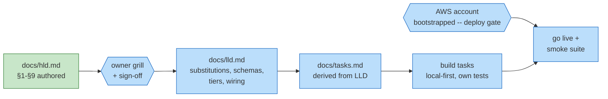

# Ledger — payment-system

## Work DAG

Encoding: green = done, blue = pending; rectangles = artifacts, hexagons =
external gates. The AWS gate binds at deployment only — development never
blocks on it (repo rule, learned on uber).

## Ledger

| Date | Work item | Outcome | Evidence |
|---|---|---|---|
| 2026-09-04 | HLD authored: Stripe-style charge flow on a double-entry ledger, 8 question-form deep dives (idempotency gate, ambiguous-timeout resolution, TransactWriteItems ledger atomicity + IAM append-only, SFN saga, webhook pipeline, settlement reconciliation, GSI write sharding, tokenization). Scope locked per owner: refunds/chargebacks, payouts, FX, fraud, 3DS out; reconciliation in as P2. Design seeds from interview research: HelloInterview "Payment System" (deep-dive skeleton), Revolut ledger-as-source-of-truth + reconcile-weeks-later expectation, Coinbase consistency emphasis | docs/hld.md at review altitude | this commit |
| 2026-09-04 | HLD §10 added to match repo contract: final-design whiteboard (named tech + dive refs on every node/edge), what-changed-since-§4 delta list, and "One charge, start to finish" narration (10 steps: client retry replay, double saga start, ambiguous network timeout, atomic finalize, webhook through a 503 deploy, auditor replay, recon catching in-file-not-in-ledger drift) | docs/hld.md §10 | this commit |
| 2026-09-06 | Grill resolution: §1.2 cast glossary added (customer owns issuing-bank account only, appears as cardToken; merchant owns the account with us; card network = scheme+issuer+acquirer one-box, customer debit outside our boundary) + §4 card-network paragraph sharpened; pattern encoded in AGENTS.md §1.2 | docs/hld.md §1.2, §4 | this commit |
| 2026-09-06 | Grill resolution: §6.1 clarified that FAILED charges persist fully in the charges table (outcome, timestamps, network ref; analytics via merchantId GSI) -- only the ledger ignores attempts, by the balanced-pair invariant | docs/hld.md §6.1 | this commit |
