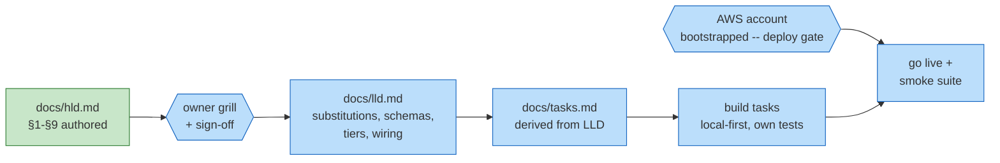

# Ledger — payment-system

## Work DAG

Encoding: green = done, blue = pending; rectangles = artifacts, hexagons =
external gates. The AWS gate binds at deployment only — development never
blocks on it (repo rule, learned on uber).

## Ledger

| Date | Work item | Outcome | Evidence |
|---|---|---|---|
| 2026-09-04 | HLD authored: Stripe-style charge flow on a double-entry ledger, 8 question-form deep dives (idempotency gate, ambiguous-timeout resolution, TransactWriteItems ledger atomicity + IAM append-only, SFN saga, webhook pipeline, settlement reconciliation, GSI write sharding, tokenization). Scope locked per owner: refunds/chargebacks, payouts, FX, fraud, 3DS out; reconciliation in as P2. Design seeds from interview research: HelloInterview "Payment System" (deep-dive skeleton), Revolut ledger-as-source-of-truth + reconcile-weeks-later expectation, Coinbase consistency emphasis | docs/hld.md at review altitude | this commit |
