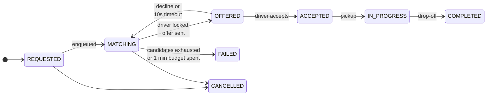
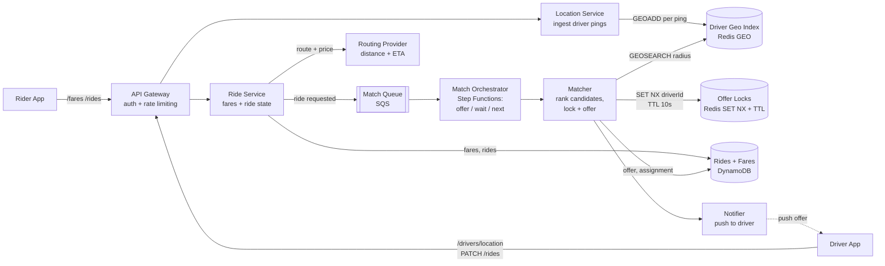
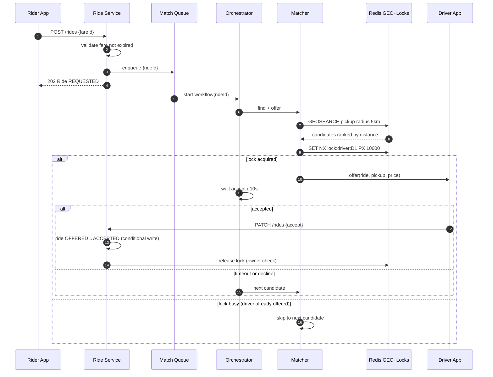

# Uber-like Ride Hailing

_This document is the design at production scale (interview altitude). The
buildable specification of the lab system — contracts, schemas, wiring — lives
in [lld.md](./lld.md)._

## 1. Overview

A ride-hailing marketplace: riders get a fare estimate, request a ride, and are
matched with a nearby available driver who can accept or decline. The interesting
problems are all in the matching path — a firehose of driver location updates,
proximity search under latency pressure, and a consistency guarantee (one offer,
one driver, one ride) that must hold while everything is retrying.

### 1.1 Problem statement

Connect physical supply (drivers moving through space) with bursty demand (riders,
concentrated by events and rush hours) in under a minute, without ever
double-booking a driver, and without melting the datastore that tracks where
everyone is. A naive CRUD design fails on all three counts: location writes
overwhelm any disk-backed table, proximity queries over lat/long columns are table
scans, and "just update the ride row" racing across service instances sends one
driver two rides.

## 2. Requirements

### 2.1 Functional requirements

1. **[P1] Fare estimate** — rider inputs pickup + destination, gets estimated fare and ETA before committing.
2. **[P1] Request ride** — rider requests a ride against a previously issued fare estimate.
3. **[P1] Matching** — the system matches the request with a nearby, available driver; drivers receive one offer at a time.
4. **[P1] Accept / decline** — driver accepts or declines an offer; on accept, driver gets pickup coordinates; on decline or timeout, the next candidate driver is offered.
5. **[P2] Ride lifecycle** — pickup, in-progress, completion state transitions recorded.
6. **[P3] Live driver position on rider's map during pickup.**

### 2.2 Non-functional requirements

Scale assumptions (worked, order-of-magnitude):

- 10M drivers online globally at peak, location ping every ~5 s → **~2M location updates/s**. This single number dominates the design.
- 20M rides/day ≈ 230 rides/s average; event spikes concentrate demand: assume **100k ride requests from one metro within minutes**.
- Ride + fare records ~1 KB each → 20M × 2 × 1 KB ≈ **40 GB/day** of durable transactional data. Trivial for any store; the write *rate* on locations is the problem, not volume.

1. **Matching latency** — offer reaches a driver in seconds; match-or-fail within 1 minute of the request.
2. **Matching consistency** — a driver never holds two simultaneous offers or rides; a ride never dispatches to two drivers. This is the one place we pay for strong consistency.
3. **Burst absorption** — 100k near-simultaneous requests from one geo area must degrade to slower matching, never to dropped requests.
4. **Location freshness over durability** — driver positions may be lost on failure (they self-heal within one ping interval); ride state may never be lost.

### 2.3 Out of scope

Ratings, ride categories (XL/Comfort), scheduled rides, payments processing,
surge-pricing model internals (the fare service treats pricing as a pluggable
function), driver onboarding, fraud.

## 3. Core entities and APIs

Entities: **Rider**, **Driver** (profile + availability status), **Fare**
(pickup, destination, quoted price, ETA, expiry), **Ride** (rider, fare,
assigned driver, state machine below), **DriverLocation** (ephemeral: id →
lat/lng, updated continuously, never the system of record for anything durable).

```
POST  /fares                 {pickup, destination}        -> Fare        (rider)
POST  /rides                 {fareId}                     -> Ride        (rider)
POST  /drivers/location      {lat, lng}                   -> 200         (driver, identity from auth token)
PATCH /rides/{rideId}        {action: accept|decline}     -> Ride        (driver)
GET   /rides/{rideId}                                     -> Ride        (rider/driver polling state)
```

Identity always comes from the auth token, never the body — a client that can
write `driverId` into a payload can impersonate any driver. Fares are
server-priced and referenced by id at request time so the quoted price can't be
tampered with client-side.

Ride state machine:



## 4. High-level design



One box per unit of work:

- **API Gateway** — TLS termination, token auth, rate limiting. Nothing clever lives here.
- **Ride Service** — owns Fare and Ride records. Prices fares via the routing provider, creates rides in `REQUESTED`, and emits exactly one message per ride onto the match queue. Synchronous work ends here; it never waits for a match.
- **Location Service** — the write firehose. Validates a driver ping and issues a `GEOADD`; no durable write on this path at all (Deep Dive 9.1).
- **Match Queue** — buffer between demand spikes and matching capacity (Deep Dive 9.3).
- **Match Orchestrator** — a durable workflow per ride that loops *offer → wait ≤10 s → accepted? done : next candidate* until acceptance, exhaustion, or the 1-minute budget expires (Deep Dive 9.4).
- **Matcher** — one iteration of that loop: `GEOSEARCH` for nearby candidates, rank (distance as v1 proxy for pickup ETA), acquire the driver's offer lock, persist the offer, notify (Deep Dives 9.1, 9.2).
- **Driver Geo Index + Offer Locks** — same Redis engine, two jobs: geospatial index of live supply; short-TTL mutual exclusion on offers.
- **Rides + Fares store** — the durable system of record (Deep Dive 9.5).
- **Notifier** — pushes offers to the driver app (APNs/FCM in production; the lab build substitutes a polled offer endpoint — same contract, no mobile fleet required).

## 5. Data model

DynamoDB, on-demand:

| Table | PK | SK / notes |
|---|---|---|
| `fares` | `fareId` | pickup, destination, price, eta, `expiresAt` (TTL) |
| `rides` | `rideId` | riderId, fareId, status, driverId?, timestamps; GSI `driverId-status` for "driver's active ride"; GSI `riderId-createdAt` for history |
| `driver-offers` (lab notifier) | `driverId` | rideId, offeredAt, `expiresAt` (TTL) — production replaces this table with push delivery |

Redis:

| Key | Type | Contents |
|---|---|---|
| `geo:drivers` | GEO set | member = driverId, score = geohash of last ping |
| `geo:drivers:ts` | ZSET | driverId → last-ping epoch; sweeper removes members stale >30 s from both keys |
| `lock:driver:{id}` | STRING | `SET NX PX 10000`, value = rideId (owner check on release) |

Access patterns that shaped this: point-lookups by id on fares/rides (hot path),
one query per driver for the active ride, radius search + lock ops in Redis.
No joins, no scans anywhere on the hot path.

## 6. Detailed design

### 6.1 Fare estimate

Rider → `POST /fares` → Ride Service calls the routing provider for distance/ETA,
applies the pricing function, writes the fare with a 5-minute TTL expiry, returns
it. Stateless, cache-friendly, no coordination.

### 6.2 Request → match → accept



Rider learns the outcome via `GET /rides/{rideId}` polling in the lab build
(production: push/WebSocket — same state machine, different delivery).

### 6.3 Location ingestion

Driver ping → Location Service → `GEOADD geo:drivers lng lat driverId` +
`ZADD geo:drivers:ts now driverId`. Each `GEOADD` overwrites the previous
position, so the index always holds the latest fix and nothing accumulates. A
sweeper (1/min) `ZRANGEBYSCORE` for members older than 30 s and removes them from
both keys — offline drivers fall out of matching automatically. Update cadence is
decided client-side (Deep Dive 9.6).

### 6.4 Matching iteration

The matcher's contract is *at most one live offer per driver, at most one live
offer per ride*:

1. `GEOSEARCH` around pickup (5 km, `ASC`, limit 10), filter out drivers with an active ride (GSI lookup).
2. For the best candidate: `SET lock:driver:{id} {rideId} NX PX 10000`. Failure means another ride's matcher owns this driver right now — skip, next.
3. Lock acquired → conditional-write the offer onto the ride (`status=MATCHING → OFFERED`, `attempt+=1`), notify driver.
4. Accept path does `OFFERED → ACCEPTED` guarded by `attribute driverId = :caller` — a stale accept (after timeout already moved on) loses the conditional write and gets a 409.
5. Decline/timeout → orchestrator resumes at step 1 with the candidate excluded.

The lock TTL (10 s) equals the offer window, so a crashed matcher leaks nothing:
the lock self-expires and the driver returns to the pool.

## 7. Alternatives considered

Compact scorecards; full reasoning in the deep dives.

**Driver location store** (Deep Dive 9.1)

| Option | Write path @2M/s | Radius query | Verdict |
|---|---|---|---|
| DynamoDB/Postgres rows | melts or costs ~$200k/day | scan or unfit B-tree | rejected |
| Batch every 10s + PostGIS | survivable | good (GiST index) | viable; staleness + more moving parts |
| **Redis GEO in-memory** | in-memory, trivially | `GEOSEARCH` native | **chosen**; durability traded away knowingly |

**No-double-dispatch mechanism** (Deep Dive 9.2)

| Option | Coordination | Crash behavior | Verdict |
|---|---|---|---|
| In-process lock + timer | none across instances | lock lost / stuck | rejected |
| DB status column | transactional | in-memory timeout lost on crash; needs janitor cron | runner-up |
| **Redis `SET NX` + TTL** | atomic, shared | TTL self-releases | **chosen** |

**Demand buffering** (Deep Dive 9.3): direct sync call → rejected (spike = drops);
**SQS** → chosen (managed, DLQ, scales without capacity math); Kafka → the
at-scale answer for regional partitioning + replay, deliberately not the lab answer.

**Offer/timeout orchestration** (Deep Dive 9.4): service-local timers → rejected;
SQS delay-queue state machine → viable but hand-rolled bookkeeping; **Step
Functions** → chosen (durable waits, retries, state survives crashes).

**System of record** (Deep Dive 9.5): Postgres → fine at this scale, runner-up;
**DynamoDB on-demand** → chosen for the access patterns (all point lookups) and
zero-idle-cost lab economics.

## 8. Failure analysis and operations

| Failure | Blast radius | Behavior / recovery |
|---|---|---|
| Redis down | matching + location index | No new matches (fail closed — consistency guarantee outlives availability). In-flight offers unaffected in DynamoDB. On recovery the geo index rebuilds itself within one ping interval (~5 s) — this is why losing location data is acceptable. |
| SQS down | new ride requests | Ride Service returns 5xx on enqueue; riders retry. Nothing accepted is lost. |
| Step Functions execution dies | one ride's matching | Durable state: execution resumes or is retried from history; worst case the ride times out at 1 min and fails visibly. |
| DynamoDB down | everything durable | Full stop; multi-AZ managed service, accepted dependency. |
| Routing provider down | fare estimates | No new fares (degraded but explicit); active rides unaffected. |
| Matcher crashes mid-offer | one offer | Driver lock TTL expires in ≤10 s; orchestrator retry re-runs the iteration idempotently (conditional writes make repeats no-ops). |

Metrics that page: match latency p99 (SLO: <60 s), match failure rate, queue
depth + oldest-message age, lock-contention rate (skips/search), stale-driver
ratio in geo index, Step Functions execution failures. Everything else is
dashboards, not pages.

## 9. Deep Dives

### 9.1 Why an in-memory geo index for driver locations, not the ride database?

**The question behind the question:** what does 2M writes/s of *disposable* data
do to a durable store, and when is losing data fine?

**Durable table:** every ping becomes a write to DynamoDB/Postgres. At 2M
writes/s that's either a melted database or (DynamoDB on-demand at ~$1.25/M
writes) **~$200k/day** — for data that is stale 5 seconds later and worthless 30
seconds later. And once stored, finding "drivers within 5 km" over lat/lng
columns is a scan; B-tree indexes don't answer 2-D radius questions.

**Batch + PostGIS:** aggregate pings for ~10 s, bulk-write into Postgres with a
GiST geospatial index. Write load drops 2 orders of magnitude, queries get fast.
Costs: locations are up to a batch-interval stale (worse matches), plus a
batching pipeline to operate.

**In-memory GEO index:** Redis `GEOADD` encodes lat/lng into a geohash score in
a sorted set; `GEOSEARCH` answers radius queries natively. Writes are in-memory
overwrites — the newest fix simply replaces the old one, handling 2M/s across a
sharded cluster. Staleness is one ping (~5 s). The trade: durability. And that
trade is nearly free — if Redis dies, the entire dataset regenerates from live
pings within ~5 s of recovery. Durability for self-refreshing data is paying to
back up a mirror.

**Decision:** Redis GEO. NFR-4 explicitly ranks freshness over durability for
locations, and the recovery argument makes the durability loss a non-event.

**In the code (planned — task 3):** `cdk/lib/location-stack.ts` (ElastiCache +
sweeper schedule), `src/location/handler.ts` (GEOADD ingest),
`src/location/sweeper.ts` (stale eviction), `src/matching/candidates.ts`
(GEOSEARCH).

### 9.2 Why a distributed lock with TTL for offers, not a status column?

**The question behind the question:** where does mutual exclusion live when the
service enforcing it can crash?

**In-process locking:** each matcher instance tracks offered drivers in memory
with a timer. Two instances offer the same driver concurrently (no shared
state); a crash strands the driver "offered" forever. Non-starter.

**Status column in the database:** `UPDATE drivers SET status='offered' WHERE
status='available'` — transactional, coordinated, correct on the happy path. The
hole is the *release*: the 10-second offer expiry lives in some service's memory.
Crash between offer and timeout and the driver is stuck until a janitor cron
notices — added complexity, delayed unlock, and the cron is now a correctness
component.

**Lock with TTL:** `SET lock:driver:{id} {rideId} NX PX 10000`. Atomic
acquisition shared by every matcher instance, and the *expiry is the store's
job*: no process needs to survive for the driver to be released. Accept path
releases early (owner-checked); crash path self-heals in ≤10 s. Cost: matching
correctness now depends on Redis availability — acceptable because the data is
10-second ephemera (loss ⇒ brief over-conservatism or a duplicate offer window
bounded by the ride-side conditional write, which remains the final arbiter).

**Decision:** Redis lock, TTL = offer window; DynamoDB conditional writes on the
ride record as the durable backstop (defense in depth: the lock prevents the
race, the conditional write makes it harmless if it ever happens).

**In the code (planned — task 4):** `src/matching/driver-lock.ts` (acquire/release
with owner check), `src/rides/accept.ts` (conditional `OFFERED→ACCEPTED`).

### 9.3 Why a queue between ride creation and matching, not a direct call?

**The question behind the question:** what happens to the 100k-requests spike if
matching is synchronous?

**Direct call:** Ride Service invokes the matcher inline. Its availability now
multiplies with the matcher's; a demand spike becomes matcher back-pressure
becomes rider-facing 5xx; a matcher crash *loses the request entirely* — a rider
waiting for a match that will never come. Retries pile on exactly when the
system is sickest.

**Queue:** the ride lands durably (`REQUESTED`) and one message is enqueued;
acknowledgment to the rider takes milliseconds regardless of matching load. The
spike becomes queue depth — riders match slower, nobody is dropped (NFR-3
verbatim). Consumers scale on depth; a consumer crash returns the message after
visibility timeout. Costs: eventual matching (fine — matching is asynchronous by
nature), duplicate delivery (fine — the orchestration is idempotent via
conditional writes), one more component.

**Decision:** SQS. Kafka's regional partitions + replay are the right answer at
Uber scale; a lab that needs ordering-free work distribution with a DLQ needs
SQS's operational surface, not a cluster.

**In the code (planned — task 4):** `cdk/lib/matching-stack.ts` (queue + DLQ +
depth alarm), `src/rides/request.ts` (enqueue after persist).

### 9.4 Why durable execution for the offer loop, not delay-queue bookkeeping?

**The question behind the question:** the offer/timeout/next-driver loop is a
multi-step process with a human in the middle — where does its state live when
processes die?

**Delay queue:** on each offer, schedule a +10 s message; on processing, check
"still unassigned?" and offer to the next driver. Workable, but the workflow
state (which attempt, which drivers exhausted, cancel-on-accept) is smeared
across messages and rows, and every edge (accept racing the delayed message,
duplicate delivery) is hand-rolled reconciliation logic.

**Durable workflow:** the loop *is* a state machine, so run it on an engine that
persists state transitions: offer → wait (accept signal | 10 s timeout) → branch
→ next candidate, with the 1-minute budget as a workflow-level timeout. Crashes
resume from recorded history; retries and timeouts are declarative; the ride's
matching history becomes inspectable execution history (superb for debugging a
lab and for arguing in an interview). Cost: an orchestration dependency and its
learning curve.

**Decision:** Step Functions (this is Temporal's home turf too — same pattern;
Step Functions keeps the lab serverless and free-tier-friendly).

**In the code (planned — task 4):** `cdk/lib/matching-stack.ts` (state machine
definition: Map over candidates, `waitForTaskToken` accept-signal, timeouts),
`src/matching/*.ts` (per-state Lambdas).

### 9.5 Why DynamoDB for rides and fares, not Postgres?

**The question behind the question:** does anything here need relational power,
and what does the lab's idle time cost?

**Postgres (Aurora Serverless):** relations, transactions across entities,
ad-hoc queries for analytics; PostGIS would even cover locations if we hadn't
solved that in-memory. At 230 writes/s it's comfortably fine — this is a
legitimate choice, not a strawman.

**DynamoDB:** every hot-path access is a point lookup or single-partition query
(fare by id, ride by id, active ride by driver) — the exact shape DynamoDB
serves at any scale with single-digit-ms latency. Conditional writes give the
state-machine guards (9.2, 9.4) natively. On-demand mode costs zero while the
lab sleeps, and `cdk destroy` deletes tables cleanly (RDS teardown drags
snapshots/subnet groups).

**Decision:** DynamoDB — chosen by access patterns and lab economics. The honest
counterweight: the moment ad-hoc relational questions matter (ops analytics,
finance), that workload belongs in an analytical replica, not in this
transactional path — at which point CDC into a warehouse beats swapping the
primary store.

**In the code (planned — task 2):** `cdk/lib/data-stack.ts` (tables, GSIs,
TTLs), `src/rides/store.ts` (conditional-write helpers).

### 9.6 Why do clients decide their own location-update cadence?

**The question behind the question:** can we cut the 2M/s write load without
buying hardware — and who has the information to do it?

A fixed 5 s cadence treats a driver parked at an airport queue like one doing
120 km/h on a highway. Only the device knows speed, heading change, and
proximity to an active pickup — so the client adapts: stationary → ~30 s;
cruising straight → ~10 s; fast/turning/near-assignment → 2–5 s. Same matching
accuracy where it matters, at a fraction of the writes (an airport lot full of
idle drivers drops its ping load ~6x). Cost: cadence logic ships in the app and
degrades unevenly across devices; the server-side stale sweeper threshold must
tolerate the slowest legitimate cadence.

**Decision:** adaptive client cadence, server treats cadence as untrusted input
(sweeper + freshness checks are server-side).

**In the code (planned — task 6):** `src/sim/driver-sim.ts` (the lab's driver
simulator implements the adaptive policy; production would ship it in the app).
