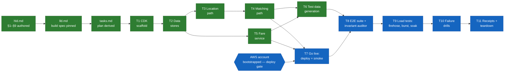

# Ledger — Uber-like Ride Hailing

## Work DAG

Color = status (green done · amber in progress · blue pending). Shape = kind
(rectangle = artifact/code · hexagon = external gate).

## Ledger

Append-only. Corrections get a new row, never a rewrite.

| Date | Work item | Outcome | Evidence |
|---|---|---|---|
| 2026-08-30 | Design authored (§1–§9, 6 deep dives) from the ride-hailing problem brief | design.md v1 committed | this commit |
| 2026-08-30 | Implementation plan derived from design | tasks.md v1, 8 task groups, all traced to design sections | this commit |
| 2026-08-30 | Ledger seeded with work DAG | ledger.md v1 | this commit |
| 2026-08-30 | Testability revision: plan restructured 8→11 groups — added test-data generation (T6), explicit go-live gate (T7), automated e2e suite with always-on consistency invariant auditor (T8), load tests with measured targets (T9), failure drills proving §8 claims (T10); NFR→test-task mapping added to plan header | tasks.md v2, DAG updated | this commit |
| 2026-08-30 | LLD authored: production→lab substitution map, component inventory (exact tasks.md file paths), API contract incl. lab HMAC auth, attribute-level DDB schemas with verbatim guard expressions, Redis key/command spec, Step Functions state list, stack wiring + config matrix, tasks↔LLD↔design traceability. Repo contract updated (AGENTS.md workflow gains Specify step; README layout; design.md pointer) | lld.md v1 | this commit |
| 2026-08-30 | LLD diagrams added: concrete deployment diagrams 1a (request + location ingest, stack subgraphs) and 1b (matching path from the queue), every node a deployable resource with file path; Step Functions state graph in §5 | lld.md v2 | this commit |
| 2026-08-30 | Build-depth tiers: inventory classified CORE (7: ride handler/store, location handler, sweeper, candidates, offer step, driver lock) / SUPPORTING (7 thin, incl. 4 glue components previously missing from the table; RoutingPort + offer-delivery port named as swap points) / HARNESS (4, never deployed; invariant auditor flagged correctness-critical). Dependency-direction lint added as task 1.4; tier requirement encoded in AGENTS.md contract | lld.md v3, tasks.md v3 | this commit |
| 2026-08-30 | Correction (owner review): AWS gate moved T1→T7 — the account gates deployment only, development T1–T6 is fully local. Local-first rule added to plan header; missing per-task unit tests added (3.5 location logic, 5.3 fares/pricing); Redis client seam named in LLD §4 so CORE logic tests against fakes | tasks.md v4, ledger DAG v3, lld.md v4 | this commit |
| 2026-08-30 | T1 CDK scaffold: npm project (deps exact-pinned, public registry), strict TS, vitest, eslint, 4-stack layout with tags + eu-central-1 default, dependency-direction lint (`scripts/check-deps.ts`, self-tested). Deviation from plan wording: hand-scaffolded instead of `cdk init` (template layout conflicts with repo `cdk/`+`src/` contract). Local gate `npm run check` green: lint + 0 runtime→harness imports + typecheck + 5 tests + synth of all 4 stacks | this commit | `npm run check` exit 0 |
| 2026-08-30 | T2 data stores: data-stack materialized — `fares` (TTL), `rides` (+ `driverId-status` KEYS_ONLY GSI, `riderId-createdAt` ALL GSI), `driver-offers` (TTL + NEW_AND_OLD_IMAGES stream), all on-demand + DESTROY, names/stream ARN exported; 7 template-assertion tests pin the schema. `src/rides/store.ts`: the four §3 guards verbatim as pure command builders + `markMatching`/`createRide`, executed by `RideStore` with typed 409 mapping (STALE_OFFER; useFare disambiguates FARE_ALREADY_USED / FARE_EXPIRED / not-found from the returned old image); 17 guard tests, no AWS. Gate green: 29 tests total | this commit | `npm run check` exit 0 |
| 2026-08-30 | Directory restructure (owner decision): docs moved to `docs/` with design.md → hld.md (hld/lld pair); per-design README.md landing page added; root .gitignore (IDE metadata); repo contract updated (AGENTS.md file contract + workflow, root README layout/index) so future designs inherit the shape. Live references repointed in lld.md, code comments, package.json; historical ledger rows left as written per append-only rule | this commit | `npm run check` exit 0 |
| 2026-08-30 | T3 location path: GeoClient seam + in-memory fake with real ZSET/geo semantics; location handler (bbox validation, identity from token never body); sweeper (strict >30 s bound, boundary member survives); candidate finder (GEOSEARCH ASC → minus excluded → minus active via rides GSI lookup); ioredis adapter (2 s timeout, exercised from T7). api-stack materialized: HTTP API + deploy-time SIM_SECRET + HMAC authorizer default on every route; location-stack: isolated VPC (0 NAT), 1× cache.t4g.micro, DDB gateway endpoint, 1-min sweep rule. check-deps generalized: runtime = src/* minus harness (auto-covers new `auth`/`http` dirs). Synth made account-agnostic — ambient expired AWS creds were failing synth; local-first now holds at synth too. Gate: 56 tests | this commit | `npm run check` exit 0 |
| 2026-08-30 | T5 fare service: RoutingPort + city-speed lab routing (24 km/h over haversine); pricing 300 + 120/km + 25/min EUR cents, monotonicity pinned; `POST /fares` handler (bbox 400, rider-only 403, §2.2 contract shape, expiresAt in epoch seconds = the TTL/guard unit, createdAt in ms — units split documented on the Fare type); `GET /rides/{rideId}` polling endpoint (404 taxonomy); `createFare` on the store; api-stack routes both behind the authorizer with table grants. Gate: 75 tests, 13 files | this commit | `npm run check` exit 0 |
| 2026-08-30 | Reader onboarding (owner decision): README gains "Where to start in the code" — the four entry-point handlers with their fan-out chains, store.ts flagged as the file that matters most, cdk/ + tests marked skip-on-first-pass. Requirement encoded in the AGENTS.md README contract so every future design ships one | this commit | docs-only |
| 2026-08-30 | T4 matching path: driver lock (SET NX PX + Lua owner-checked release, in-memory fake with real TTL semantics); offer step (lock → markOffered guard → offer row w/ task token, every rung self-healing); release step (guarded release pinned to driver+attempt, conditional row delete, lock release — one idempotent path serves timeout/decline/lock-busy); markFailed guard covers OFFERED so a dead workflow still drives rides terminal; POST /rides (useFare arbiter → persist → enqueue, order test-pinned) + PATCH accept/decline (token resolved strictly after the guard, pinned); offer-poll (204/200, token never exposed); offer-audit table fed by the stream (INSERT/MODIFY/REMOVE mapping, token never copied); SQS→SFN pump (execution name = rideId dedupe, per-item batch failures → DLQ). matching-stack: queue+DLQ(3), state machine (10 s offer window, 120 s backstop), 3 alarms + dashboard. Two LLD deltas recorded in-doc: 60 s budget travels as deadlineMs (ASL workflow timeout is uncatchable) and the SQS/SFN interface endpoints were dropped (nothing in the VPC calls them). Gate: 111 tests, 17 files | this commit | `npm run check` exit 0 |
| 2026-09-02 | T6 test data generation (HARNESS): seeded mulberry32 RNG; city model on the Berlin bbox with ~200 m road-grid snap + downtown/airport zones; fleet generator (uniform / downtown-weighted σ≈1.7 km / airport-cluster σ≈450 m; three behavior archetypes eager/steady/picky with acceptP, thinkMs, cadenceS, shiftMin); demand generator (steady Poisson, rush ramp via thinning rate/4→rate, hotspot burst N-in-one-neighborhood with citywide destinations); fixture CLI `npm run gen` writing versioned replayable worlds (same flags ⇒ byte-identical file; fixtures/ gitignored, regenerable from seed). Invariants pinned: determinism, bbox bounds, grid snap, cluster tightness vs uniform, Poisson count bounds, rush second-half > first, hotspot one-neighborhood. CLI smoke-run wrote rush + hotspot worlds. Gate: 128 tests, 19 files | this commit | `npm run check` exit 0 |
| 2026-09-03 | Doc-truth sweep (mechanical audit: every doc-cited path checked against disk): all six hld.md §9 deep-dive receipts flipped from "planned" to landed files — pre-implementation guesses corrected (`cdk/lib/*` → `cdk/stacks/*`; never-created `src/rides/accept.ts`/`request.ts` → `store.ts` guards + `handler.ts` + `pump.ts`; 9.4 Map-state wording → the release-and-exclude loop as built; 9.6 split honestly: fixture cadence landed, driver-sim ahead). Four lld.md §1 "part of stack" placeholder rows now carry real paths (offer-poll, authorizer, pump, offer-audit). Task 11.1 ticked. Remaining forward references (src/sim, src/e2e, src/load) are tasks 8–9 harness — intentional | this commit | audit: 0 planned markers, 0 placeholders, 4 known-future paths |

## Open items (not DAG nodes)

- AWS account: confirm + `cdk bootstrap` before **T7 (go live)** — it gates deployment only; development T1–T6 is fully local (synth, lint, unit tests, fixtures) and never blocks on it.
- Lab Redis sizing: single `cache.t4g.micro` node assumed (~$0.4/day while up); T9.5 will find its actual saturation point.
- Load-test scale honesty: lab targets 1k pings/s (single node), standing in for the design's 20k/s city figure — proves per-shard behavior and contention correctness, not absolute scale.
