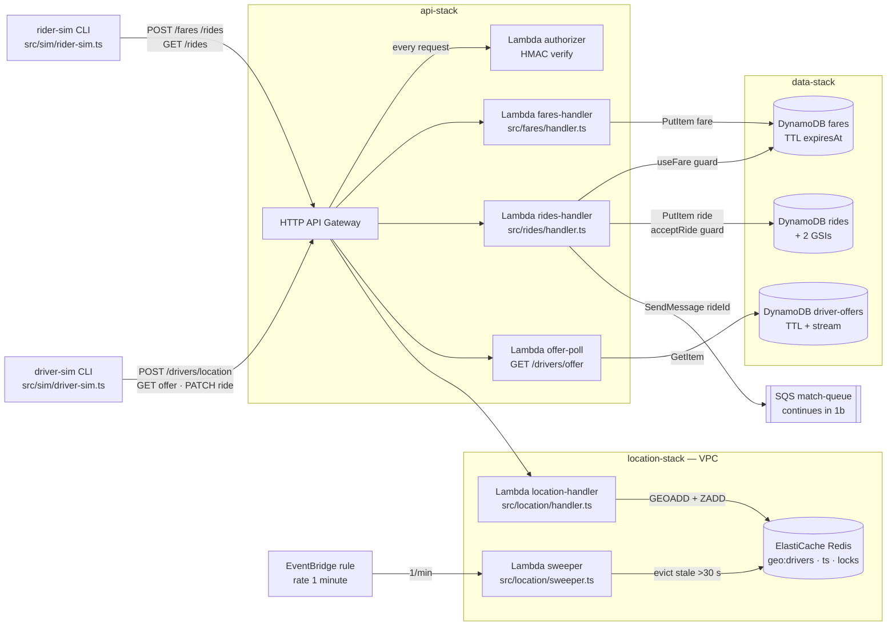
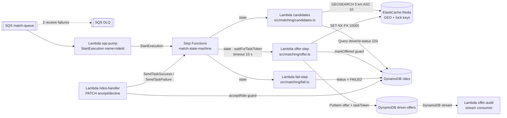
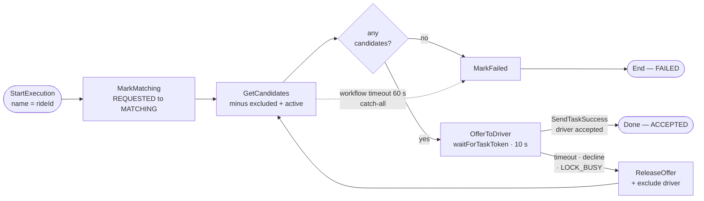

# Low-Level Design — Uber-like Ride Hailing (lab build)

This document specifies the system we actually deploy. `hld.md` answers the
interview question at production scale; this LLD defines the **scale model** of
that design: identical architecture shapes (geo index, TTL locks, queue, durable
orchestration, conditional-write guards), lab-scale parts. Every file path here
matches `tasks.md`; every mechanism traces to a `hld.md` section.

## 0. Production → lab substitution map

| hld.md (production shape) | Lab build | What it preserves | What it knowingly loses |
|---|---|---|---|
| Sharded Redis GEO cluster | 1× ElastiCache `cache.t4g.micro` | GEO command semantics, lock atomicity, per-shard contention behavior | absolute scale, cluster failover |
| Service fleets | One Lambda per handler behind an HTTP API | stateless units, per-path scaling | warm connection pools, long-lived state |
| APNs/FCM push to drivers | `driver-offers` table + simulator polling (1 s) | offer contract, 10 s timeout semantics | real push latency |
| Rider push/WebSocket updates | `GET /rides/{rideId}` polling | ride state machine visibility | push latency |
| Kafka (regional partitions, replay) | SQS standard + DLQ | buffering, at-least-once, poison isolation | ordering, replay |
| Mobile clients | `src/sim/*` simulators driven by `fixtures/` | behavior profiles, adaptive ping cadence | device/network realities |
| Third-party maps API | Haversine × city-speed model (`src/fares/routing.ts`) | pricing function shape, ETA plumbing | real road routing |
| Production authn (OAuth/JWT infra) | HMAC-signed identity token via Lambda authorizer (§2.1) | "identity from token, never body" rule | real identity provider |

## 1. Component inventory

Runtime: Node.js 22, TypeScript, one esbuild-bundled Lambda per entry.

The abstract boxes of hld.md §4 materialize as the exact resources below —
split at the SQS handoff into the request/ingest paths and the matching path.
Rectangles = Lambda (compute), cylinders = data stores, double brackets =
queues; operations ride on the edges.

**Diagram 1a — request and location ingest paths**



**Diagram 1b — matching path (from the queue onward)**



### Build-depth tiers

Every component carries a tier that sets its quality bar — this is what keeps
the build clean (no accidental depth in glue) and scalable (all depth
concentrated where the design's guarantees live):

- **CORE — build in depth.** These components *are* the system: they carry the
  design's deep dives and the NFR guarantees. Full rigor: input validation,
  error taxonomy, idempotency, unit tests per guard/branch, no shortcuts.
  Scalability lives here by construction — stateless Lambdas, on-demand
  DynamoDB, one Step Functions execution per ride all scale horizontally; the
  single Redis node is the one deliberate lab bottleneck (its saturation point
  is measured, not guessed, in task 9).
- **SUPPORTING — build clean, deliberately thin.** Real deployed code, but
  minimal by design: straight-line logic, no speculative features. Where a
  supporting component stands in for a production capability it sits behind a
  **port** so CORE code never knows: `RoutingPort` (haversine today, a real
  maps adapter later, `src/fares/handler.ts` unchanged) and the offer-delivery
  contract (the `driver-offers` table today, an APNs/FCM push adapter later,
  `src/matching/offer.ts` unchanged).
- **HARNESS — simulator and test tooling, never deployed.** Everything under
  `src/sim/`, `src/testdata/`, `src/load/`, `src/e2e/` runs from the dev
  machine and emulates the world outside the system boundary (mobile apps,
  demand) or measures the system from outside. Quality bar: deterministic and
  readable. One exception to "test-tool casual": the invariant auditor is
  correctness-critical harness — it is the proof mechanism for NFR-2, so its
  assertions get CORE-level review.

Dependency direction is enforced, not hoped for: runtime code
(`src/{fares,rides,location,matching}`) must never import from harness
directories — lint rule in task 1.4. In the deployment diagrams above, HARNESS
is exactly the set of nodes outside every stack subgraph.

| Component | Tier | File | Trigger | Writes to | Reads from |
|---|---|---|---|---|---|
| Ride handler | CORE | `src/rides/handler.ts` | `POST /rides`, `GET /rides/{id}`, `PATCH /rides/{id}` | `rides`, match queue, SFN task token | `fares`, `rides` |
| Ride store (guards) | CORE | `src/rides/store.ts` | (lib) | `rides` conditional writes | `rides` |
| Location handler | CORE | `src/location/handler.ts` | `POST /drivers/location` | Redis GEO + ts ZSET | — |
| Stale sweeper | CORE | `src/location/sweeper.ts` | EventBridge 1/min | Redis (evictions) | Redis ts ZSET |
| Candidate finder | CORE | `src/matching/candidates.ts` | SFN state | — | Redis GEOSEARCH, `rides` GSI |
| Offer step | CORE | `src/matching/offer.ts` | SFN state (waitForTaskToken) | Redis lock, `rides`, `driver-offers` | — |
| Driver lock lib | CORE | `src/matching/driver-lock.ts` | (lib) | Redis `SET NX` / Lua release | — |
| Fare handler | SUPPORTING | `src/fares/handler.ts` | `POST /fares` | `fares` | RoutingPort |
| Routing stand-in | SUPPORTING (port) | `src/fares/routing.ts` | (lib) | — | — |
| Offer-poll endpoint | SUPPORTING (port face) | `src/matching/offer-poll.ts` | `GET /drivers/offer` | — | `driver-offers` |
| HMAC authorizer | SUPPORTING | `src/auth/authorizer.ts` (+ `src/auth/token.ts`) | every request | — | `SIM_SECRET` |
| SQS→SFN pump | SUPPORTING | `src/matching/pump.ts` | SQS batch | SFN StartExecution | match queue |
| Fail step | SUPPORTING | `src/matching/fail.ts` | SFN state | `rides` → `FAILED` | — |
| Release step | SUPPORTING | `src/matching/release.ts` | SFN state (timeout/decline/lock-busy) | `rides` guarded release, `driver-offers` delete, lock release | — |
| Offer-audit writer | SUPPORTING | `src/matching/offer-audit.ts` | DDB stream | offer-audit table | `driver-offers` stream |
| Invariant auditor | HARNESS (correctness-critical) | `src/e2e/invariants.ts` | e2e/load harness | — | `rides`, offer audit |
| Test data gens | HARNESS | `src/testdata/{city,fleet,demand}.ts` | CLI `npm run gen` | `fixtures/` | — |
| Simulators | HARNESS | `src/sim/{driver-sim,rider-sim}.ts` | CLI | HTTP API | `fixtures/`, `deploy/outputs.json` |
| Load runner | HARNESS | `src/load/runner.ts` | CLI | HTTP API | `fixtures/` |

VPC placement: only Redis-touching Lambdas (location handler, sweeper,
candidates, offer) run in the VPC. DynamoDB access from inside uses the free
gateway endpoint; Step Functions callbacks use an interface endpoint (§6).

## 2. API contract

Base URL from `deploy/outputs.json` → `apiUrl`. All bodies JSON.

### 2.1 Auth (lab)

Every request carries `Authorization: Bearer <token>` where
`token = base64(payload) + "." + hex(hmacSHA256(payload, SIM_SECRET))` and
`payload = {"role":"rider"|"driver","id":"<uuid>"}`. A Lambda authorizer
verifies the HMAC and injects `role`/`id` into the request context — handlers
never read identity from the body (design §3 security note). `SIM_SECRET` is
generated at deploy time and exported to `deploy/outputs.json`. **This is
deliberately not production auth**; it exists so the "identity from token" rule
is real in code rather than waived in the lab.

### 2.2 Endpoints

| Endpoint | Request | 2xx response | Errors |
|---|---|---|---|
| `POST /fares` (rider) | `{pickup:{lat,lng}, destination:{lat,lng}}` | `201 {fareId, priceCents, currency:"EUR", etaSeconds, expiresAt}` | `400` bad coords |
| `POST /rides` (rider) | `{fareId}` | `202 {rideId, status:"REQUESTED"}` | `404` unknown fare · `409 FARE_EXPIRED` · `409 FARE_ALREADY_USED` |
| `GET /rides/{rideId}` (rider/driver) | — | `200 {rideId, status, driverId?, pickup?, attempt}` | `404` |
| `POST /drivers/location` (driver) | `{lat, lng}` | `200 {}` | `400` outside city bbox |
| `GET /drivers/offer` (driver, lab notifier) | — | `200 {rideId, pickup, priceCents, expiresAt}` or `204` | — |
| `PATCH /rides/{rideId}` (driver) | `{action:"accept"\|"decline"}` | `200 {status}` | `409 STALE_OFFER` (reassigned or timed out) · `404` |

Error body shape everywhere: `{error: {code, message}}`.

## 3. DynamoDB schemas

On-demand mode. All tables `RemovalPolicy.DESTROY`.

**`fares`** — PK `fareId` (S). Attributes: `pickupLat/Lng` (N), `destLat/Lng`
(N), `priceCents` (N), `etaSeconds` (N), `riderId` (S), `usedByRideId` (S, set
on ride creation — enforces one ride per fare), `createdAt` (N), `expiresAt`
(N, **TTL**).

**`rides`** — PK `rideId` (S). Attributes: `riderId`, `fareId`, `status` (S:
`REQUESTED|MATCHING|OFFERED|ACCEPTED|IN_PROGRESS|COMPLETED|CANCELLED|FAILED`),
`driverId` (S, present ≥ OFFERED), `attempt` (N), `runId` (S, test-run tag for
invariant audits), `createdAt/offeredAt/acceptedAt/terminalAt` (N).
GSIs: `driverId-status` (active-ride filter), `riderId-createdAt` (history).

Guard expressions (verbatim, implemented in `src/rides/store.ts`):

```
markOffered:  SET status=OFFERED, driverId=:d, attempt=:a, offeredAt=:now
              ConditionExpression: #status = MATCHING
acceptRide:   SET status=ACCEPTED, acceptedAt=:now
              ConditionExpression: #status = OFFERED AND driverId = :caller
releaseOffer: SET status=MATCHING REMOVE driverId
              ConditionExpression: #status = OFFERED AND driverId = :d AND attempt = :a
useFare:      SET usedByRideId=:r
              ConditionExpression: attribute_not_exists(usedByRideId) AND expiresAt > :now
```

A failed condition never retries blindly: `STALE_OFFER` / `FARE_ALREADY_USED`
map straight to 409s (design Deep Dive 9.2: the conditional write is the final
arbiter).

**`driver-offers`** — PK `driverId` (S). Attributes: `rideId`, `taskToken` (S,
Step Functions callback token), `priceCents`, `pickupLat/Lng`, `offeredAt`,
`expiresAt` (N, **TTL** = offeredAt + 10 s). Written by the offer step; read by
`GET /drivers/offer`; deleted on accept/decline. Its DynamoDB Stream feeds an
`offer-audit` append log (handler in matching-stack) — the invariant auditor's
source for "no overlapping offers per driver".

## 4. Redis schema and command usage

Single logical DB, keys namespaced:

| Key | Type | Written by | Commands |
|---|---|---|---|
| `geo:drivers` | GEO (ZSET) | location handler | `GEOADD` (overwrite per ping) · `GEOSEARCH FROMLONLAT … BYRADIUS 5 km ASC COUNT 10` (candidates) · `ZREM` (sweeper) |
| `geo:drivers:ts` | ZSET | location handler | `ZADD` per ping · `ZRANGEBYSCORE -inf (now-30s)` + `ZREM` (sweeper) |
| `lock:driver:{driverId}` | STRING | driver-lock lib | acquire `SET key rideId NX PX 10000` · release = Lua compare-and-DEL (only if value == rideId — never release another ride's lock) |

Client: `ioredis` behind a minimal seam (`GeoClient` / `LockClient` interfaces
in `src/matching/driver-lock.ts` and the location/candidates modules) — CORE
logic unit-tests against in-memory fakes of the seam; the real ioredis adapter
is exercised from task 7 onward. Cell-boundary correctness lives inside
`GEOSEARCH` (neighbor expansion + exact-distance filter, hld.md Deep Dive 9.7):
the adapter never hand-rolls geohash prefix queries, and the smoke suite's
boundary-pair probe is the live receipt. 2 s command timeout, zero retries on
lock acquire — a timeout counts as "driver busy, next candidate". Fail toward
liveness; correctness stays guarded by the conditional writes.

## 5. Match orchestration (Step Functions, standard workflow)

Execution name = `rideId`, so duplicate SQS deliveries cannot start a second
workflow (`ExecutionAlreadyExists` swallowed by the SQS→SFN pump Lambda).
Input: `{rideId, pickup, priceCents, excluded: [], deadlineMs}` — the pump
stamps `deadlineMs = now + MATCH_BUDGET_S` so the budget travels with the ride.



1. `MarkMatching` — `REQUESTED→MATCHING` (idempotent condition).
2. `GetCandidates` — GEOSEARCH minus `excluded` minus drivers with an active ride.
3. `AnyCandidates?` — Choice; empty → `MarkFailed`.
4. `OfferToDriver` — `offer.ts`, `waitForTaskToken`, `TimeoutSeconds: 10`: acquire lock (busy → exclude driver, loop), `markOffered`, write `driver-offers` row carrying the task token.
5. Task success (accept handler ran `acceptRide` then `SendTaskSuccess`) → `Done`.
6. `States.Timeout` or task failure (decline → `SendTaskFailure`) → `ReleaseOffer` (guarded release + lock release + offer row delete) → append driver to `excluded` → `GetCandidates`.
7. `MarkFailed` — terminal `FAILED`.

The 60 s budget (design NFR-1) is enforced *inside* the workflow: GetCandidates
reports no candidates once `deadlineMs` has passed, which routes to the guarded
`MarkFailed` (a workflow-level timeout cannot be caught in ASL, and an aborted
execution would leave the ride non-terminal). The state machine's own
`TimeoutSeconds: 120` is a backstop only — and because an aborted execution
runs no states, a timed-out execution **pages** (ExecutionsTimedOut alarm): its
ride rests at `OFFERED`, which also keeps that driver "active" in the candidate
filter. Recovery is one invocation of the fail step — `markFailed` deliberately
covers OFFERED so the operator tool and a racing late accept are both safe: the
guard arbitrates. A late accept then gets a clean `STALE_OFFER`. Handlers
resolve the token only *after* their conditional write succeeds — the ride
record, not the workflow, is the source of truth.

## 6. CDK stacks and wiring

| Stack | Contains | Exports |
|---|---|---|
| `data-stack` | 3 tables + `driver-offers` stream | table names/ARNs |
| `location-stack` | VPC (2 AZ, private-isolated), ElastiCache single node, SGs, DynamoDB **gateway** endpoint (free). No SQS/SFN interface endpoints: nothing inside the VPC calls them — the pump and the rides handler (task-token responses) run outside | Redis endpoint, VPC/SG ids |
| `api-stack` | HTTP API, HMAC authorizer, fare/ride/location/offer handlers, `SIM_SECRET` | `apiUrl` |
| `matching-stack` | queue + DLQ (maxReceiveCount 3), SQS→SFN pump, state machine, matcher Lambdas, offer-audit table + stream writer, dashboard + 3 paging alarms (match p99, oldest-message age, DLQ non-empty) | queue URL, state machine ARN, audit table |

`cdk deploy --all --outputs-file deploy/outputs.json` — that file is the single
config source for smoke, e2e, simulators, and load (tasks 7–9).

## 7. Configuration matrix

| Env var | Used by | Value |
|---|---|---|
| `RIDES_TABLE` / `FARES_TABLE` / `OFFERS_TABLE` | handlers | from data-stack |
| `REDIS_ENDPOINT` | VPC Lambdas | from location-stack |
| `MATCH_QUEUE_URL` | ride handler | from matching-stack |
| `STATE_MACHINE_ARN` | SQS pump | from matching-stack |
| `LOCK_TTL_MS` | offer step | `10000` (= offer window, DD 9.2) |
| `SEARCH_RADIUS_KM` / `CANDIDATE_LIMIT` | candidates | `5` / `10` |
| `MATCH_BUDGET_S` | state machine | `60` (NFR-1) |
| `STALE_DRIVER_S` | sweeper | `30` |
| `FARE_TTL_S` | fare handler | `300` |
| `CITY_BBOX` | fare/location validation, testdata | Berlin `52.35,13.20,52.60,13.55` |

One knob, one owner: every number appears in exactly one construct and reaches
code via env — no constant duplicated in source.

## 8. Test architecture (tasks 6–10)

- **Fixtures** (`fixtures/*.json`): `{version, seed, profile, placement, city, drivers[{id, start, profile:{acceptP, thinkMs, cadenceS, shiftMin}}], demand[{atMs, pickup, dest}]}` — `atMs` are offsets from run start so a fixture replays at any wall-clock time; same flags ⇒ byte-identical file; regenerated from the seed (`npm run gen`), never committed.
- **Smoke** (`npm run smoke`): the 5 checks of tasks 7.2 against §2 endpoints (incl. the geohash boundary-pair probe — Deep Dive 9.7's live receipt), <60 s total, non-zero exit gates the LIVE gate.
- **E2E** (`npm run e2e`): vitest; each spec = fixture world + scenario + **invariant audit**. The auditor pulls all `rides` rows for the spec's `runId` plus the offer-audit trail and asserts: per driver, offer intervals never overlap; per ride, at most one driverId ever ACCEPTED; every ride terminal.
- **Load** (`npm run load -- --scenario firehose|burst|soak`): worker pool, per-request latency records → p50/p95/p99 summary; the burst scenario ends with the same invariant audit over the whole run.
- **Drills** (task 10): fault injection via `CHAOS=kill-after-lock` env flag on the offer step + scripted ElastiCache reboot; evidence = timestamped CloudWatch snapshots into `ledger.md`.

## 9. Traceability

| tasks.md | This LLD | hld.md |
|---|---|---|
| 1 scaffold | §6 | §4 |
| 2 data stores | §3 | §5, DD 9.5 |
| 3 location path | §1, §4 | §6.3, DD 9.1/9.6/9.7 |
| 4 matching path | §4, §5 | §6.2/§6.4, DD 9.2/9.3/9.4/9.8 |
| 5 fares | §1, §2 | §6.1 |
| 6 test data | §8 fixtures | §2.2 |
| 7 go live | §6, §8 smoke | §4, §8 |
| 8 e2e | §8, §3 audit | NFR-2, DD 9.2 |
| 9 load | §8 load | NFR-1/3 |
| 10 drills | §8 drills | §8, DD 9.1 |
