# Ledger — Uber-like Ride Hailing

## Work DAG

Color = status (green done · amber in progress · blue pending). Shape = kind
(rectangle = artifact/code · hexagon = external gate).

```mermaid
flowchart LR
    DESIGN[design.md<br/>§1–§9 authored]
    LLD[lld.md<br/>build spec pinned]
    PLAN[tasks.md<br/>plan derived]
    T1[T1 CDK<br/>scaffold]
    T2[T2 Data<br/>stores]
    T3[T3 Location<br/>path]
    T4[T4 Matching<br/>path]
    T5[T5 Fare<br/>service]
    T6[T6 Test data<br/>generation]
    T7[T7 Go live:<br/>deploy + smoke]
    T8[T8 E2E suite +<br/>invariant auditor]
    T9[T9 Load tests:<br/>firehose, burst, soak]
    T10[T10 Failure<br/>drills]
    T11[T11 Receipts +<br/>teardown]
    AWS{{AWS account<br/>bootstrapped for CDK}}

    DESIGN --> LLD --> PLAN --> T1
    AWS --> T1
    T1 --> T2
    T2 --> T3
    T2 --> T5
    T3 --> T4
    T4 --> T6
    T5 --> T6
    T4 --> T7
    T5 --> T7
    T6 --> T8
    T7 --> T8
    T8 --> T9 --> T10 --> T11

    classDef done fill:#2e7d32,color:#fff,stroke:#1b5e20
    classDef active fill:#ff8f00,color:#fff,stroke:#e65100
    classDef pending fill:#1565c0,color:#fff,stroke:#0d47a1
    class DESIGN,LLD,PLAN done
    class T1,T2,T3,T4,T5,T6,T7,T8,T9,T10,T11,AWS pending
```

## Ledger

Append-only. Corrections get a new row, never a rewrite.

| Date | Work item | Outcome | Evidence |
|---|---|---|---|
| 2026-08-30 | Design authored (§1–§9, 6 deep dives) from the ride-hailing problem brief | design.md v1 committed | this commit |
| 2026-08-30 | Implementation plan derived from design | tasks.md v1, 8 task groups, all traced to design sections | this commit |
| 2026-08-30 | Ledger seeded with work DAG | ledger.md v1 | this commit |
| 2026-08-30 | Testability revision: plan restructured 8→11 groups — added test-data generation (T6), explicit go-live gate (T7), automated e2e suite with always-on consistency invariant auditor (T8), load tests with measured targets (T9), failure drills proving §8 claims (T10); NFR→test-task mapping added to plan header | tasks.md v2, DAG updated | this commit |
| 2026-08-30 | LLD authored: production→lab substitution map, component inventory (exact tasks.md file paths), API contract incl. lab HMAC auth, attribute-level DDB schemas with verbatim guard expressions, Redis key/command spec, Step Functions state list, stack wiring + config matrix, tasks↔LLD↔design traceability. Repo contract updated (AGENTS.md workflow gains Specify step; README layout; design.md pointer) | lld.md v1 | this commit |
| 2026-08-30 | LLD diagrams added: concrete deployment diagrams 1a (request + location ingest, stack subgraphs) and 1b (matching path from the queue), every node a deployable resource with file path; Step Functions state graph in §5 | lld.md v2 | this commit |

## Open items (not DAG nodes)

- AWS account for the lab deploy: confirm account + `cdk bootstrap` before T1.
- Lab Redis sizing: single `cache.t4g.micro` node assumed (~$0.4/day while up); T9.5 will find its actual saturation point.
- Load-test scale honesty: lab targets 1k pings/s (single node), standing in for the design's 20k/s city figure — proves per-shard behavior and contention correctness, not absolute scale.
