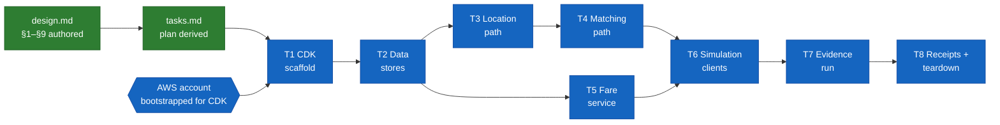

# Ledger — Uber-like Ride Hailing

## Work DAG

Color = status (green done · amber in progress · blue pending). Shape = kind
(rectangle = artifact/code · hexagon = external gate).

## Ledger

Append-only. Corrections get a new row, never a rewrite.

| Date | Work item | Outcome | Evidence |
|---|---|---|---|
| 2026-08-30 | Design authored (§1–§9, 6 deep dives) from the ride-hailing problem brief | design.md v1 committed | this commit |
| 2026-08-30 | Implementation plan derived from design | tasks.md v1, 8 task groups, all traced to design sections | this commit |
| 2026-08-30 | Ledger seeded with work DAG | ledger.md v1 | this commit |

## Open items (not DAG nodes)

- AWS account for the lab deploy: confirm account + `cdk bootstrap` before T1.
- Lab Redis sizing: single `cache.t4g.micro` node assumed (~$0.4/day while up); revisit only if the burst test saturates it.
